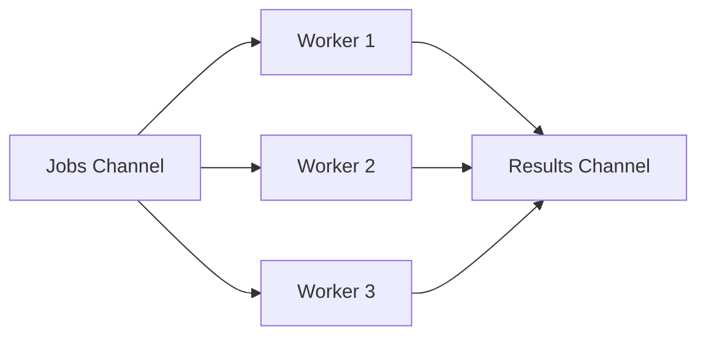

# ২২. Worker Pools for Concurrent Processing

ধরো তোমার কাছে দশ হাজার ছবি আছে, প্রতিটাকে রিসাইজ করতে হবে। প্রথম চিন্তা হতে পারে — লেসন ০৭-এ শেখা `go` কীওয়ার্ড দিয়ে দশ হাজারটা গোরুটিন একসাথে ছেড়ে দিই! কিন্তু এটা অনেকটা একটা ছোট রেস্টুরেন্টে একসাথে দশ হাজার কাস্টমারকে ঢুকতে দেওয়ার মতো — রান্নাঘরে জায়গা নেই, শেফ নেই, ফলাফলে সবাই একসাথে আটকে যাবে। প্রতিটা গোরুটিন হালকা হলেও, দশ হাজারটা একসাথে মেমরি, CPU, আর হয়তো নেটওয়ার্ক কানেকশনের উপর এমন চাপ ফেলবে যে পুরো সিস্টেমই ধসে পড়তে পারে। এই সমস্যাকেই বলে **unbounded concurrency**-এর বিপদ।

সমাধান হলো **worker pool** প্যাটার্ন — রেস্টুরেন্টে সীমিতসংখ্যক শেফ (worker) রাখো, আর কাস্টমারদের (jobs) একটা লাইনে (channel) দাঁড় করাও। শেফরা লাইন থেকে একের পর এক অর্ডার নিয়ে কাজ করে, যে যখন ফাঁকা হয় সে পরেরটা তুলে নেয়। এভাবে কাজের সংখ্যা যতই হোক, একসাথে সক্রিয় থাকা গোরুটিনের সংখ্যা নিয়ন্ত্রিত থাকে।



Go-তে এই প্যাটার্নটা বানানো হয় দুটো চ্যানেল দিয়ে — একটা `jobs` চ্যানেল, যেখান থেকে ওয়ার্কাররা কাজ তুলে নেয়, আর একটা `results` চ্যানেল, যেখানে ওয়ার্কাররা ফলাফল জমা রাখে।

```go
package main

import (
	"fmt"
	"sync"
)

func worker(id int, jobs <-chan int, results chan<- int, wg *sync.WaitGroup) {
	defer wg.Done()
	for job := range jobs { // jobs চ্যানেল বন্ধ না হওয়া পর্যন্ত কাজ তুলে নাও
		fmt.Printf("worker %d processing job %d\n", id, job)
		results <- job * job // ধরা যাক কাজটা হলো বর্গ করা
	}
}

func main() {
	const numWorkers = 3
	jobs := make(chan int, 10)
	results := make(chan int, 10)
	var wg sync.WaitGroup

	for w := 1; w <= numWorkers; w++ {
		wg.Add(1)
		go worker(w, jobs, results, &wg)
	}

	for j := 1; j <= 9; j++ {
		jobs <- j
	}
	close(jobs) // আর কোনো নতুন কাজ আসবে না, এটা জানিয়ে দাও

	wg.Wait()
	close(results)

	for r := range results {
		fmt.Println("result:", r)
	}
}
```

এখানে লেসন ২০-২১-এর সব উপাদান একসাথে কাজ করছে — `sync.WaitGroup` দিয়ে বোঝা যাচ্ছে কখন সব ওয়ার্কার শেষ করলো, আর চ্যানেল (লেসন ০৭) নিজেই এখানে সমন্বয়ের কাজ করছে বলে আলাদা করে Mutex লাগছে না। `close(jobs)` কল করার পর `range jobs` লুপ স্বয়ংক্রিয়ভাবে বেরিয়ে আসে, কারণ Go-তে বন্ধ চ্যানেল থেকে বাকি সব মান পড়ে নেওয়ার পর লুপ থেমে যায়।

`numWorkers`-এর সংখ্যাটা তুমি নিয়ন্ত্রণ করতে পারো — এটাই worker pool-এর আসল শক্তি। CPU-নির্ভর কাজের জন্য সাধারণত CPU কোরের সংখ্যার কাছাকাছি রাখা হয়, আর নেটওয়ার্ক/IO-নির্ভর কাজের জন্য (যেমন একগুচ্ছ API কল) সংখ্যাটা অনেক বেশি রাখা যায়, কারণ ওয়ার্কাররা বেশিরভাগ সময় অপেক্ষাতেই থাকে।

কাজের সময় যদি কোনো ওয়ার্কার আটকে যায় বা খুব বেশি দেরি করে, তখন পুরো পুলটাকে কতক্ষণ অপেক্ষা করাবে সেটা নিয়ন্ত্রণ করার দরকার হয় — সেই টাইমআউট ব্যবস্থাপনার হাতিয়ার `select` স্টেটমেন্ট নিয়ে কথা হবে পরের লেসনে।
