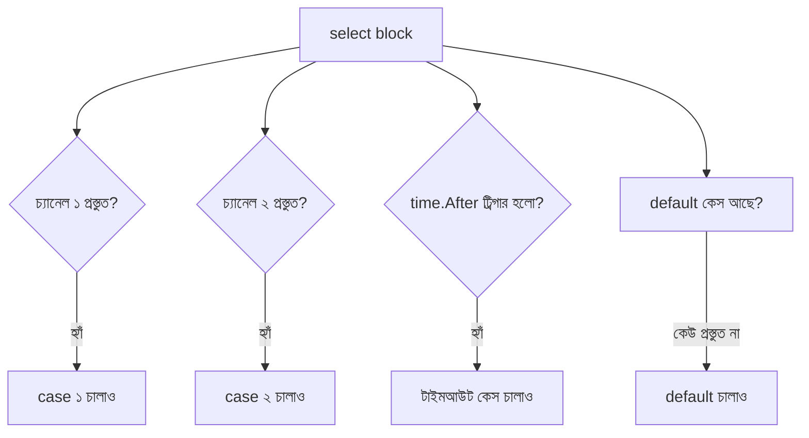

# ২৩. Select Statement and Timeouts in Channels

আগের লেসনের worker pool-এ একটা লুকানো ঝুঁকি ছিলো — যদি কোনো কাজ কখনোই শেষ না হয়, বা কোনো চ্যানেল থেকে কখনোই ডেটা না আসে, তাহলে সেই গোরুটিন **চিরকাল** অপেক্ষা করতে থাকবে। এটা অনেকটা রেস্টুরেন্টের ওয়েটারের মতো, যে একটা টেবিলের অর্ডারের জন্য সারাজীবন দাঁড়িয়ে থাকে, অন্য টেবিলের দিকে ফিরেও তাকায় না। বাস্তব সিস্টেমে এই "চিরকাল অপেক্ষা" গ্রহণযোগ্য না — তোমার দরকার একসাথে একাধিক সম্ভাবনার দিকে নজর রাখা, আর যেটা আগে ঘটে সেটাকেই সাড়া দেওয়া।

এই কাজের জন্য Go দিয়েছে `select` স্টেটমেন্ট, যেটা দেখতে অনেকটা `switch`-এর মতো, কিন্তু প্রতিটা `case` একটা চ্যানেল অপারেশন। `select` একসাথে একাধিক চ্যানেলের দিকে তাকিয়ে থাকে, আর যে চ্যানেলে প্রথম কিছু ঘটে সেই `case`-টাই চালায়।

```go
package main

import (
	"fmt"
	"time"
)

func main() {
	ch := make(chan string)

	go func() {
		time.Sleep(2 * time.Second)
		ch <- "কাজ সম্পন্ন"
	}()

	select {
	case result := <-ch:
		fmt.Println(result)
	case <-time.After(1 * time.Second):
		fmt.Println("টাইমআউট! কাজটা খুব দেরি করছে")
	}
}
```

এখানে `time.After(1 * time.Second)` নিজেই একটা চ্যানেল ফেরত দেয়, যেটাতে ১ সেকেন্ড পর একটা মান পাঠানো হয়। যেহেতু গোরুটিনের কাজ শেষ হতে ২ সেকেন্ড লাগছে কিন্তু টাইমআউট সেট করা আছে ১ সেকেন্ডে, তাই `select` টাইমআউট কেসটাই বেছে নেবে — প্রোগ্রাম চিরকাল আটকে থাকে না। এটা ঠিক HTTP ক্লায়েন্টের রিকোয়েস্ট টাইমআউটের মতো ধারণা, শুধু এখানে চ্যানেলের স্তরে কাজ করছি।

`select`-এর আরেকটা গুরুত্বপূর্ণ ব্যবহার হলো **নন-ব্লকিং** চ্যানেল অপারেশন — মানে চ্যানেলে ডেটা আছে কিনা চেক করা, কিন্তু না থাকলে অপেক্ষা না করে সাথে সাথে এগিয়ে যাওয়া। এখানে কাজে লাগে `default` কেস।

```go
select {
case msg := <-ch:
	fmt.Println("পেলাম:", msg)
default:
	fmt.Println("এখনো কিছু আসেনি, অন্য কাজ করি")
}
```

`default` থাকলে `select` কখনো ব্লক করবে না — কোনো চ্যানেল প্রস্তুত না থাকলে সাথে সাথে `default` চলে যায়। এটা কাজে লাগে যখন তুমি একটা লুপে বারবার চেক করতে চাও কোনো নতুন ইভেন্ট এসেছে কিনা, কিন্তু সেই চেকের জন্য পুরো প্রোগ্রাম থামিয়ে রাখতে চাও না।



worker pool-এ যদি একটা টাইমআউট যোগ করতে চাও, তাহলে প্রতিটা ওয়ার্কারের কাজ প্রসেস করার লজিকে ঠিক এই ধরনের `select` বসিয়ে দেওয়া যায়, যাতে একটা আটকে যাওয়া কাজ পুরো পুলকে থামিয়ে না রাখে। কিন্তু একটা মাত্র চ্যানেলের টাইমআউট ম্যানুয়ালি সামলানোর চেয়ে বড় সিস্টেমে দরকার হয় একটা কেন্দ্রীয়, পুনর্ব্যবহারযোগ্য সমাধান — যেটাই আমরা দেখবো পরের লেসনে, **context** প্যাকেজের মাধ্যমে।
