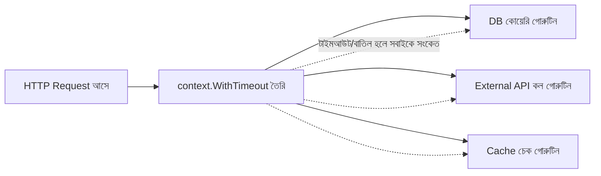

# ২৪. Context Package for Managing Goroutines

আগের লেসনে আমরা `select` আর `time.After` দিয়ে একটা একক চ্যানেলের টাইমআউট সামলেছিলাম। কিন্তু বাস্তব ব্যাকএন্ড সিস্টেমে সমস্যাটা আরো জটিল — একটা HTTP রিকোয়েস্ট হ্যান্ডলার হয়তো ভেতরে ভেতরে তিন-চারটা গোরুটিন চালু করে (একটা ডেটাবেজ কোয়েরি করছে, একটা এক্সটার্নাল API কল করছে, একটা ক্যাশ চেক করছে)। এখন যদি ইউজার ব্রাউজার ট্যাব বন্ধ করে দেয়, বা রিকোয়েস্টের একটা নির্দিষ্ট সময়সীমা পার হয়ে যায় — তাহলে এই সবগুলো গোরুটিনকেই থামাতে হবে, একসাথে, সমন্বিতভাবে। প্রতিটার জন্য আলাদা `time.After` বসানো এলোমেলো আর কষ্টসাধ্য।

এই সমস্যার জন্য Go দিয়েছে **context** প্যাকেজ। `context.Context`-কে ভাবতে পারো একটা "বাতিলের সংকেত" বহনকারী বস্তু হিসেবে, যা একটা রিকোয়েস্টের পুরো জীবনচক্র জুড়ে ফাংশন থেকে ফাংশনে, গোরুটিন থেকে গোরুটিনে পাস করা হয়। যখনই কেউ এই context বাতিল করে, তার সাথে যুক্ত সব গোরুটিন সেই সংকেত পেয়ে নিজেদের কাজ গুটিয়ে নিতে পারে।

সবচেয়ে সাধারণ দুটো তৈরির উপায় হলো `context.WithCancel` আর `context.WithTimeout`।

```go
package main

import (
	"context"
	"fmt"
	"time"
)

func worker(ctx context.Context, id int) {
	for {
		select {
		case <-ctx.Done(): // কেউ context বাতিল করেছে বা সময় শেষ
			fmt.Printf("worker %d: বন্ধ হচ্ছে, কারণ: %v\n", id, ctx.Err())
			return
		default:
			fmt.Printf("worker %d: কাজ করছি...\n", id)
			time.Sleep(300 * time.Millisecond)
		}
	}
}

func main() {
	ctx, cancel := context.WithTimeout(context.Background(), 1*time.Second)
	defer cancel() // রিসোর্স লিক এড়াতে সবসময় cancel কল করা উচিত

	go worker(ctx, 1)

	time.Sleep(2 * time.Second) // মূল প্রোগ্রামকে একটু অপেক্ষা করাচ্ছি ফলাফল দেখার জন্য
}
```

`context.Background()` হলো শুরুর বিন্দু — একটা খালি, কখনো বাতিল না হওয়া context, যেখান থেকে বাকি সব context তৈরি হয়। `WithTimeout` তার থেকে একটা নতুন context বানায় যেটা ১ সেকেন্ড পর নিজে থেকেই বাতিল হয়ে যাবে। ওয়ার্কার গোরুটিনের ভেতরে `ctx.Done()` একটা চ্যানেল ফেরত দেয় যেটা বাতিল হওয়ার মুহূর্তে বন্ধ হয়ে যায় — তখন `select`-এর সেই কেসটা ট্রিগার হয়, ঠিক লেসন ২৩-এ শেখা প্যাটার্নের মতোই।

`defer cancel()` লেখাটা গুরুত্বপূর্ণ — এটা নিশ্চিত করে, ফাংশনটা তাড়াতাড়ি শেষ হলেও context-এর সাথে যুক্ত রিসোর্স মুক্ত হয়ে যাবে, নাহলে মেমরি লিক হতে পারে।



এই প্যাটার্নটাই আসলে আধুনিক Go ব্যাকএন্ডের মেরুদণ্ড — যখন আমরা পরে HTTP সার্ভার বানাবো (লেসন ২৬), তখন দেখবে প্রতিটা ইনকামিং রিকোয়েস্টের সাথে Go নিজে থেকেই একটা `context.Context` জুড়ে দেয় (`r.Context()`), যাতে রিকোয়েস্ট বাতিল হলে হ্যান্ডলারের ভেতরের সব কাজও বাতিল করা যায়। এখন আমরা চ্যানেল, গোরুটিন, `select`, আর context — চারটা টুকরোই হাতে পেয়েছি; পরের লেসনে এগুলো জোড়া লাগিয়ে বানাবো একটা সম্পূর্ণ **event-driven pipeline**।
