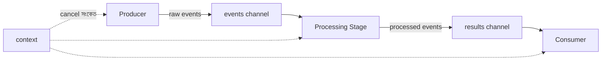

# ২৫. Building an Event-Driven Pipeline with Go

এতদিন আমরা concurrency-এর প্রতিটা টুকরো আলাদা আলাদাভাবে শিখেছি — গোরুটিন (লেসন ০৭), worker pool (লেসন ২২), `select` আর টাইমআউট (লেসন ২৩), আর context দিয়ে বাতিলকরণ (লেসন ২৪)। এবার সময় এসেছে এই সবকিছু একসাথে জোড়া লাগিয়ে একটা বাস্তব কাঠামো বানানোর — একটা **event-driven pipeline**, যেখানে ডেটা একটা ধাপ থেকে আরেকটা ধাপে প্রবাহিত হয়, ঠিক যেমন কারখানার একটা কনভেয়ার বেল্টে কাঁচামাল ঢোকে, একের পর এক স্টেশনে প্রসেস হয়, আর শেষে তৈরি পণ্য বের হয়ে আসে।

আমাদের পাইপলাইনে তিনটা ধাপ থাকবে — একটা **producer** যে নতুন "ইভেন্ট" তৈরি করে, একটা **processing stage** যে সেই ইভেন্টকে রূপান্তর করে, আর একটা **consumer** যে চূড়ান্ত ফলাফল গ্রহণ করে।



প্রতিটা ধাপ একটা করে চ্যানেল দিয়ে পরেরটার সাথে সংযুক্ত, আর পুরো পাইপলাইনটা একটা কমন `context` শেয়ার করে, যাতে যেকোনো সময় পুরো প্রবাহ পরিষ্কারভাবে বন্ধ করা যায়।

```go
package main

import (
	"context"
	"fmt"
	"time"
)

func producer(ctx context.Context, out chan<- int) {
	defer close(out)
	for i := 1; ; i++ {
		select {
		case <-ctx.Done():
			return
		case out <- i:
			time.Sleep(200 * time.Millisecond)
		}
	}
}

func processor(ctx context.Context, in <-chan int, out chan<- int) {
	defer close(out)
	for {
		select {
		case <-ctx.Done():
			return
		case n, ok := <-in:
			if !ok {
				return
			}
			out <- n * n // প্রসেসিং: বর্গ করা
		}
	}
}

func consumer(ctx context.Context, in <-chan int, done chan<- bool) {
	defer close(done)
	for {
		select {
		case <-ctx.Done():
			return
		case n, ok := <-in:
			if !ok {
				return
			}
			fmt.Println("received:", n)
		}
	}
}

func main() {
	ctx, cancel := context.WithTimeout(context.Background(), 1*time.Second)
	defer cancel()

	rawEvents := make(chan int)
	processedEvents := make(chan int)
	done := make(chan bool)

	go producer(ctx, rawEvents)
	go processor(ctx, rawEvents, processedEvents)
	go consumer(ctx, processedEvents, done)

	<-done
	fmt.Println("পাইপলাইন বন্ধ হয়ে গেলো")
}
```

লক্ষ করো প্রতিটা ধাপ একই প্যাটার্ন অনুসরণ করছে — `select`-এর মধ্যে `ctx.Done()` চেক করা (লেসন ২৪), আর চ্যানেল বন্ধ হয়ে গেলে (`ok == false`) পরিষ্কারভাবে বেরিয়ে যাওয়া। `defer close(out)` প্রতিটা ধাপে নিশ্চিত করে যে একটা ধাপ শেষ হলে তার আউটপুট চ্যানেলও বন্ধ হয়ে যায়, যাতে পরের ধাপ জানতে পারে আর কোনো ডেটা আসবে না — এটাই এই পুরো চেইনটাকে সঠিকভাবে বন্ধ হতে সাহায্য করে।

এই পাইপলাইন প্যাটার্নটা শুধু একটা exercise না — লগ প্রসেসিং সিস্টেম, রিয়েল-টাইম নোটিফিকেশন সার্ভিস, বা মেসেজ কিউ কনজিউমার — বাস্তব ব্যাকএন্ড সিস্টেমের অনেক জায়গায় ঠিক এই কাঠামোই দেখা যায়। এতক্ষণ আমরা concurrency নিয়ে কাজ করেছি প্রসেসের ভেতরে; কিন্তু একটা ব্যাকএন্ড সিস্টেমকে বাইরের জগতের সাথে যোগাযোগ করতে হয় নেটওয়ার্কের মাধ্যমে — সেই যাত্রা শুরু হবে পরের লেসনে, যেখানে আমরা বানাবো Go দিয়ে একটা সাধারণ **HTTP সার্ভার**।
