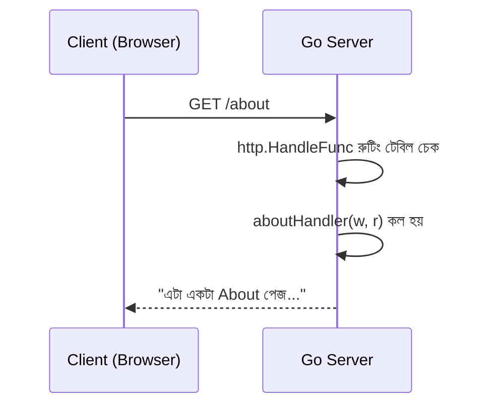

# ২৬. Building a Simple HTTP Server in Go

Module 2-তে যখন আমরা Node.js দিয়ে প্রথম ওয়েবসার্ভার বানিয়েছিলাম, তখন হয়তো `http` মডিউল ইমপোর্ট করে কয়েক লাইনেই একটা সার্ভার দাঁড় করিয়ে ফেলেছিলে। মজার ব্যাপার হলো, Go-তেও ঠিক একই দর্শন — HTTP সার্ভার বানানোর জন্য বাইরের কোনো ফ্রেমওয়ার্ক (যেমন Express.js) লাগে না, স্ট্যান্ডার্ড লাইব্রেরির **net/http** প্যাকেজই যথেষ্ট। এটা Go-এর একটা বড় শক্তি — "ব্যাটারি সহ" আসে, প্রোডাকশন-মানের ওয়েব সার্ভার বানানোর সব উপকরণ প্রথম থেকেই ভাষার সাথে দেওয়া থাকে।

একটা সবচেয়ে সহজ Go HTTP সার্ভার দেখা যাক।

```go
package main

import (
	"fmt"
	"net/http"
)

func homeHandler(w http.ResponseWriter, r *http.Request) {
	fmt.Fprintln(w, "স্বাগতম! এটা আমাদের প্রথম Go HTTP সার্ভার।")
}

func aboutHandler(w http.ResponseWriter, r *http.Request) {
	fmt.Fprintln(w, "এটা একটা About পেজ, Go দিয়ে তৈরি।")
}

func main() {
	http.HandleFunc("/", homeHandler)
	http.HandleFunc("/about", aboutHandler)

	fmt.Println("সার্ভার চলছে http://localhost:8080 এ")
	err := http.ListenAndServe(":8080", nil)
	if err != nil {
		fmt.Println("সার্ভার চালু করতে সমস্যা:", err)
	}
}
```

এখানে `http.HandleFunc` কাজ করে একটা **রাউটার**-এর মতো — প্রথম আর্গুমেন্টে URL পাথ, দ্বিতীয় আর্গুমেন্টে সেই পাথে রিকোয়েস্ট এলে কোন ফাংশন চলবে। প্রতিটা হ্যান্ডলার ফাংশনের সিগনেচার একই রকম — `http.ResponseWriter` (যার মধ্যে দিয়ে তুমি রেসপন্স লেখো) আর `*http.Request` (যার মধ্যে ইনকামিং রিকোয়েস্টের সব তথ্য থাকে)। `http.ListenAndServe(":8080", nil)` কল করা মানে "৮০৮০ পোর্টে শোনা শুরু করো, আর প্রতিটা রিকোয়েস্টের জন্য উপরে রেজিস্টার করা হ্যান্ডলারগুলো ব্যবহার করো"।



Node.js-এর সাথে তুলনা করলে ধারণাগতভাবে দুটোই প্রায় একই রকম — একটা রিকোয়েস্ট আসে, একটা হ্যান্ডলার/কলব্যাক চলে, একটা রেসপন্স ফেরত যায়। পার্থক্যটা ভেতরের ইঞ্জিনে — Node.js একটা সিঙ্গেল-থ্রেডেড ইভেন্ট লুপ দিয়ে অনেকগুলো রিকোয়েস্ট সামলায় (non-blocking I/O দিয়ে, যা তুমি Module 5-এ দেখেছো), অন্যদিকে Go-এর `net/http` সার্ভার প্রতিটা ইনকামিং রিকোয়েস্টের জন্য স্বয়ংক্রিয়ভাবে একটা করে **নতুন গোরুটিন** চালায় (লেসন ০৭)। ফলে Go-তে concurrency-টা আসে ভাষার নিজস্ব লাইটওয়েট থ্রেডিং মডেল থেকে, কোনো বিশেষ ইভেন্ট-লুপ কৌশল ছাড়াই।

এই স্বয়ংক্রিয় গোরুটিন-প্রতি-রিকোয়েস্ট মডেলটার একটা গুরুত্বপূর্ণ ফলাফল আছে — প্রতিটা `*http.Request`-এর সাথে Go নিজে থেকেই একটা `context.Context` জুড়ে দেয় (`r.Context()`), যা লেসন ২৪-এ শেখা প্যাটার্নের সাথে সরাসরি যুক্ত। ক্লায়েন্ট রিকোয়েস্ট বাতিল করলে বা কানেকশন বন্ধ হয়ে গেলে, সেই context বাতিল হয়ে যায়, আর হ্যান্ডলারের ভেতরের যেকোনো লম্বা কাজ (যেমন ডেটাবেজ কোয়েরি) সেই সংকেত ধরে নিজেকে থামাতে পারে।

আমাদের সার্ভার এখন পর্যন্ত শুধু স্ট্যাটিক টেক্সট পাঠাচ্ছে — বাস্তব API-তে দরকার হয় query parameter পড়া, request body পার্স করা, আর JSON রেসপন্স পাঠানো। এই সবকিছু নিয়েই আলোচনা হবে পরের ও এই মডিউলের শেষ লেসনে।
