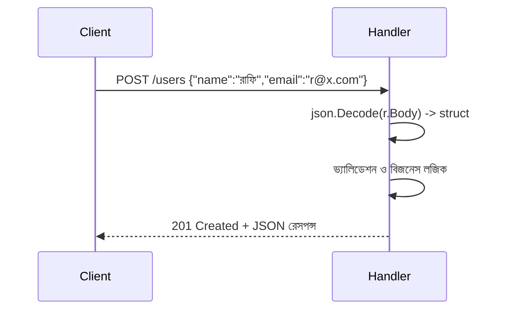

# ২৭. Handling HTTP Requests and Responses in Go

আগের লেসনে আমাদের সার্ভার শুধু স্ট্যাটিক টেক্সট পাঠাচ্ছিল। বাস্তব একটা API-কে অবশ্যই তিনটা কাজ করতে জানতে হবে — URL থেকে প্যারামিটার পড়া, রিকোয়েস্ট বডি থেকে JSON পার্স করা, আর ফেরত JSON রেসপন্স পাঠানো। Module 4-এ Express দিয়ে যা শিখেছিলে (`req.params`, `req.query`, `req.body`, `res.json()`), Go-তে সেগুলোরই সমতুল্য জিনিস আছে, শুধু একটু বেশি explicit (স্পষ্ট) ভাবে লিখতে হয়।

**Query parameter** পড়া হয় `r.URL.Query()` দিয়ে:

```go
func searchHandler(w http.ResponseWriter, r *http.Request) {
	query := r.URL.Query().Get("q")       // ?q=golang
	page := r.URL.Query().Get("page")     // ?page=2

	fmt.Fprintf(w, "খুঁজছি: %s, পাতা: %s", query, page)
}
```

**Path parameter** (যেমন `/users/42`) Go-এর স্ট্যান্ডার্ড লাইব্রেরিতে একটু ম্যানুয়াল, কারণ `net/http`-এর বেসিক রাউটার এটা নেটিভভাবে সাপোর্ট করে না (Go 1.22 থেকে সীমিত সাপোর্ট এসেছে)। তাই বাস্তব প্রজেক্টে সাধারণত একটা রাউটার লাইব্রেরি (যেমন `gorilla/mux`, বা Module 47-এ শেখা Gin ফ্রেমওয়ার্ক) ব্যবহার করা হয়, যেটা `/users/{id}` স্টাইলে path parameter বের করতে দেয়।

এবার JSON নিয়ে কাজ করা যাক — লেসন ৯-এ আমরা `encoding/json` প্যাকেজ দিয়ে ফাইল I/O শিখেছিলাম, ঠিক একই প্যাকেজ এখানে HTTP বডির জন্যও কাজ করে:

```go
type CreateUserRequest struct {
	Name  string `json:"name"`
	Email string `json:"email"`
}

func createUserHandler(w http.ResponseWriter, r *http.Request) {
	var req CreateUserRequest
	if err := json.NewDecoder(r.Body).Decode(&req); err != nil {
		http.Error(w, "invalid JSON body", http.StatusBadRequest)
		return
	}

	// এখানে req.Name, req.Email দিয়ে ইউজার তৈরির লজিক চলবে

	w.Header().Set("Content-Type", "application/json")
	w.WriteHeader(http.StatusCreated)
	json.NewEncoder(w).Encode(map[string]string{
		"message": "ইউজার তৈরি হয়েছে",
		"name":    req.Name,
	})
}
```



লক্ষ্য করো, `w.WriteHeader(http.StatusCreated)` অবশ্যই `json.NewEncoder(w).Encode(...)` কল করার **আগে** লিখতে হবে — কারণ HTTP-তে একবার বডি লেখা শুরু হয়ে গেলে স্ট্যাটাস কোড আর বদলানো যায় না (এটা Go কম্পাইলার ধরে না, রানটাইমে চুপচাপ উপেক্ষা করে, তাই ভুল করলে বাগ খুঁজে পেতে কষ্ট হয়)।

Error response-এর ক্ষেত্রেও একটা সামঞ্জস্যপূর্ণ ফরম্যাট রাখা ভালো অভ্যাস, ঠিক যেমন Module 7-এ Express-এ কেন্দ্রীভূত এরর হ্যান্ডলিং শিখেছিলে:

```go
func respondError(w http.ResponseWriter, status int, message string) {
	w.Header().Set("Content-Type", "application/json")
	w.WriteHeader(status)
	json.NewEncoder(w).Encode(map[string]string{"error": message})
}
```

Go-এর `net/http` এই সবকিছু ম্যানুয়ালি করতে দেয়, যা শেখার জন্য ভালো — কারণ বাস্তবে এর ভেতরে কী ঘটছে সেটা তুমি নিজ চোখে দেখলে। কিন্তু প্রতিটা প্রজেক্টে এই একই boilerplate বারবার লেখা ক্লান্তিকর, তাই Module 47-এ আমরা Gin ফ্রেমওয়ার্ক ব্যবহার করবো, যেটা ঠিক এই কাজগুলোকেই (`c.Param()`, `c.BindJSON()`, `c.JSON()`) অনেক সংক্ষিপ্ত করে দেয়।

আপাতত আমাদের API রিকোয়েস্ট নিতে আর রেসপন্স দিতে পারে, কিন্তু এখনো JSON-এর ভেতরের ডেটা সত্যিই সঠিক কিনা (যেমন ইমেইল ফরম্যাট ঠিক আছে কিনা) তা যাচাই করা হচ্ছে না। সেই ভ্যালিডেশনের বিষয়টাই আমাদের পরের লেসনে আসছে।
