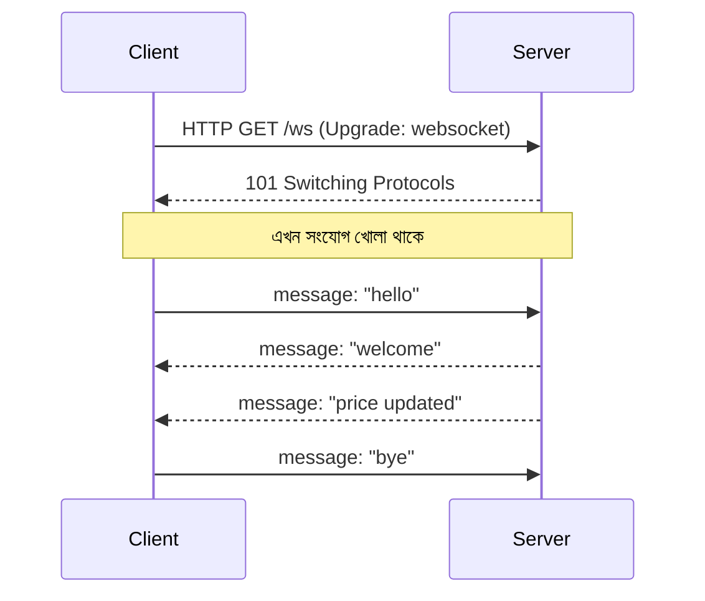

# ২৯. Working with WebSockets in Go

লেসন ২৬-২৭-এ আমরা যে HTTP সার্ভার বানিয়েছিলাম, তার একটা মৌলিক সীমাবদ্ধতা আছে — প্রতিটা কথোপকথন হয় "প্রশ্ন করো, উত্তর পাও, লাইন কেটে দাও" ধরনের। এটা অনেকটা চিঠি পাঠানোর মতো — তুমি একটা চিঠি পাঠালে, উত্তর এলো, তারপর যোগাযোগ শেষ। কিন্তু কল্পনা করো একটা লাইভ চ্যাট অ্যাপ, বা শেয়ার বাজারের দাম রিয়েল-টাইমে দেখানো একটা ড্যাশবোর্ড — এখানে সার্ভারকে বারবার নতুন করে "চিঠি" পাঠানোর দরকার নেই, বরং দরকার একটা খোলা ফোন লাইনের মতো সংযোগ, যেখানে দুই পক্ষই যখন খুশি কথা বলতে পারে। এই সমস্যার সমাধান **WebSocket**।

WebSocket শুরু হয় সাধারণ HTTP রিকোয়েস্ট দিয়েই, কিন্তু একটা বিশেষ "handshake"-এর মাধ্যমে সেই সংযোগটাকে upgrade করে একটা persistent, bidirectional চ্যানেলে পরিণত করে।



Go-তে standard library সরাসরি WebSocket সাপোর্ট করে না, তাই বাস্তব প্রজেক্টে সবচেয়ে জনপ্রিয় প্যাকেজ হলো `gorilla/websocket`। এটা HTTP handler-কেই WebSocket connection-এ upgrade করার কাজ সহজ করে দেয়।

```go
import "github.com/gorilla/websocket"

var upgrader = websocket.Upgrader{
    ReadBufferSize:  1024,
    WriteBufferSize: 1024,
}

func wsHandler(w http.ResponseWriter, r *http.Request) {
    conn, err := upgrader.Upgrade(w, r, nil)
    if err != nil {
        log.Println("upgrade failed:", err)
        return
    }
    defer conn.Close()

    for {
        msgType, msg, err := conn.ReadMessage()
        if err != nil {
            log.Println("connection closed:", err)
            break
        }
        log.Printf("received: %s", msg)

        reply := []byte("echo: " + string(msg))
        if err := conn.WriteMessage(msgType, reply); err != nil {
            break
        }
    }
}
```

এখানে `for` লুপটাই মূল পার্থক্য তৈরি করে — সাধারণ HTTP handler একবার রেসপন্স লিখেই বিদায় নেয়, কিন্তু WebSocket handler সংযোগ খোলা রাখে আর বারবার মেসেজ পড়া-লেখার সুযোগ পায়, যতক্ষণ না ক্লায়েন্ট বা সার্ভার সংযোগ বন্ধ করে। এই মডেলটা লেসন ০৭-এ শেখা goroutine আর channel-এর সাথে দারুণভাবে মিলে যায় — বাস্তবে প্রতিটা কানেকশনকে সাধারণত আলাদা একটা goroutine-এ চালানো হয়, যাতে একজন ইউজারের ধীরগতি অন্যজনকে ব্লক না করে।

পরের লেসনে আমরা REST-এর বাইরে গিয়ে দেখবো, ক্লায়েন্ট যদি নিজের মতো করে ঠিক করতে চায় কোন ডাটা দরকার, তখন কীভাবে কাজে লাগে GraphQL।
