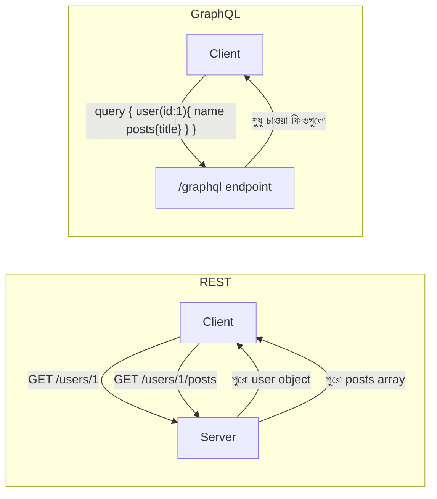

# ৩০. GraphQL APIs with Go

এতদিন আমরা যে API বানিয়েছি (লেসন ২৬-২৮), সেগুলো সবই REST স্টাইলের — মানে প্রতিটা URL একটা নির্দিষ্ট রিসোর্স প্রতিনিধিত্ব করে, আর সার্ভারই ঠিক করে দেয় সেই রিসোর্সের সাথে কী কী ডাটা ফেরত আসবে। এটা অনেকটা রেস্টুরেন্টের সেট মেনুর মতো — "কম্বো ২" অর্ডার করলে যা যা তার সাথে আসে, তার পুরোটাই তোমাকে নিতে হবে, চাইলেও শুধু ভাত বাদ দিয়ে নেয়া যায় না। কিন্তু ক্লায়েন্ট অ্যাপ (যেমন মোবাইল অ্যাপ) অনেক সময় শুধু নির্দিষ্ট কিছু ফিল্ড চায় — পুরো ইউজার অবজেক্ট না, শুধু নাম আর ছবি। এই সমস্যার সমাধান হিসেবে এসেছে **GraphQL** — এখানে ক্লায়েন্ট নিজেই বলে দেয় ঠিক কোন কোন ফিল্ড দরকার, আর সার্ভার সেভাবেই সাজিয়ে দেয়, একটা মাত্র endpoint থেকেই।



GraphQL-এর মূল দুইটা অংশ — **schema** (কী কী টাইপ আর কোয়েরি সম্ভব, তার একটা ঘোষণা) আর **resolver** (প্রতিটা ফিল্ডের জন্য আসল ডাটা কোথা থেকে আনতে হবে, তার ফাংশন)। Go-তে এই জোড়া হাতে লেখা বেশ কষ্টসাধ্য, তাই বাস্তবে `gqlgen` নামের একটা code-generation টুল ব্যবহার করা হয় — তুমি schema লিখে দাও, সে বাকি boilerplate কোড জেনারেট করে দেয়।

```graphql
# schema.graphqls
type User {
  id: ID!
  name: String!
  posts: [Post!]!
}

type Query {
  user(id: ID!): User
}
```

gqlgen এই schema থেকে Go ইন্টারফেস জেনারেট করে দেয়, আর তোমাকে শুধু resolver-এর ভেতরের লজিকটুকু লিখতে হয়:

```go
func (r *queryResolver) User(ctx context.Context, id string) (*model.User, error) {
    u, err := r.DB.FindUserByID(id)
    if err != nil {
        return nil, err
    }
    return u, nil
}

func (r *userResolver) Posts(ctx context.Context, obj *model.User) ([]*model.Post, error) {
    return r.DB.FindPostsByUserID(obj.ID)
}
```

লক্ষণীয়, `Posts` resolver-টা তখনই চলে যখন ক্লায়েন্ট আসলেই posts চেয়েছে — চায়নি এমন ফিল্ডের resolver একদম চলেই না। এটাই GraphQL-এর মূল সুবিধা — অপ্রয়োজনীয় ডাটা বা অতিরিক্ত নেটওয়ার্ক রাউন্ড-ট্রিপ কমানো, বিশেষ করে মোবাইল অ্যাপ বা জটিল, নেস্টেড ডাটা-স্ট্রাকচার নিয়ে কাজ করার সময়। তবে ছোট, সাধারণ CRUD সার্ভিসে REST-ই যথেষ্ট এবং সহজবোধ্য থাকে — GraphQL তখনই যুক্তিসঙ্গত হয়ে ওঠে, যখন ক্লায়েন্ট বৈচিত্র্যময় (একাধিক ফ্রন্টএন্ড, ভিন্ন ভিন্ন ডাটার চাহিদা) হয়।

পরের লেসনে আমরা দেখবো, যখন দুটো সার্ভিস একে অপরের সাথে দ্রুত আর কমপ্যাক্ট ফরম্যাটে কথা বলতে চায় — মাইক্রোসার্ভিস জগতের প্রিয় টুল gRPC এবং Protocol Buffers।
