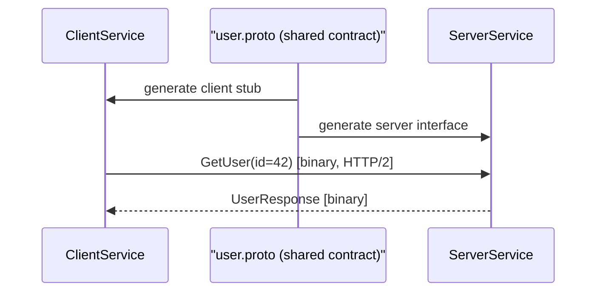

# ৩১. gRPC and Protocol Buffers in Go

লেসন ০৯-এ JSON নিয়ে কথা বলার সময় আমরা দেখেছিলাম, JSON মানুষের পড়ার জন্য চমৎকার — টেক্সট ফরম্যাট, চোখে দেখা যায়, ব্রাউজারে ডিবাগ করা সহজ। কিন্তু দুটো মাইক্রোসার্ভিস যখন একে অপরের সাথে সেকেন্ডে হাজারবার কথা বলে, তখন "মানুষের পড়ার সুবিধা" আসলে একটা বাড়তি খরচ — প্রতিটা কী-ভ্যালু জোড়া টেক্সট আকারে পাঠানো মানে বেশি bytes, বেশি parsing সময়। এখানেই কাজে লাগে **Protocol Buffers (protobuf)** — Google-এর তৈরি একটা বাইনারি সিরিয়ালাইজেশন ফরম্যাট, যেখানে ডাটা টেক্সট না, বরং কমপ্যাক্ট বাইনারি আকারে পাঠানো হয়। এটা অনেকটা চিঠির বদলে কোডভাষায় টেলিগ্রাম পাঠানোর মতো — দুই পক্ষই কোডটা আগে থেকে জানে বলে, পুরো বাক্য না লিখে শুধু সংক্ষিপ্ত সংকেত পাঠালেই চলে।

Protobuf ব্যবহারের প্রথম ধাপ হলো একটা `.proto` ফাইলে ডাটার গঠন আর সার্ভিসের সংজ্ঞা লেখা।

```protobuf
// user.proto
syntax = "proto3";

package user;

message UserRequest {
  string id = 1;
}

message UserResponse {
  string id = 1;
  string name = 2;
  string email = 3;
}

service UserService {
  rpc GetUser(UserRequest) returns (UserResponse);
}
```

এই ফাইল থেকে `protoc` কম্পাইলার Go কোড জেনারেট করে দেয় — struct, marshal/unmarshal ফাংশন, এমনকি সার্ভার আর ক্লায়েন্টের জন্য ইন্টারফেসও। **gRPC** হলো সেই ফ্রেমওয়ার্ক, যেটা এই protobuf-এ সংজ্ঞায়িত সার্ভিসগুলোকে HTTP/2-এর উপর দিয়ে দ্রুতগতির রিমোট প্রসিডিউর কল (RPC)-এ রূপান্তর করে।

```go
type server struct {
    pb.UnimplementedUserServiceServer
}

func (s *server) GetUser(ctx context.Context, req *pb.UserRequest) (*pb.UserResponse, error) {
    // ডাটাবেস থেকে ইউজার খুঁজে বের করা
    return &pb.UserResponse{
        Id:    req.Id,
        Name:  "Arman",
        Email: "arman@example.com",
    }, nil
}

func main() {
    lis, _ := net.Listen("tcp", ":50051")
    grpcServer := grpc.NewServer()
    pb.RegisterUserServiceServer(grpcServer, &server{})
    grpcServer.Serve(lis)
}
```



Go আর gRPC-এর জুটি মাইক্রোসার্ভিস জগতে এত জনপ্রিয় কেন? কারণ Go-এর দ্রুত কম্পাইলেশন, ছোট বাইনারি, আর native concurrency (লেসন ২৩-২৪) মিলে এমন সার্ভিস তৈরি করে যা কম রিসোর্সে অনেক বেশি রিকোয়েস্ট সামলাতে পারে — ঠিক যেমন মাইক্রোসার্ভিস আর্কিটেকচারে দরকার হয়, যেখানে শত শত ছোট সার্ভিস একে অপরের সাথে অবিরাম কথা বলে।

পরের লেসনে আমরা ফিরে আসবো পরিচিত জায়গায় — ডাটাবেসের সাথে সংযোগ, `database/sql` আর `sqlx` দিয়ে।
