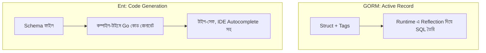

# ৩৪. ORMs in Go: GORM vs. Ent

লেসন ৩২-এ আমরা `database/sql` আর `sqlx` দিয়ে হাতে-কলমে SQL লিখেছি। এটা অনেকটা রান্নাঘরে নিজের হাতে প্রতিটা উপকরণ মেপে রান্না করার মতো — সম্পূর্ণ নিয়ন্ত্রণ থাকে, কিন্তু সময় লাগে। **ORM (Object-Relational Mapper)** হলো একটা রান্নার রোবট — তুমি বলবে "একটা User বানাও", সে নিজে থেকে INSERT স্টেটমেন্ট লিখে চালিয়ে দেবে। Go জগতে দুইটা জনপ্রিয় ORM আছে, আর তাদের দর্শন সম্পূর্ণ ভিন্ন — **GORM** আর **Ent**।

GORM কাজ করে **active-record** স্টাইলে — মানে struct নিজেই জানে কীভাবে নিজেকে সেভ করতে হয়, খুঁজে বের করতে হয়। লেখার ধরনটা খুবই সরাসরি আর সংক্ষিপ্ত।

```go
type User struct {
    gorm.Model
    Name  string
    Email string
}

db, _ := gorm.Open(postgres.Open(dsn), &gorm.Config{})
db.AutoMigrate(&User{})

user := User{Name: "Arman", Email: "arman@example.com"}
db.Create(&user)

var found User
db.First(&found, "email = ?", "arman@example.com")
```

Ent সম্পূর্ণ ভিন্ন পথে হাঁটে — এটা **code-generation আর graph-based** স্টাইল। তুমি একটা schema ফাইলে ফিল্ড আর সম্পর্ক (edges) সংজ্ঞায়িত করো, আর Ent তা থেকে টাইপ-সেফ Go কোড জেনারেট করে দেয়, অনেকটা লেসন ৩১-এ দেখা protobuf-এর `.proto` ফাইল থেকে কোড জেনারেট করার ধারণার মতো।

```go
// ent/schema/user.go
func (User) Fields() []ent.Field {
    return []ent.Field{
        field.String("name"),
        field.String("email").Unique(),
    }
}

// জেনারেট হওয়া কোড ব্যবহার
client.User.Create().SetName("Arman").SetEmail("arman@example.com").Save(ctx)
```



GORM-এর সুবিধা হলো শেখার বক্ররেখা কম আর দ্রুত শুরু করা যায়, কিন্তু ভুলগুলো (যেমন টাইপো করা কলাম নাম) ধরা পড়ে রানটাইমে। Ent একটু বেশি সেটআপ চায়, কিন্তু ভুলগুলো কম্পাইল-টাইমেই ধরা পড়ে, আর জটিল সম্পর্ক (many-to-many, graph traversal) পরিচালনা করা অনেক পরিষ্কার। ছোট প্রজেক্ট বা দ্রুত প্রোটোটাইপের জন্য GORM ভালো মানানসই, বড় আর দীর্ঘমেয়াদী প্রজেক্টে Ent-এর টাইপ-সেফটি সুবিধা দেয়। তবে দুটোরই একটা সাধারণ ঝুঁকি আছে — জটিল কোয়েরি বা পারফরম্যান্স-সংবেদনশীল কাজে ORM যে SQL জেনারেট করে তা অদক্ষ হতে পারে, তখন লেসন ৩২-এ শেখা raw SQL-এই ফিরে যাওয়াই বুদ্ধিমানের কাজ।

পরের লেসনে আমরা ডাটাবেস থেকে সরে গিয়ে দেখবো, বড় ফাইল বা বিশাল ডাটাসেট মেমোরিতে পুরোটা না লোড করে কীভাবে স্ট্রিম করে প্রসেস করা যায়।
