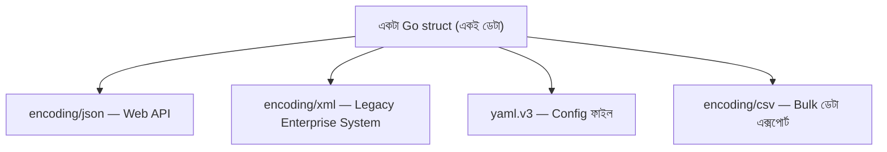

# ৩৬. Data Serialization: JSON, XML, YAML, CSV

লেসন ৯ আর ২৮-এ আমরা JSON নিয়ে অনেক কাজ করেছি, কারণ আধুনিক ওয়েব API-তে এটাই সবচেয়ে প্রচলিত ফরম্যাট। কিন্তু বাস্তব ব্যাকএন্ড ডেভেলপমেন্টে JSON একমাত্র ফরম্যাট না — কনফিগারেশন ফাইলে YAML, পুরনো এন্টারপ্রাইজ সিস্টেমে XML, আর ডেটা এক্সপোর্ট/ইম্পোর্টে CSV — এই তিনটাও নিয়মিত মুখোমুখি হতে হয়। ভালো খবর হলো, Go-তে এই সবগুলোর পেছনের দর্শন একই — একটা struct বানাও, আর ট্যাগ (`json:"..."`, `xml:"..."`, `yaml:"..."`) দিয়ে বলে দাও কোন ফিল্ড কোন নামে সিরিয়ালাইজ হবে।

**XML** স্ট্যান্ডার্ড লাইব্রেরির `encoding/xml` দিয়ে হ্যান্ডল হয়, অনেকটা `encoding/json`-এর ভাইয়ের মতো:

```go
type Invoice struct {
	XMLName xml.Name `xml:"invoice"`
	ID      string   `xml:"id,attr"`
	Total   float64  `xml:"total"`
}

data, _ := xml.MarshalIndent(Invoice{ID: "INV-01", Total: 499.5}, "", "  ")
fmt.Println(string(data))
// <invoice id="INV-01"><total>499.5</total></invoice>
```

**YAML** স্ট্যান্ডার্ড লাইব্রেরিতে নেই, তাই এক্সটার্নাল প্যাকেজ `gopkg.in/yaml.v3` লাগে (লেসন ৮-এ শেখা `go get` দিয়ে ইনস্টল করা যায়)। এটা সাধারণত কনফিগারেশন ফাইল পড়ার জন্য ব্যবহৃত হয়:

```go
type Config struct {
	Port     int    `yaml:"port"`
	Database string `yaml:"database"`
}

var cfg Config
data, _ := os.ReadFile("config.yaml") // লেসন ৯-এ শেখা ফাইল পড়া
yaml.Unmarshal(data, &cfg)
```

**CSV** স্ট্যান্ডার্ড লাইব্রেরির `encoding/csv` দিয়ে সামলানো হয়, আর এটা `io.Reader`/`io.Writer` ইন্টারফেস মেনে চলে (লেসন ৩৫-এ শেখা স্ট্রিমিং প্যাটার্নের সাথেই সামঞ্জস্যপূর্ণ), তাই বড় CSV ফাইলও লাইনে লাইনে স্ট্রিম করে পড়া যায়:

```go
file, _ := os.Open("customers.csv")
defer file.Close()

reader := csv.NewReader(file)
for {
	record, err := reader.Read()
	if err == io.EOF {
		break
	}
	fmt.Println(record[0], record[1]) // নাম, ইমেইল
}
```



কোন ফরম্যাট কখন বেছে নেবে তার একটা সহজ নিয়ম আছে — বাইরের দুনিয়ার সাথে API যোগাযোগে JSON (হালকা, পড়তে সহজ, JavaScript-এর সাথে স্বাভাবিকভাবে মেলে), মানুষ নিজে হাতে এডিট করবে এমন কনফিগ ফাইলে YAML (ইন্ডেন্টেশন দিয়ে পরিষ্কার), পুরনো ব্যাংকিং/এন্টারপ্রাইজ সিস্টেমের সাথে ইন্টিগ্রেশনে XML, আর স্প্রেডশিট/এক্সেলের সাথে ডেটা আদান-প্রদানে CSV।

এতদিন আমরা ডেটার আকার আর ফরম্যাট নিয়ে কথা বলেছি, কিন্তু ডেটা যখন নেটওয়ার্কে ভ্রমণ করে তখন তার নিরাপত্তার প্রশ্নটাও সমান গুরুত্বপূর্ণ। পরের লেসন থেকে আমরা ঢুকবো সিকিউরিটির জগতে — শুরু হবে JWT দিয়ে সুরক্ষিত API বানানো দিয়ে।
