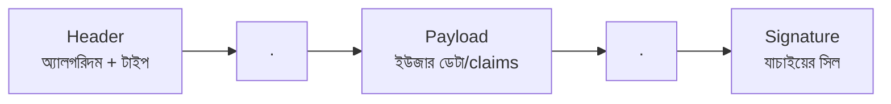
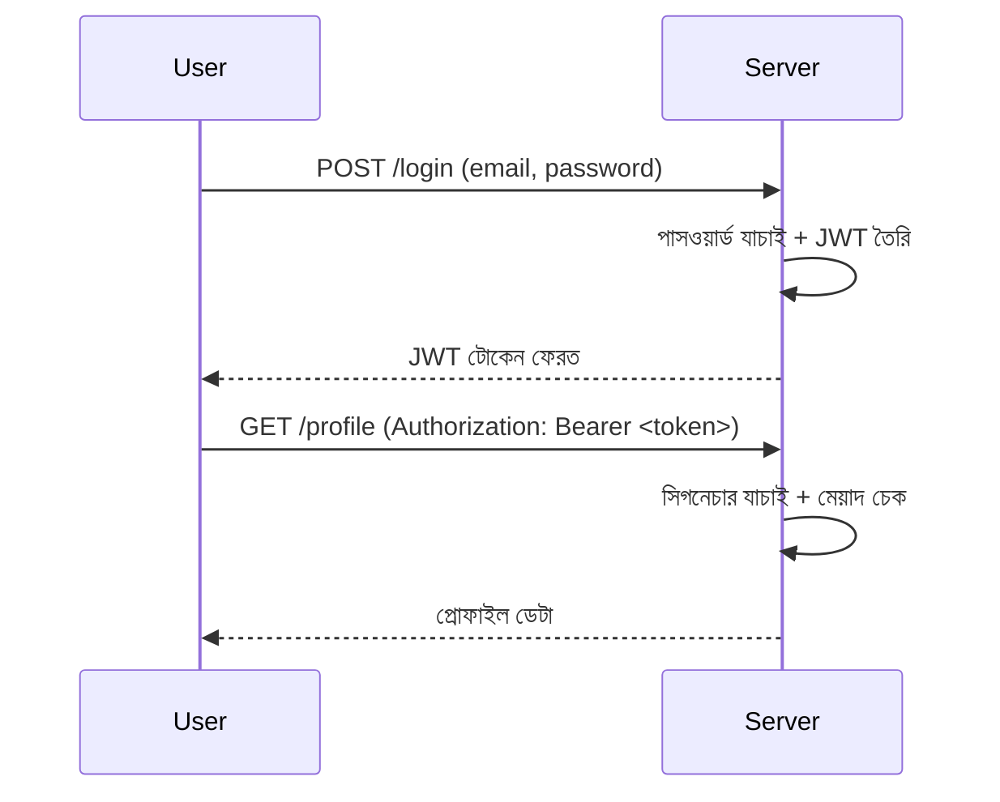

# ৩৭. Building Secure APIs With JWT Authentication

ধরো তুমি একটা রেস্টুরেন্টে ঢুকলে আর প্রতিবার খাবার অর্ডার করার সময় ওয়েটারকে নতুন করে প্রমাণ দিতে হলো তুমি কে, তোমার টেবিল কোনটা। বিরক্তিকর, তাই না? তার বদলে রেস্টুরেন্ট তোমাকে একটা "টেবিল নাম্বার কার্ড" দিয়ে দেয় — সেই কার্ড দেখালেই সবাই বুঝে যায় তুমি কে, আলাদা করে যাচাই করার দরকার পড়ে না। ওয়েব API-তে এই কার্ডের নামই **JWT (JSON Web Token)**।

আগেকার দিনের ওয়েব অ্যাপগুলো **session-based authentication** ব্যবহার করতো — সার্ভার লগইনের পর একটা সেশন তৈরি করে মেমরি বা ডাটাবেজে জমা রাখতো, আর ইউজারকে দিতো শুধু একটা আইডি। প্রতিটা রিকোয়েস্টে সার্ভার সেই আইডি দিয়ে ডাটাবেজে গিয়ে চেক করতো "এই সেশন কি এখনও বৈধ?"। এতে সার্ভারকে প্রতিটা ইউজারের অবস্থা মনে রাখতে হয় — একে বলে **stateful**। কিন্তু যখন একটা সিস্টেমে একাধিক সার্ভার থাকে (module 26-27-এ HTTP সার্ভার নিয়ে যা শিখেছো তার বড় সংস্করণ ভাবো), তখন সব সার্ভারকে একই সেশন তথ্য শেয়ার করতে হয় — জটিল ব্যাপার।

JWT এই সমস্যাটা উল্টে দেয়। সার্ভার কিছু মনে রাখে না — বরং ইউজারের পরিচয় আর প্রয়োজনীয় তথ্য টোকেনের ভেতরেই সিল করে দেয়, আর ইউজার সেই টোকেন প্রতিটা রিকোয়েস্টে সাথে করে পাঠায়। একে বলে **stateless authentication**। টোকেনটা আসলে তিনটা অংশ, ডট (`.`) দিয়ে জোড়া লাগানো:



**Header** বলে দেয় কোন সাইনিং অ্যালগরিদম ব্যবহৃত হয়েছে (যেমন HS256)। **Payload**-এ থাকে ইউজারের তথ্য — যেমন ইউজার আইডি, রোল, মেয়াদ শেষের সময় — এগুলোকে বলে **claims**। আর **Signature** হলো সার্ভারের একটা গোপন চাবি (secret key) দিয়ে হেডার আর পেলোড মিলিয়ে বানানো একটা সিল, যেটা প্রমাণ করে টোকেনটা মাঝপথে কেউ বদলায়নি।

পুরো প্রক্রিয়াটা লগইন থেকে শুরু করে API কল পর্যন্ত এভাবে দেখা যায়:



Go-তে জনপ্রিয় লাইব্রেরি হলো `golang-jwt/jwt`। টোকেন বানানো এরকম দেখতে:

```go
package main

import (
	"fmt"
	"time"

	"github.com/golang-jwt/jwt/v5"
)

var secretKey = []byte("এইটা-প্রোডাকশনে-env-var-থেকে-আসবে")

func generateToken(userID string) (string, error) {
	claims := jwt.MapClaims{
		"user_id": userID,
		"exp":     time.Now().Add(24 * time.Hour).Unix(),
	}
	token := jwt.NewWithClaims(jwt.SigningMethodHS256, claims)
	return token.SignedString(secretKey)
}

func verifyToken(tokenStr string) (jwt.MapClaims, error) {
	token, err := jwt.Parse(tokenStr, func(t *jwt.Token) (interface{}, error) {
		return secretKey, nil
	})
	if err != nil || !token.Valid {
		return nil, fmt.Errorf("invalid token")
	}
	claims, _ := token.Claims.(jwt.MapClaims)
	return claims, nil
}
```

লক্ষ করো, `exp` claim-টা টোকেনের মেয়াদ ঠিক করে দেয় — এটা ছাড়া টোকেন চিরকাল বৈধ থেকে যাবে, যা নিরাপত্তার দিক থেকে বিপজ্জনক। বাস্তব API-তে এই `verifyToken` ফাংশনটাকে একটা **middleware** হিসেবে বসানো হয়, যা প্রতিটা সুরক্ষিত রুটের আগে চলে এবং টোকেন না থাকলে বা অবৈধ হলে রিকোয়েস্ট আটকে দেয়।

JWT স্টেটলেস হওয়ায় স্কেল করা সহজ, কিন্তু একটা মূল্যও আছে — টোকেন ইস্যু হওয়ার পর সার্ভার চাইলেই সেটা "বাতিল" করতে পারে না, যতক্ষণ না মেয়াদ শেষ হয় (বা আলাদা ব্ল্যাকলিস্ট ব্যবস্থা রাখা হয়)। এই ট্রেড-অফটা মাথায় রেখেই পরের লেসনে আমরা দেখবো OAuth2 আর API Key — কখন JWT-এর বদলে এগুলো বেছে নেওয়া উচিত।
