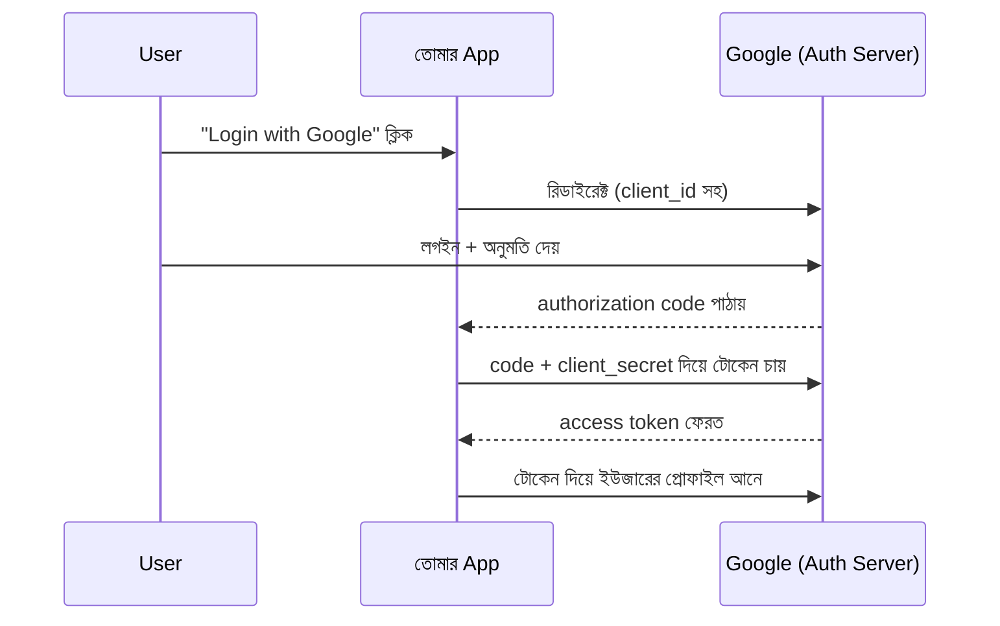

# ৩৮. OAuth2 And API Key Authentication In Go

গত লেসনে আমরা দেখেছি JWT কীভাবে একজন ইউজারের পরিচয় বহন করে। কিন্তু একটা প্রশ্ন থেকে যায় — "Login with Google" বাটনে ক্লিক করলে তুমি কখনো তোমার Google পাসওয়ার্ড আমাদের অ্যাপকে দাও না, তবুও অ্যাপটা তোমার প্রোফাইল তথ্য পেয়ে যায় কীভাবে? এই জাদুর নাম **OAuth2**।

OAuth2-কে সহজভাবে বুঝতে একটা হোটেলের চাবিকার্ডের কথা ভাবো। তুমি হোটেলের মাস্টার-কি নিজে হাতে পাও না — রিসেপশন তোমাকে একটা সীমিত ক্ষমতার কার্ড দেয়, যেটা শুধু তোমার রুম আর জিম খুলতে পারে, নির্দিষ্ট সময়ের জন্য। ঠিক তেমনই OAuth2-এ তুমি তোমার Google পাসওয়ার্ড কাউকে দাও না — বরং Google নিজে একটা সীমিত-ক্ষমতার **access token** ইস্যু করে দেয় থার্ড-পার্টি অ্যাপকে।

সবচেয়ে বহুল ব্যবহৃত ফ্লো হলো **Authorization Code Grant**:



লক্ষ করো, `client_secret`-টা কখনো ইউজারের ব্রাউজারে যায় না — শুধু সার্ভার-টু-সার্ভার কথোপকথনে ব্যবহৃত হয়, তাই এটা নিরাপদ থাকে। Go-তে এই পুরো ফ্লো নিজে হাতে না লিখে `golang.org/x/oauth2` প্যাকেজ ব্যবহার করাই বুদ্ধিমানের কাজ, কারণ প্রোটোকলের খুঁটিনাটি ভুল হলে বড় নিরাপত্তা ফাঁক তৈরি হয়।

এখন প্রশ্ন হলো — সব জায়গায় কি OAuth2 লাগবে? না। তিনটা পদ্ধতির মধ্যে পার্থক্যটা বুঝে নেওয়া জরুরি:

**JWT** ব্যবহার করো যখন তোমার নিজস্ব ইউজার সিস্টেম আছে আর তুমি নিজেই লগইন সামলাচ্ছো — যেমন গত লেসনের উদাহরণ। **OAuth2** দরকার যখন থার্ড-পার্টি সার্ভিস (Google, GitHub, Facebook) দিয়ে লগইন করাতে চাও, অথবা তোমার API অন্য অ্যাপকে সীমিত অনুমতি দিতে চাও। আর **API Key** সবচেয়ে সরল — যখন কোনো নির্দিষ্ট ব্যক্তি নয়, বরং একটা সার্ভিস বা স্ক্রিপ্ট তোমার API ব্যবহার করবে (যেমন একটা ওয়েদার API-কে কল করা), তখন একটা দীর্ঘ, র‍্যান্ডম স্ট্রিং-ই যথেষ্ট।

API Key মিডলওয়্যার Go-তে খুবই সাদাসিধা:

```go
package main

import "net/http"

var validAPIKeys = map[string]bool{
	"sk_live_abc123xyz": true,
}

func apiKeyMiddleware(next http.Handler) http.Handler {
	return http.HandlerFunc(func(w http.ResponseWriter, r *http.Request) {
		key := r.Header.Get("X-API-Key")
		if !validAPIKeys[key] {
			http.Error(w, "unauthorized", http.StatusUnauthorized)
			return
		}
		next.ServeHTTP(w, r)
	})
}
```

এই মিডলওয়্যারটা module 26-27-এ শেখা HTTP হ্যান্ডলারের সামনে বসিয়ে দিলেই কাজ শেষ — প্রতিটা রিকোয়েস্টে হেডারে সঠিক চাবি না থাকলে সে ভেতরে ঢুকতেই দেবে না। বাস্তব সিস্টেমে অবশ্য `validAPIKeys`-টা কোডে হার্ডকোড না করে ডাটাবেজ বা env var থেকে আসা উচিত — এই "সিক্রেট কোডে না রাখা"-র নীতিটাই পরের লেসনে secure coding practices-এ আরও গভীরভাবে দেখবো।

তিনটা পদ্ধতিই আলাদা সমস্যার সমাধান করে, কিন্তু একটা জিনিস সবগুলোতেই কমন — পরিচয় যাচাইয়ের পাশাপাশি সংবেদনশীল ডেটা (পাসওয়ার্ড, চাবি) সংরক্ষণের ধরনটাও সমান গুরুত্বপূর্ণ, আর সেটাই আমাদের পরের লেসনের বিষয়।
