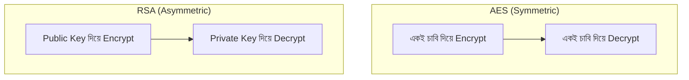

# ৩৯. Hashing And Encryption Techniques (Bcrypt, AES, RSA)

ধরো তোমার কাছে দুই ধরনের জিনিস আছে — একটা হলো তোমার বাসার চাবি, যেটা তুমি মাঝেমধ্যে খুলে আবার দরজা লাগাও; আরেকটা হলো একটা কাগজ যেটা তুমি ব্লেন্ডারে ফেলে পুরোপুরি গুঁড়ো করে দিলে — এখন সেই কাগজ থেকে আর কখনো আসল লেখা ফিরিয়ে আনা যাবে না। প্রথমটা হলো **encryption** (রিভার্সিবল, চাবি দিয়ে খোলা যায়), আর দ্বিতীয়টা হলো **hashing** (ওয়ান-ওয়ে, একবার হলে আর ফেরানো যায় না)। এই পার্থক্যটা বুঝলেই নিরাপত্তার অর্ধেক কাজ পরিষ্কার হয়ে যায়।

পাসওয়ার্ড কখনো সরাসরি ডাটাবেজে (module 32-এ শেখা ডাটাবেজে) রাখা উচিত না — কারণ ডাটাবেজ ফাঁস হলে সব ইউজারের পাসওয়ার্ড সরাসরি হাতে চলে যাবে। তার বদলে পাসওয়ার্ডকে **hash** করে রাখা হয়, যার সবচেয়ে জনপ্রিয় অ্যালগরিদম **bcrypt**। bcrypt-এর বিশেষত্ব হলো এটা ইচ্ছাকৃতভাবে "ধীর" — যাতে কেউ লাখ লাখ পাসওয়ার্ড অনুমান করে দ্রুত মিলিয়ে দেখতে না পারে (একে বলে brute-force attack ঠেকানো)। এমনকি একই পাসওয়ার্ড দুইজন ব্যবহার করলেও bcrypt প্রতিবার আলাদা hash তৈরি করে, কারণ এতে একটা এলোমেলো **salt** যোগ হয়।

```go
package main

import (
	"fmt"
	"golang.org/x/crypto/bcrypt"
)

func hashPassword(password string) (string, error) {
	bytes, err := bcrypt.GenerateFromPassword([]byte(password), bcrypt.DefaultCost)
	return string(bytes), err
}

func checkPassword(password, hash string) bool {
	err := bcrypt.CompareHashAndPassword([]byte(hash), []byte(password))
	return err == nil
}

func main() {
	hash, _ := hashPassword("myS3cretPass")
	fmt.Println("Stored hash:", hash)
	fmt.Println("Login attempt valid?", checkPassword("myS3cretPass", hash))
}
```

লক্ষ করো, `checkPassword` কখনো hash-কে ফিরিয়ে আসল পাসওয়ার্ড বের করে না — বরং নতুন করে ইনপুট পাসওয়ার্ডকে হ্যাশ করে দুটো হ্যাশ মিলিয়ে দেখে। এটাই ওয়ান-ওয়ে হ্যাশিং-এর মূল কথা।

এখন এমন কিছু ডেটা আছে যেগুলো hash করলে চলবে না, কারণ পরে আবার আসল রূপে ফিরিয়ে আনতে হবে — যেমন একজন ইউজারের ক্রেডিট কার্ড নম্বর সাময়িকভাবে সংরক্ষণ, বা দুই সার্ভারের মধ্যে গোপন বার্তা আদান-প্রদান। এখানে দরকার **encryption**, আর সেটা দুই রকমের হয়:



**AES (Advanced Encryption Standard)** হলো **symmetric encryption** — একটাই গোপন চাবি দিয়ে ডেটা লক আর আনলক দুটোই হয়। এটা খুব দ্রুত, তাই বড় ডেটা (ফাইল, ডাটাবেজ কলাম) এনক্রিপ্ট করতে ব্যবহৃত হয়। সমস্যা হলো — চাবিটা দুই পক্ষের কাছেই থাকতে হয়, তাই চাবি আদান-প্রদানই একটা নিরাপত্তা চ্যালেঞ্জ হয়ে দাঁড়ায়।

**RSA** হলো **asymmetric encryption** — এখানে দুটো আলাদা চাবি থাকে, একটা **public key** (সবার জন্য উন্মুক্ত) আর একটা **private key** (শুধু মালিকের কাছে গোপন)। যেকেউ public key দিয়ে ডেটা লক করতে পারে, কিন্তু খোলা যাবে শুধু সংশ্লিষ্ট private key দিয়ে। এটাই TLS/HTTPS-এর ভিত্তি, যা আমরা পরের লেসনে বিস্তারিত দেখবো। RSA নিরাপদ কিন্তু AES-এর তুলনায় ধীর, তাই সাধারণত এটা শুধু একটা ছোট "সেশন চাবি" আদান-প্রদানে ব্যবহৃত হয়, আর বাকি বড় ডেটা এনক্রিপ্ট হয় AES দিয়ে।

সংক্ষেপে — পাসওয়ার্ডের জন্য **bcrypt** (hash, কখনো ফেরানো লাগবে না), দ্রুত বড় ডেটার জন্য **AES** (একই চাবি দুই পক্ষে), আর চাবি নিরাপদে আদান-প্রদানের জন্য **RSA** (পাবলিক/প্রাইভেট জোড়া)। এই তিনটা টুল হাতে থাকলে পরের লেসনে আমরা দেখবো কীভাবে পুরো কোডবেসকে নিরাপদ অভ্যাসে গড়ে তোলা যায়।
