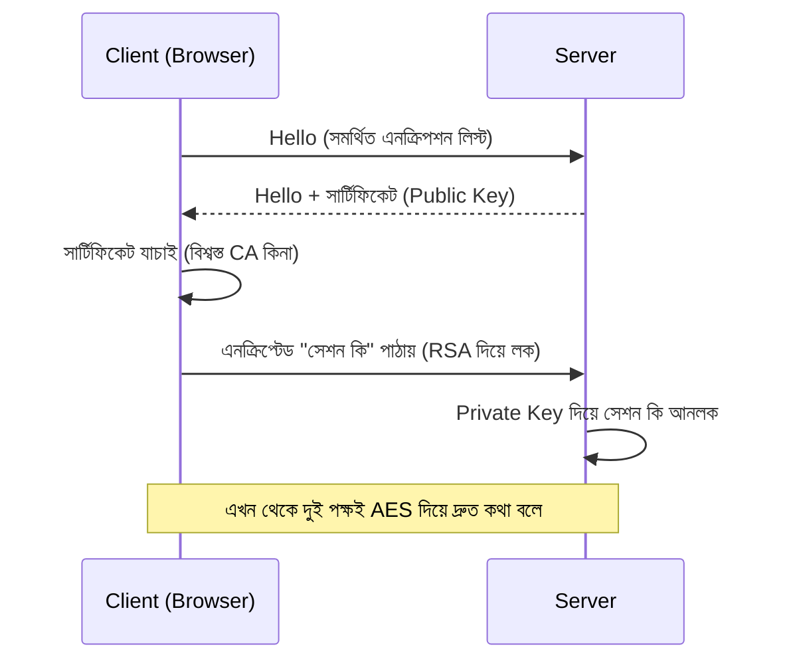

# ৪১. TLS And HTTPS In Go

মনে করো তুমি একটা চিঠি পাঠাচ্ছো ডাকযোগে, খামে না ভরেই, খোলা পাতায়। পথের মধ্যে ডাকপিয়ন, পোস্ট অফিসের কর্মী — যে কেউ চাইলেই পড়ে ফেলতে পারবে কী লেখা আছে। **HTTP**-তে ডেটা আসলে এভাবেই যাতায়াত করে — প্লেইন টেক্সটে, খোলা অবস্থায়। module 26-27-এ আমরা যে HTTP সার্ভার বানিয়েছিলাম, সেটা যদি প্রোডাকশনে এভাবেই চলে, তাহলে ইউজারের পাসওয়ার্ড, JWT টোকেন (lesson 37), কার্ড নম্বর — সবকিছু নেটওয়ার্কের মাঝে কেউ আড়ি পেতে পড়ে ফেলতে পারে। একে বলে **man-in-the-middle attack**।

**TLS (Transport Layer Security)** হলো সেই খামটা — যেটা চিঠিকে বন্ধ করে দেয়, শুধু প্রাপক আর প্রেরকই খুলতে পারে। HTTP-এর ওপর TLS বসালে সেটা হয়ে যায় **HTTPS**। TLS-এর ভেতরে ঠিক কী ঘটে তা বুঝতে একটা "হাত মেলানোর" (handshake) প্রক্রিয়া দেখা যাক:



লক্ষ করো, এই হ্যান্ডশেকে lesson 39-এ শেখা দুটো টেকনিকই কাজে লাগছে — শুরুতে **RSA** (asymmetric) দিয়ে নিরাপদে একটা সাময়িক চাবি আদান-প্রদান হয়, তারপর বাকি পুরো কথোপকথন চলে **AES** (symmetric) দিয়ে, কারণ AES দ্রুত। এই মিশ্র কৌশলটাই TLS-কে দ্রুত এবং নিরাপদ দুটোই বানায়।

সার্ভার তার পরিচয় প্রমাণ করে একটা **certificate** দিয়ে, যেটা ইস্যু করে একটা বিশ্বস্ত তৃতীয় পক্ষ — **Certificate Authority (CA)**, যেমন Let's Encrypt। ব্রাউজার আগে থেকেই জানে কোন কোন CA-কে বিশ্বাস করা যায়, তাই সে সার্টিফিকেট দেখে যাচাই করে নেয় সার্ভারটা সত্যিই যা দাবি করছে সেটাই কিনা।

Go-তে HTTPS সার্ভার চালানো খুবই সহজ — `http.ListenAndServe`-এর বদলে শুধু `ListenAndServeTLS` ব্যবহার করলেই হয়:

```go
package main

import "net/http"

func main() {
	mux := http.NewServeMux()
	mux.HandleFunc("/", func(w http.ResponseWriter, r *http.Request) {
		w.Write([]byte("Secure hello!"))
	})

	err := http.ListenAndServeTLS(":443", "cert.pem", "key.pem", mux)
	if err != nil {
		panic(err)
	}
}
```

এখানে `cert.pem` হলো সার্টিফিকেট (public key সহ), আর `key.pem` হলো সার্ভারের গোপন private key। ডেভেলপমেন্টের সময় নিজেই একটা "self-signed certificate" বানিয়ে টেস্ট করা যায় (`openssl` দিয়ে), কিন্তু প্রোডাকশনে অবশ্যই Let's Encrypt-এর মতো বিশ্বস্ত CA থেকে সার্টিফিকেট নিতে হবে — নাহলে ব্রাউজার ইউজারকে ভয়ংকর সতর্কবার্তা দেখাবে।

কেন এটা এত জরুরি? কারণ আজকের ব্যাকএন্ড শুধু একটা স্ট্যাটিক পেজ দেখায় না — এটা লগইন সামলায়, পেমেন্ট প্রসেস করে, ব্যক্তিগত ডেটা বহন করে। HTTPS ছাড়া এই সবকিছু ঝুঁকিতে থাকে, আর আধুনিক ব্রাউজারগুলো এখন HTTP সাইটকে সরাসরি "Not Secure" বলে চিহ্নিত করে দেয়।

TLS নেটওয়ার্কের স্তরে ডেটা রক্ষা করে, কিন্তু কোডের গঠনগত মান আর টেস্টযোগ্যতাও সমান জরুরি — আর সেখান থেকেই আমরা পরের লেসনে ঢুকবো Dependency Injection-এর জগতে।
