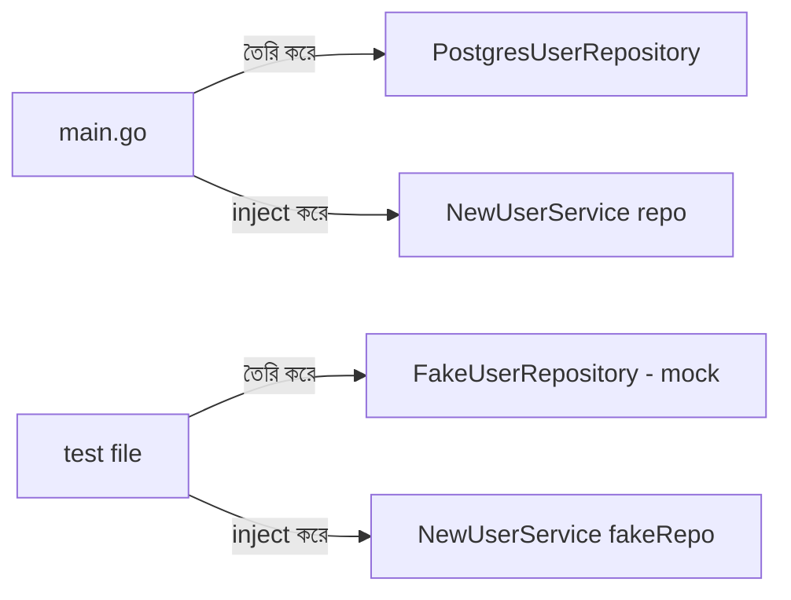

# ৪২. Dependency Injection in Go

TypeScript আর OOP নিয়ে Module 13-14-এ কাজ করার সময় হয়তো "Dependency Injection" শব্দটা শুনেছিলে, বিশেষ করে NestJS-এর মতো ফ্রেমওয়ার্কে এটা কেন্দ্রীয় একটা ধারণা। Go-তে কোনো বিল্ট-ইন DI ফ্রেমওয়ার্ক নেই, কিন্তু ধারণাটা ঠিক ততটাই গুরুত্বপূর্ণ — শুধু বাস্তবায়নটা অনেক সহজ আর explicit।

Dependency Injection মানে হলো — একটা ফাংশন বা struct তার প্রয়োজনীয় জিনিসগুলো (যেমন ডাটাবেজ কানেকশন, লগার) নিজে তৈরি না করে, বাইরে থেকে "ইনজেক্ট" (পাস) করে নেয়া। এতে করে কোড টেস্ট করা সহজ হয়, আর নির্ভরতা পরিবর্তন করা সহজ হয়।

ধরো একটা `UserService` আছে যেটার ডাটাবেজ দরকার। খারাপ পদ্ধতি হলো সরাসরি ভেতরে ডাটাবেজ কানেকশন তৈরি করে ফেলা:

```go
// খারাপ: hardcoded dependency
type UserService struct{}

func (s *UserService) GetUser(id int) (*User, error) {
	db, _ := sql.Open("postgres", "hardcoded-connection-string")
	// ... db ব্যবহার করে কোয়েরি
}
```

এই কোড টেস্ট করা প্রায় অসম্ভব, কারণ প্রতিবার আসল ডাটাবেজের সাথে কানেক্ট করতে হবে। এর বদলে, Interface-based Dependency Injection ব্যবহার করা যাক — যেটা লেসন ৬-এ শেখা interface-এর একটা সরাসরি প্রয়োগ:

```go
// ভালো: interface-এর মাধ্যমে dependency ইনজেক্ট করা
type UserRepository interface {
	FindByID(id int) (*User, error)
}

type UserService struct {
	repo UserRepository // dependency, কনক্রিট টাইপ না
}

func NewUserService(repo UserRepository) *UserService {
	return &UserService{repo: repo}
}

func (s *UserService) GetUser(id int) (*User, error) {
	return s.repo.FindByID(id)
}
```



এখন `UserService`-কে টেস্ট করার সময় (লেসন ১৫-এ শেখা `testing` প্যাকেজ দিয়ে), আসল ডাটাবেজের বদলে একটা "fake" `UserRepository` বসিয়ে দেয়া যায়:

```go
type FakeUserRepository struct{}

func (f *FakeUserRepository) FindByID(id int) (*User, error) {
	return &User{ID: id, Name: "টেস্ট ইউজার"}, nil
}

func TestGetUser(t *testing.T) {
	service := NewUserService(&FakeUserRepository{})
	user, _ := service.GetUser(1)
	if user.Name != "টেস্ট ইউজার" {
		t.Errorf("প্রত্যাশিত টেস্ট ইউজার, পাওয়া গেলো %s", user.Name)
	}
}
```

লক্ষ্য করো, `UserService` জানেই না তার `repo` আসল PostgreSQL নাকি একটা fake — সে শুধু জানে এটা `UserRepository` ইন্টারফেসের শর্ত পূরণ করে। এটাই DI-এর আসল শক্তি — কম্পোনেন্টগুলোকে একে অপরের থেকে আলগা (decoupled) রাখা।

বড় প্রজেক্টে যখন dozens dependency (ডাটাবেজ, ক্যাশ, লগার, একাধিক সার্ভিস) হাতে হাতে wiring করা কষ্টকর হয়ে যায়, তখন `google/wire` বা `uber-go/fx`-এর মতো লাইব্রেরি ব্যবহার করা হয়, যেগুলো এই wiring স্বয়ংক্রিয় করে দেয়। কিন্তু সেগুলো ব্যবহারের আগে হাতে-কলমে DI-এর মূল ধারণাটা বোঝা জরুরি, যেটা আমরা এইমাত্র করলাম।

Go-এর একটা মজার শক্তি হলো, এই ধরনের নমনীয় কোড লেখা সম্ভব হয় কারণ ভাষাটা রানটাইমে টাইপ নিয়ে অনেক কিছু জানতে আর পরিবর্তন করতে দেয় — এই ক্ষমতাটার নাম **reflection**, যেটাই আমাদের পরের লেসনের বিষয়।
