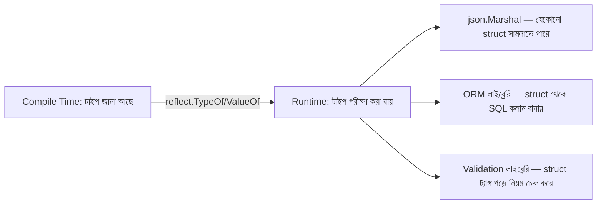

# ৪৩. Reflection in Go

পুরো এই মডিউল জুড়ে আমরা Go-কে একটা **স্ট্যাটিক্যালি টাইপড** ভাষা হিসেবে ব্যবহার করেছি — প্রতিটা ভ্যারিয়েবলের টাইপ কম্পাইল টাইমেই ঠিক হয়ে যায় (লেসন ৩)। কিন্তু মাঝে মাঝে এমন পরিস্থিতি আসে যেখানে একটা ফাংশনকে রানটাইমে জানতে হয় একটা ভ্যারিয়েবলের টাইপ কী, বা তার ফিল্ডগুলো কী কী — এটাই কেন `encoding/json`-এর `json.Marshal(anyStruct)` যেকোনো struct নিয়ে কাজ করতে পারে, তুমি আগে থেকে না বলে দিলেও। এই "রানটাইমে টাইপ পরীক্ষা করার" ক্ষমতার নাম **reflection**, আর Go-তে এটা থাকে `reflect` প্যাকেজে।

```go
package main

import (
	"fmt"
	"reflect"
)

type User struct {
	Name string
	Age  int
}

func main() {
	u := User{Name: "রাফি", Age: 28}

	t := reflect.TypeOf(u)
	v := reflect.ValueOf(u)

	for i := 0; i < t.NumField(); i++ {
		field := t.Field(i)
		value := v.Field(i)
		fmt.Printf("%s (%s) = %v\n", field.Name, field.Type, value)
	}
}
```

এই কোডটা `User` struct-এর প্রতিটা ফিল্ডের নাম, টাইপ, আর মান একে একে প্রিন্ট করে — অথচ কোডটা `User`-এর ভেতরের গঠন সম্পর্কে আগে থেকে কিছুই জানে না। ঠিক এই একই কৌশল দিয়ে `encoding/json` তোমার লেখা যেকোনো struct-কে JSON-এ রূপান্তর করে — সে ফিল্ড ট্যাগ (`json:"name"`) পড়ে, প্রতিটা ফিল্ডের মান বের করে, JSON বানিয়ে ফেলে।



Reflection দিয়ে ফিল্ডের মান পরিবর্তনও করা যায়, কিন্তু তার জন্য একটা পয়েন্টার (লেসন ১০-এ শেখা ধারণা) পাস করতে হয়, কারণ মান পরিবর্তন করতে হলে আসল মেমোরি ঠিকানায় লেখার অনুমতি লাগে:

```go
func setName(u *User, newName string) {
	v := reflect.ValueOf(u).Elem() // Elem() পয়েন্টারকে "আনরাপ" করে
	nameField := v.FieldByName("Name")
	if nameField.CanSet() {
		nameField.SetString(newName)
	}
}
```

তবে reflection নিয়ে একটা গুরুত্বপূর্ণ সতর্কতা আছে — এটা শক্তিশালী, কিন্তু **ধীরগতির** (compile-time টাইপ চেকিং না থাকায় রানটাইমে অতিরিক্ত কাজ করতে হয়), আর ভুল ব্যবহারে প্রোগ্রাম **panic** করতে পারে (লেসন ১৩-এ শেখা)। তাই সাধারণ বিজনেস লজিকে reflection ব্যবহার করা উচিত না — এটা মূলত লাইব্রেরি/ফ্রেমওয়ার্ক লেখকদের টুল (যেমন JSON এনকোডার, ORM, ভ্যালিডেশন লাইব্রেরি বানানোর সময়), সাধারণ অ্যাপ্লিকেশন কোডে না।

Reflection আমাদের দেখালো কীভাবে রানটাইমে কোড নিজের গঠন নিয়ে চিন্তা করতে পারে। পরের লেসনে আমরা উল্টো দিকে যাবো — কম্পাইল টাইমেই কীভাবে কোড স্বয়ংক্রিয়ভাবে জেনারেট করা যায়, যাতে রানটাইমে reflection-এর ধীরগতির খরচ ছাড়াই একই সুবিধা পাওয়া যায়।
