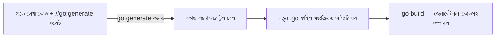

# ৪৪. Code Generation in Go (Using go generate)

আগের লেসনে আমরা শিখেছি reflection দিয়ে রানটাইমে টাইপ নিয়ে কাজ করা যায়, কিন্তু তার একটা খরচ আছে — গতি কমে যায়। Go কমিউনিটির একটা প্রিয় দর্শন হলো, "যা কম্পাইল টাইমে করা সম্ভব, সেটা রানটাইমে করো না।" এই দর্শনের একটা বাস্তব প্রয়োগ হলো **কোড জেনারেশন** — রানটাইমে reflection দিয়ে অনুমান করার বদলে, কম্পাইল করার আগেই আসল Go কোড স্বয়ংক্রিয়ভাবে লিখে ফেলা।

Go-তে এই কাজের জন্য একটা বিল্ট-ইন কমান্ড আছে — `go generate`। এটা নিজে কোনো জাদু করে না, বরং তোমার কোডে লেখা বিশেষ কমেন্ট (`//go:generate ...`) খুঁজে বের করে, আর সেই কমান্ডগুলো একে একে চালায়।

সবচেয়ে পরিচিত উদাহরণ হলো `Stringer` ইন্টারফেস অটো-জেনারেট করা। ধরো তোমার একটা enum-এর মতো টাইপ আছে:

```go
package main

//go:generate stringer -type=Status

type Status int

const (
	Pending Status = iota
	Active
	Cancelled
)
```

এখানে `Status(0)` প্রিন্ট করলে ডিফল্টভাবে শুধু `0` দেখাবে, `Pending` না। টার্মিনালে `go generate ./...` চালালে, `stringer` টুল একটা নতুন ফাইল (`status_string.go`) বানিয়ে দেয়, যেখানে `String()` মেথড অটো-জেনারেট হয়:

```go
// status_string.go (স্বয়ংক্রিয়ভাবে তৈরি — হাতে এডিট করা হয় না)
func (s Status) String() string {
	switch s {
	case Pending:
		return "Pending"
	case Active:
		return "Active"
	case Cancelled:
		return "Cancelled"
	}
	return "Unknown"
}
```



এই একই প্যাটার্ন বড় প্রজেক্টে আরো গুরুত্বপূর্ণ জায়গায় ব্যবহার হয় — যেমন Module 46-এর লেসন ৩১-এ শেখা **gRPC**-তে, `.proto` ফাইল থেকে সম্পূর্ণ Go struct আর সার্ভিস কোড অটো-জেনারেট হয় `protoc` টুল দিয়ে। কেউ হাতে সেই হাজার লাইনের boilerplate কোড লেখে না — মূল সংজ্ঞা (`.proto` ফাইল) একবার লিখলেই কোড জেনারেট হয়ে যায়। একইভাবে ORM লাইব্রেরি Ent (লেসন ৩৪-এ উল্লেখ করা) পুরোপুরি কোড জেনারেশনের উপর ভিত্তি করে কাজ করে — schema লিখলে, পুরো টাইপ-সেফ কোয়েরি API অটো-জেনারেট হয়ে যায়।

কোড জেনারেশনের সবচেয়ে বড় সুবিধা হলো — জেনারেট হওয়া কোড একদম সাধারণ, ডিবাগযোগ্য Go কোড, reflection-এর মতো রানটাইমে "জাদু" ঘটায় না। ফলে পারফরম্যান্স ভালো থাকে, আর কম্পাইল টাইমেই ভুল ধরা পড়ে যায় (যেমন কোনো ফিল্ড ভুল বানান করলে, রানটাইমে না, কম্পাইলেই এরর দেখাবে)।

এতদিন আমরা কোড লেখা, গঠন করা, নিরাপদ করা নিয়ে কথা বলেছি। এই মডিউলের একদম শেষ লেসনে আমরা দেখবো — কোড ঠিকঠাক চললেও সেটা কতটা দ্রুত চলছে তা কীভাবে মাপা যায়, আর কোথায় বাধা (bottleneck) আছে তা কীভাবে খুঁজে বের করা যায়।
