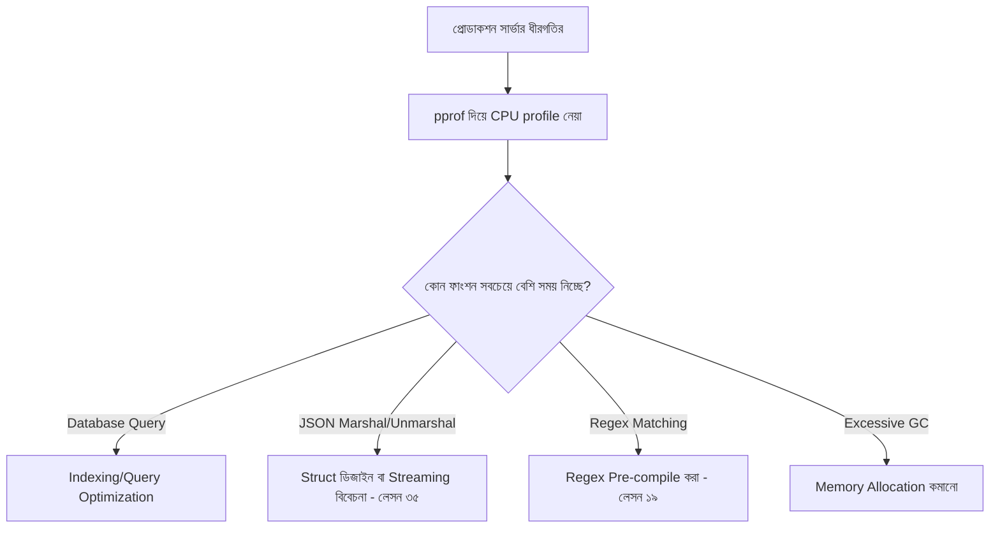

# ৪৫. Performance Optimization and Profiling in Go

এই মডিউলের যাত্রা শুরু হয়েছিল Go ভাষার পরিচয় দিয়ে, আর শেষ হচ্ছে একটা প্রশ্ন দিয়ে — কোড ঠিকঠাক কাজ করলেও, সেটা কি যথেষ্ট দ্রুত? লেসন ১৬-এ আমরা বেঞ্চমার্ক টেস্ট লিখে একটা ফাংশনের গতি মেপেছিলাম। কিন্তু বাস্তব প্রোডাকশন সমস্যায় প্রশ্নটা আরো জটিল — পুরো প্রোগ্রামের **কোন অংশে** সময় সবচেয়ে বেশি ব্যয় হচ্ছে? এই প্রশ্নের উত্তর দেয় **profiling**।

Go-এর স্ট্যান্ডার্ড লাইব্রেরিতে একটা চমৎকার বিল্ট-ইন টুল আছে — `pprof`। একটা লাইভ সার্ভারে এটা যোগ করা আশ্চর্যজনকভাবে সহজ:

```go
package main

import (
	"net/http"
	_ "net/http/pprof" // শুধু import করলেই যথেষ্ট, সাইড-ইফেক্ট হিসেবে রেজিস্টার হয়
)

func main() {
	go func() {
		http.ListenAndServe("localhost:6060", nil) // pprof এন্ডপয়েন্ট
	}()

	// ... আসল অ্যাপ্লিকেশন সার্ভার (লেসন ২৬-এর মতো)
	http.ListenAndServe(":8080", nil)
}
```

`_ "net/http/pprof"` লাইনটা লক্ষ্য করো — আন্ডারস্কোর মানে "এই প্যাকেজ ব্যবহার করছি না সরাসরি, কিন্তু এর `init()` ফাংশন চালাতে চাই" (এই ধরনের import-কে বলে blank import)। এই একটা লাইন যোগ করলেই `localhost:6060/debug/pprof/` এ গিয়ে সার্ভারের CPU ব্যবহার, মেমোরি অ্যালোকেশন, আর গোরুটিন (লেসন ৭) সংখ্যা লাইভ দেখা যায়।

CPU profile সংগ্রহ করে বিশ্লেষণ করা যায় টার্মিনাল থেকে:

```bash
go tool pprof http://localhost:6060/debug/pprof/profile?seconds=30
```

এই কমান্ড ৩০ সেকেন্ড ধরে সার্ভার পর্যবেক্ষণ করে, তারপর একটা ইন্টারেক্টিভ শেল খোলে যেখানে `top` কমান্ড দিয়ে দেখা যায় কোন ফাংশন সবচেয়ে বেশি CPU সময় খাচ্ছে।



মেমোরি সমস্যার জন্য আলাদা একটা heap profile আছে:

```bash
go tool pprof http://localhost:6060/debug/pprof/heap
```

এটা দেখায় কোন কোন জায়গায় সবচেয়ে বেশি মেমোরি অ্যালোকেট হচ্ছে — যেমন যদি দেখা যায় প্রতিটা রিকোয়েস্টে অপ্রয়োজনীয়ভাবে বড় স্লাইস (লেসন ১১) তৈরি হচ্ছে, সেটা চিহ্নিত করে ঠিক করা যায়।

একটা গুরুত্বপূর্ণ শিক্ষা হলো — **অনুমান করে অপটিমাইজ করা উচিত না**। অভিজ্ঞ ডেভেলপাররাও প্রায়ই ভুল ধারণা করে বসে কোন অংশ ধীর, কারণ মানুষের স্বজ্ঞা (intuition) প্রায়ই ভুল হয়। প্রোফাইলিং ছাড়া অপটিমাইজেশন করাটা "অন্ধকারে ঢিল ছোড়ার" মতো — সময় নষ্ট হয়, কিন্তু আসল সমস্যা থেকেই যায়। তাই নিয়মটা সবসময় — আগে মাপো, তারপর অপটিমাইজ করো।

এখানেই আমাদের Go ভাষার মৌলিক যাত্রা শেষ হলো — সিনট্যাক্স থেকে শুরু করে concurrency, নেটওয়ার্কিং, ডাটাবেজ, সিকিউরিটি, আর পারফরম্যান্স পর্যন্ত ৪৫টা লেসনের একটা পূর্ণাঙ্গ পথ। কিন্তু ভাষা শেখা আর ভাষা দিয়ে বাস্তব প্রোডাক্ট বানানো — দুটো ভিন্ন জিনিস। পরের মডিউলে আমরা এই সব জ্ঞান একসাথে নিয়ে একটা বাস্তব ওয়েব ফ্রেমওয়ার্ক — **Gin** — দিয়ে সত্যিকারের ব্যাকএন্ড API বানানো শুরু করবো।
