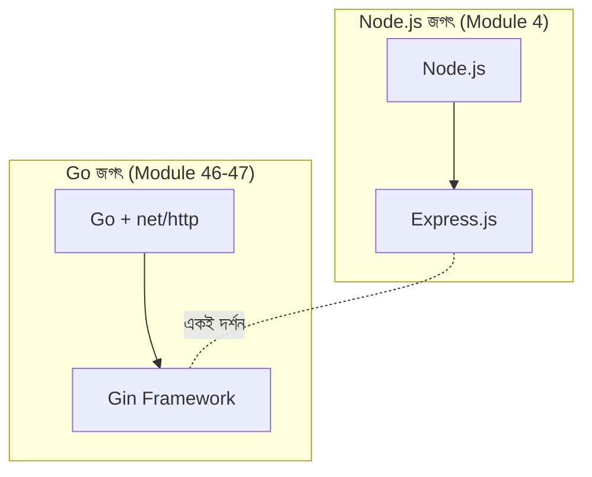
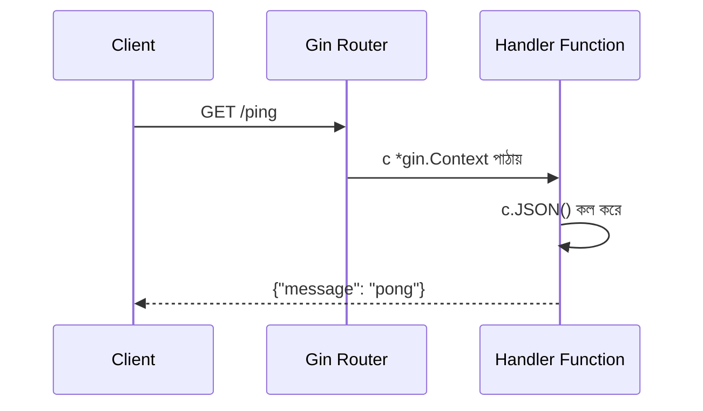

# ০১. Introduction to Gin Framework

Module 46-এ তুমি Go ভাষার ব্যাকরণ শিখেছো — variable, struct, function, goroutine, এমনকি নিজের হাতে বানানো একটা ছোট HTTP সার্ভারও চালিয়ে দেখেছো `net/http` প্যাকেজ দিয়ে। সেই সার্ভারটা কাজ করছিলো, কিন্তু নিশ্চয়ই খেয়াল করেছো — প্রতিটা রুট নিজে হাতে ম্যাপ করা লাগছিলো, প্রতিটা রিকোয়েস্ট প্যারামিটার নিজে হাতে parse করা লাগছিলো, JSON response নিজে হাতে বানাতে হচ্ছিলো। এই জায়গাটাতেই একটা প্রশ্ন স্বাভাবিকভাবেই চলে আসে — ঠিক যেমন Module 3-তে আমরা প্রশ্ন করেছিলাম "Node.js কেন দরকার", এখন প্রশ্ন করা দরকার "Go দিয়ে raw HTTP লেখা যখন সম্ভবই আছে, তাহলে Gin নামের একটা framework কেন লাগবে?"

উত্তরটা ঠিক একই যুক্তিতে দাঁড়িয়ে আছে, যেই যুক্তিতে Module 4-এ আমরা Express.js শিখেছিলাম Node.js-এর উপরে। Node.js নিজে একটা সার্ভার চালাতে পারে, কিন্তু routing, middleware, request parsing — এই সবকিছু বারবার হাতে লিখতে গেলে কোড অগোছালো আর পুনরাবৃত্তিমূলক হয়ে যায়। Express সেই সমস্যাগুলো সমাধান করেছিলো একটা পরিষ্কার, প্রেডিক্টেবল কাঠামো দিয়ে। Go-এর জগতে ঠিক সেই ভূমিকাটাই পালন করে **Gin**।

**Gin** হলো Go ভাষার জন্য লেখা একটা HTTP web framework, যেটা `net/http`-এর উপরেই তৈরি, কিন্তু তার চারপাশে বসিয়ে দিয়েছে একটা পরিষ্কার routing system, middleware chain, JSON বাইন্ডিং, আর ভ্যালিডেশন — অনেকটা Express.js-এর মতোই দর্শনে, কিন্তু Go-এর কম্পাইলড, স্ট্যাটিকালি-টাইপড জগতে। Gin-কে তুলনা করা যায় Node.js জগতের Express-এর সাথে সরাসরি — একই কাজ, ভিন্ন ভাষায়, কিন্তু Go-এর গতি আর টাইপ-সেফটি নিয়ে।



তাহলে Gin ঠিক কী কী সমস্যা সমাধান করে? তিনটা মূল জায়গায় নজর দেওয়া যাক।

**প্রথমত, routing সহজ হয়ে যায়।** raw `net/http`-এ প্রতিটা path-এর জন্য `if` কিংবা `switch` বসিয়ে ম্যানুয়ালি ম্যাচ করতে হয়। Gin দেয় একটা **router** অবজেক্ট, যেখানে তুমি বলে দাও "এই path, এই HTTP method-এ, এই function চালাও" — ঠিক যেভাবে Module 7-এ Express router নিয়ে কাজ করেছিলে।

**দ্বিতীয়ত, middleware চেইন তৈরি করা যায়।** Module 7-তে আমরা শিখেছিলাম middleware কী এবং কেন দরকার — logging, authentication, rate limiting এই ধরনের কাজ একবার লিখে বারবার ব্যবহার করা। Gin-এর মধ্যেও ঠিক একই ধারণা আছে, আর আমরা বিস্তারিত দেখবো Lesson 4-এ।

**তৃতীয়ত, JSON নিয়ে কাজ করা অসম্ভব সহজ।** Module 8-এ আমরা শিখেছিলাম JSON কীভাবে frontend থেকে backend-এ যায়। Gin-এর `c.JSON()` আর `c.ShouldBindJSON()` ফাংশন দুটো দিয়ে এই পুরো প্রক্রিয়াটা মাত্র এক লাইনে করা যায়।

এখন একটা ছোট কোড দেখে নেওয়া যাক, যাতে বোঝা যায় Gin আসলে দেখতে কেমন:

```go
package main

import (
    "net/http"

    "github.com/gin-gonic/gin"
)

func main() {
    router := gin.Default()

    router.GET("/ping", func(c *gin.Context) {
        c.JSON(http.StatusOK, gin.H{
            "message": "pong",
        })
    })

    router.Run(":8080")
}
```

এই কয়েক লাইন কোড একটা সম্পূর্ণ ওয়েব সার্ভার চালু করে দেয়, যেটা `/ping` নামের একটা রুটে GET রিকোয়েস্ট পেলে `{"message": "pong"}` রিটার্ন করে। খেয়াল করো `gin.Default()` — এটা একটা router তৈরি করে যার সাথে আগে থেকেই দুটো দরকারি middleware বসানো থাকে: logger আর panic-recovery। `gin.H` আসলে `map[string]interface{}`-এর একটা shortcut, যেটা দিয়ে সহজে JSON অবজেক্ট বানানো যায়। আর `c *gin.Context` হলো Gin-এর সবচেয়ে গুরুত্বপূর্ণ concept — প্রতিটা রিকোয়েস্ট-রেসপন্স চক্রের পুরো তথ্য (query param, body, header, response writer) এই একটা অবজেক্টের ভেতর দিয়েই বয়ে যায়।



Gin জনপ্রিয় হওয়ার আরেকটা বড় কারণ হলো এর **পারফরম্যান্স**। Gin ব্যবহার করে একটা কাস্টম HTTP router (`httprouter`-এর একটা রূপ) যেটা radix tree ব্যবহার করে রুট ম্যাচ করে — ফলে হাজার হাজার রুট থাকলেও ম্যাচিং হয় প্রায় সাথে সাথেই। এটা Go-এর native গতির সাথে যোগ হয়ে Gin-কে বানায় সবচেয়ে দ্রুততম web framework-গুলোর একটা, যেটা ভারী ট্র্যাফিক সামলানো backend সিস্টেমের জন্য দারুণ উপযোগী।

সামনের লেসনগুলোতে আমরা ধাপে ধাপে একটা পূর্ণাঙ্গ প্রজেক্ট বানাবো — Lesson 2-এ প্রজেক্ট সেটআপ দিয়ে শুরু করে, Lesson 3-এ REST API, Lesson 5-এ ডেটাবেজ সংযোগ, আর শেষ পর্যন্ত Lesson 9-এ deployment পর্যন্ত পৌঁছাবো। এই পুরো যাত্রাটা তোমাকে দেখাবে কীভাবে Go আর Gin মিলে একটা প্রোডাকশন-গ্রেড ব্যাকএন্ড সিস্টেম দাঁড় করানো যায়।
