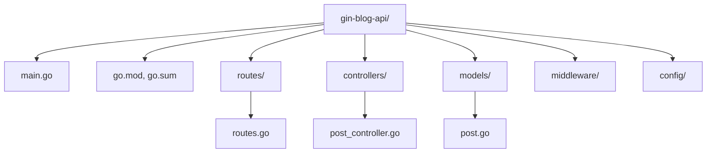

# ০২. Setting Up a Gin Project

Lesson 1-এ আমরা Gin দিয়ে একটা তিন-লাইনের সার্ভার চালিয়ে দেখেছিলাম, কিন্তু বাস্তব প্রজেক্টে শুধু একটা `main.go` ফাইলে সবকিছু গুঁজে দিলে চলে না। ঠিক যেমন Module 6 আর 7-এ আমরা শিখেছিলাম Express প্রজেক্টে router, controller, middleware আলাদা ফোল্ডারে রাখা হয় গোছানোর জন্য, Go প্রজেক্টেও একই নিয়ম প্রযোজ্য — বরং Go নিজেই এই গোছানো কাঠামোকে উৎসাহিত করে তার মডিউল সিস্টেমের মাধ্যমে।

শুরু করা যাক একদম গোড়া থেকে। Module 46-এ তুমি ইতিমধ্যে `go mod init` কমান্ড দেখেছো, যেটা দিয়ে Go একটা প্রজেক্টকে "মডিউল" হিসেবে চিহ্নিত করে আর তার dependency ট্র্যাক করে। আমাদের এই মডিউলের প্রজেক্টের জন্য প্রথম ধাপ এটাই:

```bash
mkdir gin-blog-api
cd gin-blog-api
go mod init github.com/yourname/gin-blog-api
```

এটা একটা `go.mod` ফাইল বানায়, যেটা অনেকটা Node.js জগতের `package.json`-এর মতো কাজ করে — প্রজেক্টের নাম, Go ভার্সন, আর dependency-গুলোর তালিকা রাখে। এরপর আমরা Gin প্যাকেজটা ইনস্টল করি:

```bash
go get -u github.com/gin-gonic/gin
```

এই কমান্ড চালানোর পর `go.mod`-এ Gin আর তার সব dependency যোগ হয়ে যায়, আর পাশাপাশি একটা `go.sum` ফাইল তৈরি হয় যেটা প্রতিটা প্যাকেজের ঠিক ভার্সন আর checksum লক করে রাখে — অনেকটা `package-lock.json`-এর মতো, যাতে "আমার মেশিনে তো কাজ করছিলো" সমস্যাটা এড়ানো যায়।

এখন ফোল্ডার স্ট্রাকচার নিয়ে ভাবা যাক। আমরা এমন একটা কাঠামো বানাবো যেটা সামনের প্রতিটা লেসনে বাড়তে থাকবে:



এই কাঠামোটা খুব চেনা লাগবে যদি তুমি Module 7-এ router-controller-middleware প্যাটার্ন মনে রাখো। পার্থক্য শুধু এই যে এখানে JavaScript-এর `require`/`import`-এর বদলে Go-এর প্যাকেজ সিস্টেম ব্যবহার হচ্ছে — প্রতিটা ফোল্ডার একটা প্যাকেজ, আর একটা প্যাকেজের ফাংশন আরেকটা প্যাকেজে ব্যবহার করতে হলে তার নাম Capital letter দিয়ে শুরু করতে হয় (exported করতে হয়), Module 46-এ যেটা তুমি শিখেছো।

শুরুর `main.go` ফাইলটা লিখি:

```go
package main

import (
    "log"

    "github.com/gin-gonic/gin"
)

func main() {
    router := gin.Default()

    router.GET("/health", func(c *gin.Context) {
        c.JSON(200, gin.H{"status": "ok"})
    })

    if err := router.Run(":8080"); err != nil {
        log.Fatal("সার্ভার চালু করা যায়নি:", err)
    }
}
```

এখানে `/health` নামের একটা রুট রাখা হয়েছে — এটা একটা প্রচলিত অভ্যাস, যেটাকে বলে **health check endpoint**। প্রোডাকশনে যখন সার্ভার deploy করা হয় (Lesson 9-এ বিস্তারিত দেখবো), তখন লোড ব্যালেন্সার বা মনিটরিং টুল বারবার এই এন্ডপয়েন্টে রিকোয়েস্ট পাঠিয়ে যাচাই করে সার্ভারটা বেঁচে আছে কিনা।

সার্ভারটা চালাতে হলে:

```bash
go run main.go
```

আর যদি এটা একটা এক্সিকিউটেবল বাইনারিতে কম্পাইল করতে চাও (যেটা Go-এর সবচেয়ে বড় সুবিধাগুলোর একটা — কোনো রানটাইম ইনস্টল ছাড়াই সরাসরি চালানো যায়), তাহলে:

```bash
go build -o gin-blog-api
./gin-blog-api
```

এই পার্থক্যটা খেয়াল রাখা জরুরি — Node.js প্রজেক্ট চালাতে সবসময় সার্ভারে Node ইনস্টল থাকা লাগে, কিন্তু Go প্রজেক্ট একবার কম্পাইল হয়ে গেলে একটা স্বয়ংসম্পূর্ণ বাইনারি ফাইল হয়ে যায়, যেটা যেকোনো লিনাক্স সার্ভারে সরাসরি চালানো যায় কোনো dependency ছাড়াই। এই বৈশিষ্ট্যটাই Lesson 9-এ deployment আলোচনায় গুরুত্বপূর্ণ ভূমিকা রাখবে।

আরেকটা ভালো অভ্যাস হলো `.env` ফাইল দিয়ে কনফিগারেশন আলাদা রাখা — যেমন পোর্ট নাম্বার, ডেটাবেজ URL। এর জন্য আমরা `godotenv` নামের একটা জনপ্রিয় প্যাকেজ ব্যবহার করবো:

```bash
go get github.com/joho/godotenv
```

```go
// config/config.go
package config

import (
    "log"
    "os"

    "github.com/joho/godotenv"
)

func LoadEnv() {
    if err := godotenv.Load(); err != nil {
        log.Println("`.env` ফাইল পাওয়া যায়নি, ডিফল্ট এনভায়রনমেন্ট ব্যবহার হচ্ছে")
    }
}

func GetPort() string {
    port := os.Getenv("PORT")
    if port == "" {
        port = "8080"
    }
    return port
}
```

এই `config` প্যাকেজটা আমরা `main.go`-তে import করে ব্যবহার করবো, আর ঠিক এই প্যাটার্নটাই Lesson 5-এ ডেটাবেজ কানেকশন স্ট্রিং লোড করার সময় আবার কাজে লাগবে। এখন আমাদের প্রজেক্টের ভিত্তি প্রস্তুত — পরের লেসনে আমরা এই কাঠামোর উপর দাঁড়িয়ে একটা পূর্ণাঙ্গ REST API বানাবো।
