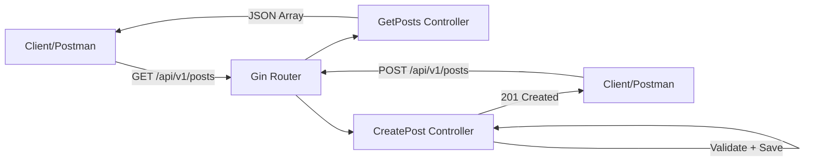

# ০৩. Building REST APIs with Gin

Lesson 2-এ আমরা প্রজেক্টের কাঠামো তৈরি করেছি — `routes/`, `controllers/`, `models/` ফোল্ডার সাজানো, `.env` লোড করার ব্যবস্থা। এখন সময় হয়েছে সেই কাঠামোর উপর দাঁড়িয়ে আসল কাজ করার — একটা কার্যকর REST API বানানো। Module 6-এ তুমি শিখেছিলে REST কী, status code কীভাবে ব্যবহার হয়, আর POST endpoint-এর অ্যানাটমি কেমন। এখন সেই একই ধারণাগুলো Go আর Gin দিয়ে বাস্তবায়ন করবো।

আমরা একটা ব্লগ পোস্ট API বানাবো — যেখানে পোস্ট তৈরি করা, দেখা, আপডেট করা, আর মুছে ফেলা যাবে। প্রথমে দরকার একটা **model**, অর্থাৎ ডেটার কাঠামো। Module 8-এ আমরা শিখেছিলাম JSON data modeling কীভাবে করতে হয় — Go-তে এই কাজটা করা হয় `struct` দিয়ে, যেটা তুমি Module 46-এ পরিচিত হয়েছো:

```go
// models/post.go
package models

type Post struct {
    ID      uint   `json:"id"`
    Title   string `json:"title" binding:"required"`
    Content string `json:"content" binding:"required"`
    Author  string `json:"author"`
}
```

খেয়াল করো struct field-এর পাশে থাকা এই ব্যাকটিক দেওয়া অংশটুকু — একে বলে **struct tag**। `json:"title"` বলে দিচ্ছে JSON-এ রূপান্তরের সময় এই ফিল্ডের নাম কী হবে (Go-তে ফিল্ড Capital letter দিয়ে শুরু হয় exported করার জন্য, কিন্তু JSON-এ সাধারণত lowercase রাখা হয়)। আর `binding:"required"` হলো Gin-এর ভ্যালিডেশন নির্দেশনা — এই ফিল্ড খালি থাকলে Gin নিজে থেকেই এরর দেবে, যেটা Module 6-এ আমরা ম্যানুয়ালি `if` দিয়ে চেক করতাম।

এখন একটা সাময়িক in-memory স্টোরেজ দিয়ে controller লিখি (Lesson 5-এ আমরা এটাকে আসল ডেটাবেজে রূপান্তর করবো):

```go
// controllers/post_controller.go
package controllers

import (
    "net/http"
    "strconv"

    "github.com/gin-gonic/gin"
    "github.com/yourname/gin-blog-api/models"
)

var posts = []models.Post{}
var nextID uint = 1

func GetPosts(c *gin.Context) {
    c.JSON(http.StatusOK, posts)
}

func GetPostByID(c *gin.Context) {
    id, _ := strconv.Atoi(c.Param("id"))
    for _, p := range posts {
        if p.ID == uint(id) {
            c.JSON(http.StatusOK, p)
            return
        }
    }
    c.JSON(http.StatusNotFound, gin.H{"error": "পোস্ট পাওয়া যায়নি"})
}

func CreatePost(c *gin.Context) {
    var newPost models.Post
    if err := c.ShouldBindJSON(&newPost); err != nil {
        c.JSON(http.StatusBadRequest, gin.H{"error": err.Error()})
        return
    }
    newPost.ID = nextID
    nextID++
    posts = append(posts, newPost)
    c.JSON(http.StatusCreated, newPost)
}
```

এখানে দুটো গুরুত্বপূর্ণ জিনিস লক্ষ্য করার আছে। `c.Param("id")` দিয়ে আমরা URL-এর **path parameter** পড়ছি — ঠিক যেভাবে Module 4-এ Express-এ `req.params.id` ব্যবহার করতাম। আর `c.ShouldBindJSON(&newPost)` দিয়ে request body-র JSON ডেটা সরাসরি আমাদের struct-এ ঢুকে যাচ্ছে, এবং সাথে সাথে `binding:"required"` ট্যাগ অনুযায়ী ভ্যালিডেশনও হয়ে যাচ্ছে। এক লাইনে যা Module 6-এ আমরা বহু লাইনে ম্যানুয়ালি করতাম, তা এখানে Gin নিজেই সামলে নিচ্ছে।

এবার এই handler-গুলোকে রুটের সাথে যুক্ত করি:

```go
// routes/routes.go
package routes

import (
    "github.com/gin-gonic/gin"
    "github.com/yourname/gin-blog-api/controllers"
)

func SetupRoutes(router *gin.Engine) {
    api := router.Group("/api/v1")
    {
        api.GET("/posts", controllers.GetPosts)
        api.GET("/posts/:id", controllers.GetPostByID)
        api.POST("/posts", controllers.CreatePost)
    }
}
```

এখানে `router.Group("/api/v1")` একটা দরকারি টেকনিক — এটা একগুচ্ছ রুটকে একটা কমন প্রিফিক্সের নিচে সংগঠিত করে, যাতে ভবিষ্যতে API-র ভার্সন বদলাতে হলে (যেমন `/api/v2`) পুরোনো ভার্সন অক্ষত রেখেই নতুন ভার্সন যোগ করা যায়।



এই routes প্যাকেজটাকে এখন `main.go`-তে যুক্ত করলেই আমাদের API সম্পূর্ণ কার্যকর হয়ে যায়:

```go
package main

import (
    "github.com/gin-gonic/gin"
    "github.com/yourname/gin-blog-api/config"
    "github.com/yourname/gin-blog-api/routes"
)

func main() {
    config.LoadEnv()
    router := gin.Default()
    routes.SetupRoutes(router)
    router.Run(":" + config.GetPort())
}
```

এখন Postman বা Thunder Client দিয়ে (Module 4-এ যেভাবে Express API টেস্ট করেছিলে ঠিক সেভাবে) `POST http://localhost:8080/api/v1/posts` এ একটা JSON body পাঠালে তুমি একটা নতুন পোস্ট তৈরি হতে দেখবে, আর status code হিসেবে পাবে `201 Created` — Module 6-এর status code লেসনের ধারণাগুলো এখানে হুবহু প্রযোজ্য, শুধু ভাষা বদলেছে।

এই in-memory স্টোরেজের একটা বড় সীমাবদ্ধতা আছে অবশ্যই — সার্ভার রিস্টার্ট হলে সব ডেটা হারিয়ে যায়। এই সমস্যার সমাধান আসবে Lesson 5-এ, যখন আমরা GORM দিয়ে একটা আসল ডেটাবেজের সাথে সংযোগ স্থাপন করবো। আপাতত পরের লেসনে আমরা দেখবো কীভাবে routing আরও সংগঠিত করা যায় আর middleware দিয়ে এই রুটগুলোকে সুরক্ষিত করা যায়।
