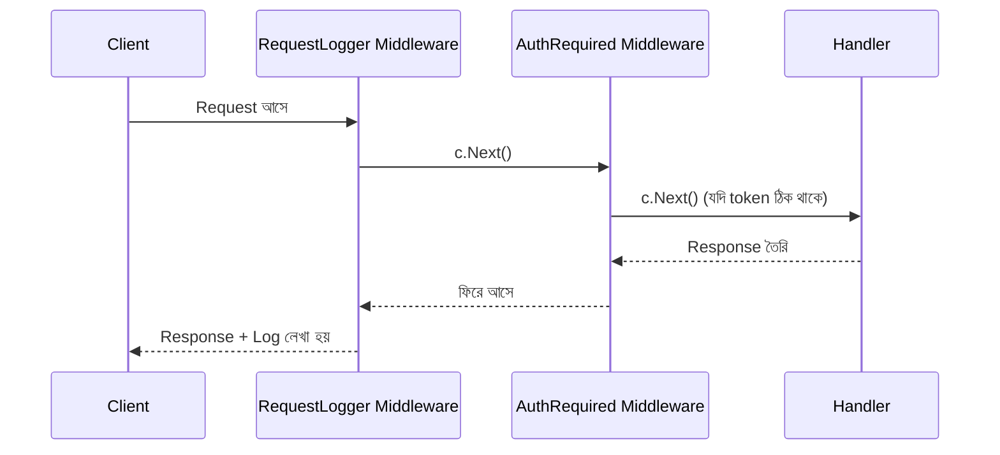

# ০৪. Routing and Middleware in Gin

Lesson 3-এ আমরা `/api/v1/posts` নামের একটা রুট গ্রুপ বানিয়েছিলাম, আর সেখানে GET আর POST দুটো এন্ডপয়েন্ট যোগ করেছিলাম। কিন্তু বাস্তব প্রজেক্টে রুটের সংখ্যা দ্রুত বাড়তে থাকে, আর প্রতিটা রিকোয়েস্টে কিছু কমন কাজ করা লাগে — লগ রাখা, অথেন্টিকেশন চেক করা, রেট লিমিট বসানো। Module 7-এ তুমি এই সমস্যাটার সমাধান হিসেবে middleware ধারণাটা শিখেছিলে Express-এ। এই লেসনে আমরা দেখবো Gin-এ ঠিক একই ধারণা কীভাবে কাজ করে, তবে Go-এর নিজস্ব স্টাইলে।

প্রথমে routing নিয়ে আরেকটু গভীরে যাই। Lesson 3-এ আমরা `:id` দিয়ে path parameter দেখেছি, কিন্তু Gin **query parameter**-ও সহজে সাপোর্ট করে — Module 4-এ যেটা তুমি `req.query` দিয়ে Express-এ ব্যবহার করেছিলে:

```go
func SearchPosts(c *gin.Context) {
    keyword := c.DefaultQuery("q", "")
    limit := c.DefaultQuery("limit", "10")

    c.JSON(200, gin.H{
        "keyword": keyword,
        "limit":   limit,
        "message": "সার্চ রেজাল্ট এখানে আসবে",
    })
}
```

`c.DefaultQuery("q", "")` মানে — `q` নামের query parameter পড়ো, না থাকলে খালি স্ট্রিং ব্যবহার করো। এভাবে `/search?q=golang&limit=5` এর মতো URL হ্যান্ডেল করা যায়।

এবার আসল আলোচনায় আসি — **middleware**। Gin-এ একটা middleware আসলে একটা ফাংশন যেটা `gin.HandlerFunc` টাইপের, আর তার ভেতরে থাকে `c.Next()` নামের একটা কল, যেটা বলে দেয় "এখন পরের হ্যান্ডলারে যাও।" এই প্যাটার্নটাকে বলে **chain of responsibility**, আর এটা ঠিক Module 7-এ Express middleware-এর `next()` ফাংশনের মতোই কাজ করে।

চলো একটা লগিং middleware বানাই:

```go
// middleware/logger.go
package middleware

import (
    "log"
    "time"

    "github.com/gin-gonic/gin"
)

func RequestLogger() gin.HandlerFunc {
    return func(c *gin.Context) {
        startTime := time.Now()

        c.Next() // পরের handler/middleware চালাও

        duration := time.Since(startTime)
        log.Printf("[%s] %s - %d - %v",
            c.Request.Method,
            c.Request.URL.Path,
            c.Writer.Status(),
            duration,
        )
    }
}
```

এই middleware-টা `c.Next()` কল করার আগে সময় রেকর্ড করে, তারপর পুরো রিকোয়েস্ট প্রসেস হয়ে যাওয়ার পর (অর্থাৎ `c.Next()` রিটার্ন করার পর) কতক্ষণ লাগলো আর কী status code পাঠানো হলো, সেটা লগ করে। এটাই Module 7-এ আমরা যেটাকে বলেছিলাম "audit logger project" এর Go সংস্করণ।



এখন একটা authentication middleware বানাই, যেটা পরবর্তী Lesson 6-এ JWT নিয়ে কাজ করার সময় আরও বিস্তৃত হবে। আপাতত একটা সরল সংস্করণ দেখি যেটা header-এ টোকেন আছে কিনা চেক করে:

```go
// middleware/auth.go
package middleware

import (
    "net/http"

    "github.com/gin-gonic/gin"
)

func AuthRequired() gin.HandlerFunc {
    return func(c *gin.Context) {
        token := c.GetHeader("Authorization")
        if token == "" {
            c.JSON(http.StatusUnauthorized, gin.H{"error": "টোকেন পাওয়া যায়নি"})
            c.Abort() // পরবর্তী handler বন্ধ করে দেয়
            return
        }
        c.Next()
    }
}
```

লক্ষ্য করো `c.Abort()` মেথডটা — এটা `c.Next()`-এর ঠিক বিপরীত কাজ করে। এটা চেইনটাকে এখানেই থামিয়ে দেয়, ফলে এর পরের কোনো middleware বা handler আর চলে না। এটা গুরুত্বপূর্ণ, কারণ শুধু return করলেই চেইন থামে না — Gin-এ পরের middleware-গুলো চলতেই থাকবে যদি `Abort()` কল না করা হয়।

এখন এই middleware-গুলোকে আমাদের রুটে যুক্ত করি। Gin তিনটা লেভেলে middleware বসানোর সুযোগ দেয় — গ্লোবাল, গ্রুপ-ভিত্তিক, আর রুট-ভিত্তিক:

```go
func SetupRoutes(router *gin.Engine) {
    router.Use(middleware.RequestLogger()) // গ্লোবাল - সব রুটে চলবে

    api := router.Group("/api/v1")
    {
        api.GET("/posts", controllers.GetPosts)
        api.GET("/posts/:id", controllers.GetPostByID)

        protected := api.Group("/")
        protected.Use(middleware.AuthRequired()) // শুধু এই গ্রুপে চলবে
        {
            protected.POST("/posts", controllers.CreatePost)
            protected.DELETE("/posts/:id", controllers.DeletePost)
        }
    }
}
```

এই কাঠামোটা খুব স্পষ্টভাবে বলে দিচ্ছে — পোস্ট দেখা (`GET`) সবার জন্য খোলা, কিন্তু পোস্ট তৈরি বা মোছার (`POST`, `DELETE`) জন্য অথেন্টিকেশন বাধ্যতামূলক। এই বিভাজনটাই বাস্তব-জীবনের API ডিজাইনের একটা মৌলিক নিয়ম, আর Module 7-এ তুমি এই একই নীতি Express-এ প্র্যাকটিস করেছিলে।

Gin-এর সাথে একটা built-in rate limiting middleware আসে না, কিন্তু Module 7-এ যে rate limiting অ্যালগরিদমগুলো নিয়ে আলোচনা হয়েছিলো (token bucket, sliding window), সেগুলো একই লজিক দিয়ে একটা কাস্টম Gin middleware হিসেবে লেখা সম্ভব — একটা map-এ IP অনুযায়ী রিকোয়েস্ট গোনা, আর নির্দিষ্ট সীমা পার হলে `c.Abort()` করে `429 Too Many Requests` পাঠানো।

এই middleware আর routing-এর কাঠামো এখন আমাদের প্রজেক্টকে একটা প্রোডাকশন-প্রস্তুত রূপ দিচ্ছে। পরের লেসনে আমরা in-memory স্টোরেজ ছেড়ে GORM দিয়ে একটা আসল ডেটাবেজের সাথে সংযোগ স্থাপন করবো, যাতে ডেটা স্থায়ীভাবে সংরক্ষিত থাকে।
