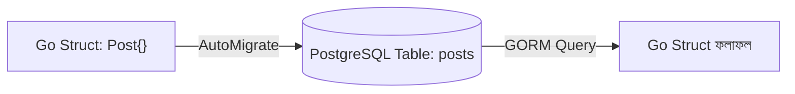

# ০৫. Connecting to Databases with GORM

এতক্ষণ আমরা যে ব্লগ পোস্ট API বানিয়েছি, তার একটা বড় দুর্বলতা আছে — Lesson 3-এ যেমন বলেছিলাম, ডেটা রাখা হচ্ছে একটা সাধারণ Go স্লাইসে, মেমরিতে। সার্ভার বন্ধ করলেই সব হারিয়ে যায়। Module 46-এ তুমি ইতিমধ্যে GORM-এর প্রাথমিক পরিচিতি পেয়েছো — এটা Go-এর সবচেয়ে জনপ্রিয় **ORM** (Object-Relational Mapper), যেটা দিয়ে Go struct-কে সরাসরি ডেটাবেজ টেবিলের সাথে সংযুক্ত করা যায়। এই লেসনে আমরা সেই জ্ঞানকে আমাদের Gin প্রজেক্টে বাস্তবায়ন করবো।

প্রথমে দরকারি প্যাকেজগুলো ইনস্টল করি। আমরা PostgreSQL ব্যবহার করবো, যদিও GORM MySQL, SQLite ইত্যাদিও সমানভাবে সাপোর্ট করে:

```bash
go get -u gorm.io/gorm
go get -u gorm.io/driver/postgres
```

এখন আমাদের `config` প্যাকেজে (Lesson 2-এ যেটা আমরা `.env` লোড করার জন্য বানিয়েছিলাম) একটা ডেটাবেজ কানেকশন ফাংশন যোগ করি:

```go
// config/database.go
package config

import (
    "fmt"
    "log"
    "os"

    "gorm.io/driver/postgres"
    "gorm.io/gorm"
)

var DB *gorm.DB

func ConnectDatabase() {
    dsn := fmt.Sprintf(
        "host=%s user=%s password=%s dbname=%s port=%s sslmode=disable",
        os.Getenv("DB_HOST"),
        os.Getenv("DB_USER"),
        os.Getenv("DB_PASSWORD"),
        os.Getenv("DB_NAME"),
        os.Getenv("DB_PORT"),
    )

    db, err := gorm.Open(postgres.Open(dsn), &gorm.Config{})
    if err != nil {
        log.Fatal("ডেটাবেজে কানেক্ট করা যায়নি:", err)
    }

    DB = db
    log.Println("ডেটাবেজ কানেকশন সফল হয়েছে")
}
```

`DSN` (Data Source Name) স্ট্রিংটা ডেটাবেজের ঠিকানা, ইউজারনেম, পাসওয়ার্ড সব একসাথে বহন করে — আর এই সংবেদনশীল তথ্যগুলো কখনোই কোডে হার্ডকোড করা উচিত না, বরং `.env` ফাইল থেকে আসা উচিত, যেটা Lesson 2-এ আমরা সেট করেছিলাম।

এখন আমাদের `Post` মডেলটাকে (Lesson 3-এ তৈরি করা) GORM-friendly করতে হবে:

```go
// models/post.go
package models

import "gorm.io/gorm"

type Post struct {
    gorm.Model
    Title   string `json:"title" binding:"required"`
    Content string `json:"content" binding:"required"`
    Author  string `json:"author"`
}
```

`gorm.Model` একটা embedded struct যেটা স্বয়ংক্রিয়ভাবে `ID`, `CreatedAt`, `UpdatedAt`, `DeletedAt` ফিল্ড যোগ করে দেয় — এটা Go-এর **struct embedding** ফিচার, যেটা Module 46-এ তুমি দেখেছো, অনেকটা inheritance-এর মতো আচরণ করে কিন্তু আরও নমনীয়ভাবে।

টেবিল তৈরির জন্য GORM-এর **AutoMigrate** ব্যবহার করি, যেটা Go struct দেখে নিজে থেকেই সঠিক কলাম আর টাইপ দিয়ে টেবিল বানিয়ে দেয়:

```go
func ConnectDatabase() {
    // ... উপরের কানেকশন কোড ...
    DB.AutoMigrate(&models.Post{})
}
```



এখন controller-গুলো আপডেট করি যাতে in-memory স্লাইসের বদলে সরাসরি ডেটাবেজে কথা বলে:

```go
// controllers/post_controller.go
package controllers

import (
    "net/http"

    "github.com/gin-gonic/gin"
    "github.com/yourname/gin-blog-api/config"
    "github.com/yourname/gin-blog-api/models"
)

func GetPosts(c *gin.Context) {
    var posts []models.Post
    config.DB.Find(&posts)
    c.JSON(http.StatusOK, posts)
}

func GetPostByID(c *gin.Context) {
    var post models.Post
    id := c.Param("id")

    if err := config.DB.First(&post, id).Error; err != nil {
        c.JSON(http.StatusNotFound, gin.H{"error": "পোস্ট পাওয়া যায়নি"})
        return
    }
    c.JSON(http.StatusOK, post)
}

func CreatePost(c *gin.Context) {
    var newPost models.Post
    if err := c.ShouldBindJSON(&newPost); err != nil {
        c.JSON(http.StatusBadRequest, gin.H{"error": err.Error()})
        return
    }

    config.DB.Create(&newPost)
    c.JSON(http.StatusCreated, newPost)
}

func DeletePost(c *gin.Context) {
    id := c.Param("id")
    if err := config.DB.Delete(&models.Post{}, id).Error; err != nil {
        c.JSON(http.StatusInternalServerError, gin.H{"error": "মুছে ফেলা যায়নি"})
        return
    }
    c.JSON(http.StatusOK, gin.H{"message": "পোস্ট মুছে ফেলা হয়েছে"})
}
```

লক্ষ্য করো — controller-এর গঠন প্রায় একই রকম রয়ে গেছে, শুধু ডেটা রাখার জায়গাটা বদলেছে স্লাইস থেকে ডেটাবেজে। এটাই ভালো আর্কিটেকচারের একটা লক্ষণ — Module 6-এ যেটাকে বলা হয়েছিলো "data flow" ভালোভাবে ডিজাইন করা থাকলে, স্টোরেজ পরিবর্তনের প্রভাব বাকি কোডে খুব কম পড়ে।

`main.go`-তে এখন কানেকশন যোগ করি:

```go
func main() {
    config.LoadEnv()
    config.ConnectDatabase()

    router := gin.Default()
    routes.SetupRoutes(router)
    router.Run(":" + config.GetPort())
}
```

একটা গুরুত্বপূর্ণ ধারণা এখানে বোঝা দরকার — GORM-এর `Find`, `First`, `Create`, `Delete` মেথডগুলো আসলে SQL কোয়েরি তৈরি করে দেয় পেছনে থেকে, কিন্তু আমাদের নিজে হাতে কোনো SQL লিখতে হচ্ছে না। এই সুবিধাটাকে বলে **query builder**, আর এটা তুলনীয় Node.js জগতের Mongoose বা Sequelize-এর সাথে, যেটা হয়তো তুমি আগে অন্য কোনো প্রজেক্টে দেখে থাকতে পারো।

এখন আমাদের API-এর ডেটা সত্যিকারের ডেটাবেজে স্থায়ীভাবে থাকছে। পরের লেসনে আমরা এই একই ডেটাবেজ কানেকশন ব্যবহার করে একটা `User` মডেল বানাবো, আর তার উপর ভিত্তি করে JWT দিয়ে সম্পূর্ণ authentication সিস্টেম তৈরি করবো।
