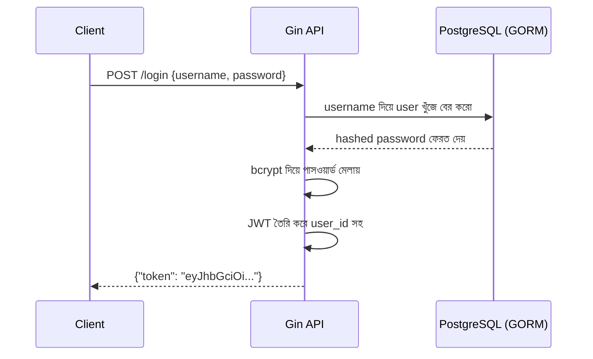

# ০৬. User Authentication and JWT in Gin

Lesson 5-এ আমরা GORM দিয়ে `Post` মডেলকে ডেটাবেজে স্থায়ীভাবে সংরক্ষণ করতে শিখেছি। এখন সময় হয়েছে সেই একই ডেটাবেজ কানেকশন ব্যবহার করে একটা `User` মডেল বানানোর, আর তার উপর ভিত্তি করে একটা সম্পূর্ণ authentication সিস্টেম দাঁড় করানোর। Module 46-এ তুমি Go-তে JWT (JSON Web Token) তৈরির প্রাথমিক ধারণা পেয়েছো — এখানে আমরা সেটাকে আমাদের Gin API-এর ভেতরে বাস্তবায়ন করবো, আর Lesson 4-এ বানানো `AuthRequired` middleware-টাকে পূর্ণাঙ্গ রূপ দেবো।

প্রথমে `User` মডেল বানাই, ঠিক Lesson 5-এর `Post` মডেলের মতো একই প্যাটার্নে:

```go
// models/user.go
package models

import "gorm.io/gorm"

type User struct {
    gorm.Model
    Username string `json:"username" binding:"required" gorm:"unique"`
    Password string `json:"password" binding:"required"`
}
```

পাসওয়ার্ড কখনোই প্লেইন টেক্সটে ডেটাবেজে রাখা উচিত না — এটা একটা মৌলিক নিরাপত্তা নিয়ম। তাই আমরা `bcrypt` ব্যবহার করে পাসওয়ার্ড হ্যাশ করবো:

```bash
go get golang.org/x/crypto/bcrypt
go get github.com/golang-jwt/jwt/v5
```

```go
// controllers/auth_controller.go
package controllers

import (
    "net/http"
    "os"
    "time"

    "github.com/gin-gonic/gin"
    "github.com/golang-jwt/jwt/v5"
    "github.com/yourname/gin-blog-api/config"
    "github.com/yourname/gin-blog-api/models"
    "golang.org/x/crypto/bcrypt"
)

func Register(c *gin.Context) {
    var input models.User
    if err := c.ShouldBindJSON(&input); err != nil {
        c.JSON(http.StatusBadRequest, gin.H{"error": err.Error()})
        return
    }

    hashedPassword, _ := bcrypt.GenerateFromPassword([]byte(input.Password), bcrypt.DefaultCost)
    input.Password = string(hashedPassword)

    if err := config.DB.Create(&input).Error; err != nil {
        c.JSON(http.StatusInternalServerError, gin.H{"error": "ইউজার তৈরি করা যায়নি"})
        return
    }

    c.JSON(http.StatusCreated, gin.H{"message": "রেজিস্ট্রেশন সফল হয়েছে"})
}
```

এখানে `bcrypt.GenerateFromPassword` পাসওয়ার্ডকে একমুখী হ্যাশে রূপান্তর করে — অর্থাৎ হ্যাশ থেকে আসল পাসওয়ার্ড ফিরে পাওয়া সম্ভব না, শুধু যাচাই করা যায় কোনো ইনপুট সঠিক কিনা। এটাই লগইনের সময় কাজে লাগবে।

এখন লগইন ফাংশন, যেখানে সফল হলে একটা JWT টোকেন তৈরি হবে:

```go
func Login(c *gin.Context) {
    var input models.User
    if err := c.ShouldBindJSON(&input); err != nil {
        c.JSON(http.StatusBadRequest, gin.H{"error": err.Error()})
        return
    }

    var user models.User
    if err := config.DB.Where("username = ?", input.Username).First(&user).Error; err != nil {
        c.JSON(http.StatusUnauthorized, gin.H{"error": "ভুল ইউজারনেম বা পাসওয়ার্ড"})
        return
    }

    if err := bcrypt.CompareHashAndPassword([]byte(user.Password), []byte(input.Password)); err != nil {
        c.JSON(http.StatusUnauthorized, gin.H{"error": "ভুল ইউজারনেম বা পাসওয়ার্ড"})
        return
    }

    claims := jwt.MapClaims{
        "user_id": user.ID,
        "exp":     time.Now().Add(24 * time.Hour).Unix(),
    }
    token := jwt.NewWithClaims(jwt.SigningMethodHS256, claims)

    signedToken, err := token.SignedString([]byte(os.Getenv("JWT_SECRET")))
    if err != nil {
        c.JSON(http.StatusInternalServerError, gin.H{"error": "টোকেন তৈরি করা যায়নি"})
        return
    }

    c.JSON(http.StatusOK, gin.H{"token": signedToken})
}
```



এখন Lesson 4-এর সেই সরল `AuthRequired` middleware-কে আসল JWT যাচাইকরণ দিয়ে প্রতিস্থাপন করি:

```go
// middleware/auth.go
package middleware

import (
    "net/http"
    "os"
    "strings"

    "github.com/gin-gonic/gin"
    "github.com/golang-jwt/jwt/v5"
)

func AuthRequired() gin.HandlerFunc {
    return func(c *gin.Context) {
        authHeader := c.GetHeader("Authorization")
        if authHeader == "" {
            c.JSON(http.StatusUnauthorized, gin.H{"error": "টোকেন পাওয়া যায়নি"})
            c.Abort()
            return
        }

        tokenString := strings.TrimPrefix(authHeader, "Bearer ")

        token, err := jwt.Parse(tokenString, func(t *jwt.Token) (interface{}, error) {
            return []byte(os.Getenv("JWT_SECRET")), nil
        })

        if err != nil || !token.Valid {
            c.JSON(http.StatusUnauthorized, gin.H{"error": "টোকেন অবৈধ বা মেয়াদোত্তীর্ণ"})
            c.Abort()
            return
        }

        claims, _ := token.Claims.(jwt.MapClaims)
        c.Set("user_id", claims["user_id"])

        c.Next()
    }
}
```

এখানে `c.Set("user_id", ...)` দিয়ে আমরা যাচাইকৃত ইউজারের আইডি Gin Context-এর ভেতরে রেখে দিচ্ছি, যাতে পরবর্তী handler-গুলো `c.Get("user_id")` দিয়ে এটা ব্যবহার করতে পারে — যেমন কোন ইউজার কোন পোস্ট তৈরি করলো তা ট্র্যাক করতে।

রুট সেটআপে এখন `/register` আর `/login` যোগ করি, এগুলো অবশ্যই public থাকবে (`AuthRequired` ছাড়া), যেখানে পোস্ট তৈরি-মোছা protected থাকবে:

```go
func SetupRoutes(router *gin.Engine) {
    router.Use(middleware.RequestLogger())

    auth := router.Group("/api/v1/auth")
    {
        auth.POST("/register", controllers.Register)
        auth.POST("/login", controllers.Login)
    }

    api := router.Group("/api/v1")
    {
        api.GET("/posts", controllers.GetPosts)
        api.GET("/posts/:id", controllers.GetPostByID)

        protected := api.Group("/")
        protected.Use(middleware.AuthRequired())
        {
            protected.POST("/posts", controllers.CreatePost)
            protected.DELETE("/posts/:id", controllers.DeletePost)
        }
    }
}
```

এভাবে আমরা Lesson 4-এর middleware কাঠামো, Lesson 5-এর ডেটাবেজ কানেকশন, আর নতুন JWT লজিক — সবকিছু একসাথে জুড়ে একটা বাস্তবসম্মত authentication ফ্লো দাঁড় করালাম। এখন কোনো ইউজার রেজিস্টার করে, লগইন করে একটা টোকেন পায়, আর সেই টোকেন `Authorization: Bearer <token>` হেডারে পাঠিয়ে সুরক্ষিত রুটগুলো ব্যবহার করতে পারে। পরের লেসনে আমরা দেখবো কীভাবে এই পুরো সিস্টেমের এরর হ্যান্ডলিং আরও পরিপক্ব আর কেন্দ্রীভূত করা যায়।
