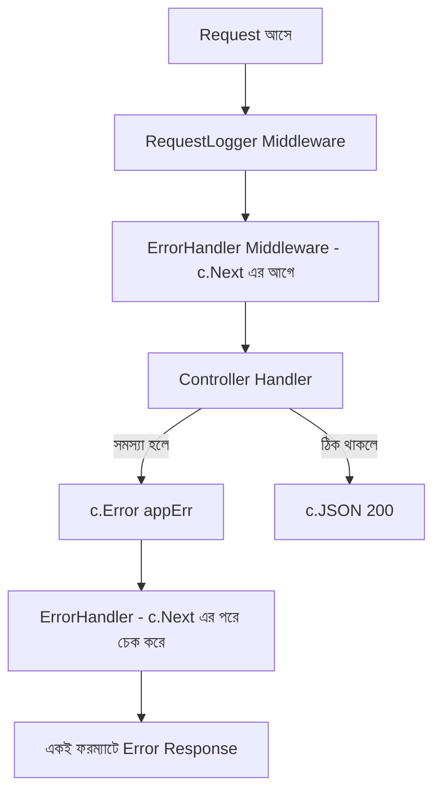

# ০৭. Error Handling and Logging in Gin

আমাদের ব্লগ API এখন কার্যকরভাবে দাঁড়িয়ে গেছে — routing (Lesson 3-4), ডেটাবেজ (Lesson 5), আর authentication (Lesson 6)। কিন্তু এখন পর্যন্ত আমরা প্রতিটা controller-এ আলাদা আলাদাভাবে `c.JSON(http.StatusXXX, gin.H{"error": ...})` লিখেছি। এই প্যাটার্নটা প্রজেক্ট বড় হলে সমস্যা তৈরি করে — এরর মেসেজের ফরম্যাট জায়গায় জায়গায় ভিন্ন হয়ে যায়, আর কোথাও ভুলে এরর হ্যান্ডল করতে ভুলে গেলে পুরো সার্ভার ক্র্যাশ করতে পারে। Module 7-এ আমরা শিখেছিলাম কেন centralized error handling গুরুত্বপূর্ণ Express-এ — এই লেসনে আমরা সেই একই নীতি Gin-এ প্রয়োগ করবো।

প্রথমে একটা কাস্টম error টাইপ বানাই, যাতে প্রতিটা এরর একটা সামঞ্জস্যপূর্ণ গঠনে থাকে:

```go
// utils/errors.go
package utils

type AppError struct {
    Code    int    `json:"-"`
    Message string `json:"message"`
}

func (e *AppError) Error() string {
    return e.Message
}

func NewAppError(code int, message string) *AppError {
    return &AppError{Code: code, Message: message}
}
```

এখন Gin-এর একটা গুরুত্বপূর্ণ ফিচার ব্যবহার করি — `c.Error()`। এটা দিয়ে একটা handler এরর "রিপোর্ট" করে দিতে পারে, আর সেই এরর কেন্দ্রীয়ভাবে একটা middleware-এ ধরা যায়:

```go
// middleware/error_handler.go
package middleware

import (
    "net/http"

    "github.com/gin-gonic/gin"
    "github.com/yourname/gin-blog-api/utils"
)

func ErrorHandler() gin.HandlerFunc {
    return func(c *gin.Context) {
        c.Next() // আগে বাকি সব handler চলুক

        if len(c.Errors) == 0 {
            return
        }

        err := c.Errors.Last().Err

        if appErr, ok := err.(*utils.AppError); ok {
            c.JSON(appErr.Code, gin.H{"error": appErr.Message})
            return
        }

        // অচেনা এরর হলে, বিস্তারিত লুকিয়ে সাধারণ মেসেজ পাঠাও
        c.JSON(http.StatusInternalServerError, gin.H{"error": "একটা অপ্রত্যাশিত সমস্যা হয়েছে"})
    }
}
```

লক্ষ্য করার মতো ব্যাপার হলো, এই middleware প্রথমে `c.Next()` কল করছে যাতে আসল handler-টা চলে যায়, তারপর `c.Next()`-এর *পরে* `c.Errors` চেক করছে। এটা Lesson 4-এ শেখা logging middleware-এর একই কৌশল — কাজ শুরুর আগে আর পরে দুই দিকেই middleware হস্তক্ষেপ করতে পারে।

এখন controller-এ এরর হ্যান্ডলিং কতটা পরিষ্কার হয়ে যায় দেখা যাক:

```go
func GetPostByID(c *gin.Context) {
    var post models.Post
    id := c.Param("id")

    if err := config.DB.First(&post, id).Error; err != nil {
        c.Error(utils.NewAppError(http.StatusNotFound, "পোস্ট পাওয়া যায়নি"))
        return
    }
    c.JSON(http.StatusOK, post)
}
```

`c.Error(...)` কল করার পর সাথে সাথে `return` করা জরুরি, কারণ `c.Error()` নিজে থেকে চেইন থামায় না — এটা শুধু error queue-তে যোগ করে, বাস্তব response পাঠানোর কাজটা করে ErrorHandler middleware, চেইনের একদম শেষে।



এই ErrorHandler-কে আমরা সবার প্রথমে গ্লোবাল middleware হিসেবে বসাই, যাতে এটা পুরো চেইনকে ঘিরে রাখে:

```go
func SetupRoutes(router *gin.Engine) {
    router.Use(middleware.ErrorHandler())
    router.Use(middleware.RequestLogger())
    // ... বাকি routes আগের মতোই
}
```

এখন আরেকটা বিপজ্জনক পরিস্থিতি নিয়ে ভাবা যাক — **panic**। Go-তে যদি কোথাও একটা nil pointer access হয়ে যায়, বা array-এর বাইরের index অ্যাক্সেস করা হয়, পুরো প্রোগ্রাম ক্র্যাশ করে যেতে পারে। সৌভাগ্যক্রমে, Lesson 1-এ যেই `gin.Default()` ব্যবহার করেছিলাম, সেটার সাথে আগে থেকেই একটা `Recovery()` middleware যুক্ত থাকে, যেটা যেকোনো panic ধরে ফেলে আর `500 Internal Server Error` পাঠায়, পুরো সার্ভার ক্র্যাশ হওয়া থেকে বাঁচায়। চাইলে এটাকেও কাস্টমাইজ করা যায়:

```go
router := gin.New() // Default() না, খালি Engine
router.Use(gin.CustomRecovery(func(c *gin.Context, recovered interface{}) {
    log.Printf("PANIC ধরা পড়েছে: %v", recovered)
    c.JSON(http.StatusInternalServerError, gin.H{"error": "সার্ভারে একটা মারাত্মক সমস্যা হয়েছে"})
}))
```

Logging নিয়ে একটা শেষ কথা — প্রোডাকশন সিস্টেমে সাধারণ `log.Println` যথেষ্ট নয়, কারণ সেখানে **structured logging** দরকার হয় (JSON ফরম্যাটে লগ, যাতে পরে অনুসন্ধান করা সহজ হয়)। Go ইকোসিস্টেমে এর জন্য জনপ্রিয় প্যাকেজ হলো `zap` বা `logrus`। এই কোর্সের পরিধিতে আমরা গভীরে না গেলেও, ধারণাটা মনে রাখা দরকার — Lesson 4-এর `RequestLogger` middleware-কে সহজেই `zap.Logger` দিয়ে প্রতিস্থাপন করা যায় স্ট্রাকচার্ড লগের জন্য।

এখন আমাদের API-এর কাছে একটা পরিপক্ব, কেন্দ্রীভূত এরর হ্যান্ডলিং সিস্টেম আছে যা পুরো অ্যাপ্লিকেশন জুড়ে সামঞ্জস্যপূর্ণ রেসপন্স দেয়, আর panic থেকেও সুরক্ষিত। পরের লেসনে আমরা দেখবো কীভাবে এই সম্পূর্ণ API-টাকে টেস্ট করা যায় — Lesson 3 থেকে তৈরি হওয়া প্রতিটা এন্ডপয়েন্ট যাচাই করার জন্য।
