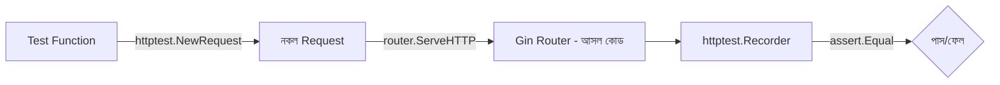

# ০৮. Testing and Debugging in Gin

এতগুলো লেসন ধরে আমরা যে ব্লগ API বানিয়েছি — routing (Lesson 3-4), ডেটাবেজ (Lesson 5), authentication (Lesson 6), আর error handling (Lesson 7) — এতদিন সেগুলো যাচাই করেছি Postman বা Thunder Client দিয়ে হাতে-কলমে, ঠিক যেভাবে Module 4-এ Express API টেস্ট করা শিখেছিলে। কিন্তু হাতে টেস্ট করা একটা বড় সমস্যা তৈরি করে — প্রতিবার কোনো কোড বদলালে, তোমাকে আবার হাতে সব এন্ডপয়েন্ট চেক করতে হয়। এই লেসনে আমরা শিখবো কীভাবে এই যাচাইকরণ প্রক্রিয়াটা স্বয়ংক্রিয় করা যায়।

Go ভাষার একটা বড় সুবিধা হলো এর টেস্টিং সাপোর্ট ভাষার মধ্যেই বিল্ট-ইন — Module 46-এ তুমি `testing` প্যাকেজের প্রাথমিক পরিচিতি পেয়েছো, যেখানে ফাইলের নাম `_test.go` দিয়ে শেষ হয়, আর প্রতিটা টেস্ট ফাংশন `Test` দিয়ে শুরু হয় এবং `*testing.T` প্যারামিটার নেয়।

Gin API টেস্ট করার সময় আমরা সত্যিকারের নেটওয়ার্ক কল না করে, Go-এর `net/http/httptest` প্যাকেজ ব্যবহার করে একটা "নকল" রিকোয়েস্ট বানাই আর সরাসরি রাউটারে পাঠাই। এতে টেস্ট দ্রুত চলে, কোনো আসল সার্ভার চালু করা লাগে না। চলো Lesson 3-এর `GetPosts` হ্যান্ডলারের একটা টেস্ট লিখি:

```go
// controllers/post_controller_test.go
package controllers

import (
    "net/http"
    "net/http/httptest"
    "testing"

    "github.com/gin-gonic/gin"
    "github.com/stretchr/testify/assert"
)

func setupTestRouter() *gin.Engine {
    gin.SetMode(gin.TestMode)
    router := gin.Default()
    router.GET("/api/v1/posts", GetPosts)
    return router
}

func TestGetPosts(t *testing.T) {
    router := setupTestRouter()

    req, _ := http.NewRequest(http.MethodGet, "/api/v1/posts", nil)
    recorder := httptest.NewRecorder()

    router.ServeHTTP(recorder, req)

    assert.Equal(t, http.StatusOK, recorder.Code)
}
```

এখানে কয়েকটা নতুন জিনিস আছে। `gin.SetMode(gin.TestMode)` টেস্ট চালানোর সময় Gin-এর ভারবোস লগ বন্ধ করে দেয়। `httptest.NewRecorder()` একটা ভুয়া `http.ResponseWriter` তৈরি করে, যেটা আসল রেসপন্স ধরে রাখে যাচাই করার জন্য। আর `router.ServeHTTP(recorder, req)` — এটাই মূল কৌশল, যেটা দিয়ে আমরা কোনো নেটওয়ার্ক পোর্ট না খুলেই সরাসরি Gin রাউটারের ভেতর দিয়ে রিকোয়েস্ট চালিয়ে দিচ্ছি। `testify` প্যাকেজের `assert.Equal` দিয়ে আমরা প্রত্যাশিত আর প্রকৃত ফলাফল তুলনা করি। এটা ইনস্টল করতে হবে:

```bash
go get github.com/stretchr/testify
```

এখন Lesson 6-এর authentication ফ্লো টেস্ট করা আরেকটু জটিল, কারণ সেখানে JSON body পাঠাতে হয়। দেখা যাক:

```go
func TestCreatePostUnauthorized(t *testing.T) {
    gin.SetMode(gin.TestMode)
    router := gin.Default()
    router.POST("/api/v1/posts", middleware.AuthRequired(), CreatePost)

    body := `{"title": "নতুন পোস্ট", "content": "কিছু কনটেন্ট"}`
    req, _ := http.NewRequest(http.MethodPost, "/api/v1/posts",
        strings.NewReader(body))
    req.Header.Set("Content-Type", "application/json")
    // ইচ্ছাকৃতভাবে Authorization হেডার বাদ দেওয়া হলো

    recorder := httptest.NewRecorder()
    router.ServeHTTP(recorder, req)

    assert.Equal(t, http.StatusUnauthorized, recorder.Code)
}
```

এই টেস্টটা যাচাই করছে Lesson 6-এ বানানো `AuthRequired` middleware সত্যিই কাজ করছে কিনা — টোকেন ছাড়া রিকোয়েস্ট পাঠালে `401 Unauthorized` ফিরে আসা উচিত। এভাবে প্রতিটা সুরক্ষা নিয়ম কোডে লেখা টেস্ট দিয়ে চিরস্থায়ীভাবে যাচাই করা থাকে, ভবিষ্যতে কেউ ভুলে middleware সরিয়ে ফেললেও টেস্ট ব্যর্থ হয়ে সতর্ক করে দেবে।



টেস্ট চালানোর কমান্ড খুব সহজ:

```bash
go test ./...
go test -v ./controllers/...    # verbose আউটপুট, কোন টেস্ট চলছে দেখা যায়
go test -cover ./...            # কত শতাংশ কোড টেস্ট দিয়ে কভার হলো তা দেখায়
```

ডেটাবেজ নিয়ে কাজ করা কোড টেস্ট করার সময় একটা গুরুত্বপূর্ণ সিদ্ধান্ত নিতে হয় — আসল ডেটাবেজের বদলে একটা আলাদা টেস্ট ডেটাবেজ, অথবা SQLite-এর in-memory মোড ব্যবহার করা ভালো অভ্যাস, যাতে টেস্ট চালানো প্রোডাকশন ডেটার কোনো ক্ষতি না করে। GORM-এ এটা করা সহজ — শুধু `postgres.Open(dsn)`-এর বদলে `sqlite.Open(":memory:")` ব্যবহার করলেই একটা সম্পূর্ণ আলাদা, দ্রুত, ডিস্কে-না-লেখা ডেটাবেজ তৈরি হয়ে যায় শুধু টেস্টের জন্য।

**Debugging** নিয়ে দুটো ব্যবহারিক টুলের কথা বলা দরকার। প্রথমত, `gin.Default()` ডিফল্টভাবেই প্রতিটা রিকোয়েস্টের একটা কালারফুল লগ প্রিন্ট করে — method, path, status code, সময়। ডেভেলপমেন্টের সময় এই লগ দেখেই বেশিরভাগ সমস্যা ধরা পড়ে। দ্বিতীয়ত, Go-এর সাথে আসে `delve` নামের একটা powerful debugger, যেটা VS Code-এর সাথে ইন্টিগ্রেট করে ব্রেকপয়েন্ট বসিয়ে, ভ্যারিয়েবলের মান লাইভ দেখতে দেখতে কোড পরীক্ষা করা যায় — Module 1-এ যেই VS Code সেটআপ করেছিলে, সেখানেই Go extension ইনস্টল করলে delve স্বয়ংক্রিয়ভাবে কাজ করে।

এখন আমাদের API-এর একটা শক্ত টেস্ট স্যুট আছে, যেটা প্রতিটা গুরুত্বপূর্ণ ফ্লো — পোস্ট তৈরি, দেখা, অথেন্টিকেশন — স্বয়ংক্রিয়ভাবে যাচাই করে। পরের আর শেষ লেসনে আমরা দেখবো কীভাবে এই সম্পূর্ণ, টেস্ট-করা অ্যাপ্লিকেশনটাকে একটা আসল সার্ভারে deploy করা যায়।
