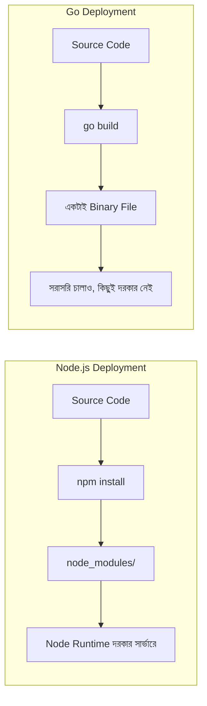
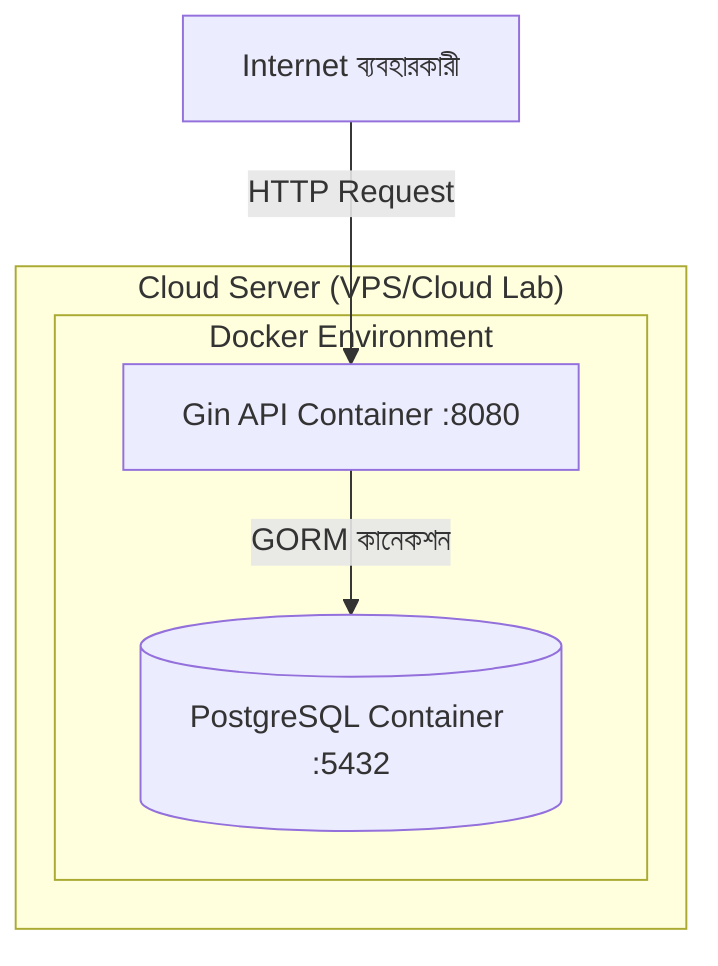

# ০৯. Deploying Gin Applications

আমাদের যাত্রার শেষ ধাপে পৌঁছে গেছি। Lesson 1 থেকে শুরু করে আমরা একটা সম্পূর্ণ ব্লগ API বানিয়েছি — Gin দিয়ে রুটিং, GORM দিয়ে ডেটাবেজ, JWT দিয়ে authentication, কেন্দ্রীভূত error handling, আর অটোমেটেড টেস্ট। এখন প্রশ্ন হলো — এই কোডটা এখন শুধু তোমার নিজের কম্পিউটারে চলছে, কিন্তু বাস্তব ইউজাররা এটা ব্যবহার করবে কীভাবে? Module 2-তে আমরা প্রথম শিখেছিলাম localhost আর ক্লাউডের পার্থক্য, আর ক্লাউড ল্যাবে Node.js deploy করেছিলাম। এখন সেই একই যাত্রা করবো, কিন্তু Go আর Gin দিয়ে — আর দেখবো Go-এর deployment গল্পটা কেন এত সহজ।

মনে করে দেখো Lesson 2-তে আমরা বলেছিলাম Go কোড কম্পাইল হয়ে একটা **স্বয়ংসম্পূর্ণ বাইনারি** হয়ে যায়। এটাই deployment-কে radically সহজ করে দেয়। Node.js অ্যাপ deploy করতে সার্ভারে Node.js রানটাইম, `node_modules` ফোল্ডার (হাজার হাজার ফাইল) সবকিছু লাগে। Go অ্যাপ deploy করতে শুধু একটা ফাইল লাগে — কম্পাইল করা বাইনারিটা।



আজকাল সবচেয়ে জনপ্রিয় পদ্ধতি হলো **Docker** ব্যবহার করে containerize করা, কারণ এটা পরিবেশ-নির্ভর সমস্যা (dependency ভার্সন মিসম্যাচ, অপারেটিং সিস্টেমের পার্থক্য) সম্পূর্ণ দূর করে দেয়। চলো আমাদের ব্লগ API-এর জন্য একটা `Dockerfile` লিখি, যেটা Go-এর একটা বিশেষ কৌশল ব্যবহার করে — **multi-stage build**:

```dockerfile
# Dockerfile

# ধাপ ১: বিল্ড স্টেজ - এখানে কম্পাইল হয়
FROM golang:1.22-alpine AS builder

WORKDIR /app
COPY go.mod go.sum ./
RUN go mod download

COPY . .
RUN go build -o gin-blog-api .

# ধাপ ২: রান স্টেজ - শুধু বাইনারিটা থাকে
FROM alpine:latest

WORKDIR /app
COPY --from=builder /app/gin-blog-api .
COPY --from=builder /app/.env .

EXPOSE 8080
CMD ["./gin-blog-api"]
```

এই দুই-ধাপের কৌশলটা গুরুত্বপূর্ণ কারণ প্রথম স্টেজে (`golang:1.22-alpine`) পুরো Go কম্পাইলার আর টুলচেইন থাকে, যেটা কয়েকশো মেগাবাইট ভারী। কিন্তু চূড়ান্ত ইমেজে (`alpine:latest`) আমরা শুধু কম্পাইল করা বাইনারিটা কপি করি — ফলে চূড়ান্ত Docker ইমেজের সাইজ হয় মাত্র কয়েক মেগাবাইট, Node.js অ্যাপের ইমেজের তুলনায় (যেখানে পুরো `node_modules` থাকে) অনেক ছোট আর দ্রুত deploy হয়।

Docker ইমেজ বানানো আর চালানো:

```bash
docker build -t gin-blog-api .
docker run -p 8080:8080 --env-file .env gin-blog-api
```

বাস্তব প্রজেক্টে আমাদের API-এর সাথে একটা PostgreSQL ডেটাবেজও (Lesson 5) দরকার, তাই `docker-compose.yml` দিয়ে দুটো সার্ভিসকে একসাথে চালানো সুবিধাজনক:

```yaml
# docker-compose.yml
version: "3.8"
services:
  api:
    build: .
    ports:
      - "8080:8080"
    environment:
      - DB_HOST=db
      - DB_USER=postgres
      - DB_PASSWORD=secret
      - DB_NAME=blogdb
      - DB_PORT=5432
      - JWT_SECRET=your-secret-key
    depends_on:
      - db
  db:
    image: postgres:16-alpine
    environment:
      - POSTGRES_USER=postgres
      - POSTGRES_PASSWORD=secret
      - POSTGRES_DB=blogdb
    volumes:
      - pgdata:/var/lib/postgresql/data

volumes:
  pgdata:
```

এখানে `depends_on` নিশ্চিত করে API সার্ভিস চালু হওয়ার আগে ডেটাবেজ সার্ভিস প্রস্তুত থাকে। শুধু একটা কমান্ডেই পুরো সিস্টেম চালু হয়ে যায়:

```bash
docker-compose up --build
```



Deployment-এর জন্য শেষ কিছু ব্যবহারিক প্রস্তুতি নেওয়া দরকার, যেগুলো Module 3-তে আমরা "type of servers and port mapping" আলোচনায় প্রাথমিকভাবে দেখেছিলাম:

**প্রথমত, environment variable আলাদা রাখা।** production সার্ভারে কখনোই `.env` ফাইলে সরাসরি secret hardcode করে রাখা উচিত না; ক্লাউড প্ল্যাটফর্মের নিজস্ব secret management ব্যবহার করা উচিত (যেমন Environment Variables সেকশন Railway, Render, বা AWS-এ)।

**দ্বিতীয়ত, `gin.SetMode(gin.ReleaseMode)` সেট করা।** ডেভেলপমেন্টে Gin ভারবোস ডিবাগ তথ্য দেখায়, কিন্তু প্রোডাকশনে এটা বন্ধ করা উচিত পারফরম্যান্স আর নিরাপত্তার জন্য:

```go
func main() {
    if os.Getenv("APP_ENV") == "production" {
        gin.SetMode(gin.ReleaseMode)
    }
    // ... বাকি সেটআপ
}
```

**তৃতীয়ত, একটা reverse proxy (Nginx) বসানো**, যেটা HTTPS handle করে আর একাধিক container-এর মধ্যে ট্র্যাফিক বণ্টন করে — Module 3-এ যেই "বিভিন্ন ধরনের সার্ভার" নিয়ে আলোচনা হয়েছিলো, সেই ধারণারই বাস্তব প্রয়োগ।

এই মডিউলের শুরুতে আমরা প্রশ্ন করেছিলাম কেন Gin দরকার Go-তে raw HTTP থাকা সত্ত্বেও। এখন, ৯টা লেসনের শেষে, আমাদের হাতে আছে একটা সম্পূর্ণ, টেস্ট-করা, ডেটাবেজ-সংযুক্ত, নিরাপদ, এবং Docker-এ প্যাকেজ করা প্রোডাকশন-প্রস্তুত ব্যাকএন্ড সিস্টেম — যেটা Module 46-এর Go বেসিক্স আর এই মডিউলের Gin ফ্রেমওয়ার্ক জ্ঞান একসাথে মিলিয়ে তৈরি। এই ভিত্তি নিয়েই আমরা এগিয়ে যাবো Module 48-এ, যেখানে তুমি একটা সম্পূর্ণ ফাইনাল প্রজেক্ট নিজে হাতে বানাবে।
