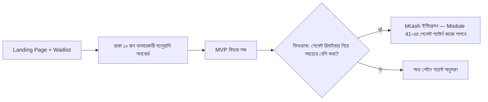

# ০১. Indie SaaS Project Brief — একা হাতে একটা মাইক্রো-SaaS বানানো

Module 48-এ আমরা একটা "টিমে কাজ করলে যেমন হবে" ধরনের প্রজেক্ট বানিয়েছি — বড় স্কোপ, চার সপ্তাহের প্ল্যান, একাধিক ফিচার। কিন্তু Module 43, 44, আর 45-এ আমরা শিখেছি সম্পূর্ণ ভিন্ন একটা জগত — একজন সোলো ডেভেলপার কীভাবে নিজে হাতে একটা ছোট, ফোকাসড SaaS প্রোডাক্ট বানিয়ে নিজের ব্যবসা দাঁড় করায়। এই লেসনে আমরা সেই দুই জগতকে এক করবো — একটা বাস্তব ইনডি SaaS প্রজেক্ট ব্রিফ, যেটা তুমি একা হাতে, সীমিত সময়ে বানাতে পারবে।

Module 44-এ আমরা শিখেছি লিন ডেভেলপমেন্ট আর MVP স্ট্র্যাটেজি মানে হলো সবচেয়ে ছোট সংস্করণ বানিয়ে বাজারে ছেড়ে দেয়া, তারপর ফিডব্যাক অনুযায়ী বাড়ানো। এই প্রজেক্টটাও ঠিক সেই নীতিতে ডিজাইন করা — বড় কিছু না, বরং একটা নির্দিষ্ট, ছোট, তীক্ষ্ণ সমস্যার সমাধান।

## প্রজেক্ট আইডিয়া: InvoiceBari — বাংলাদেশি ফ্রিল্যান্সারদের জন্য ইনভয়েসিং SaaS

Module 43-এর লেসন ৩-এ যে persona-র কথা বলেছিলাম — "রাফি, ফ্রিল্যান্স গ্রাফিক ডিজাইনার, যে এখনো Google Docs দিয়ে ইনভয়েস বানায়" — সেই গল্প থেকেই এই প্রজেক্টটার জন্ম। বাংলাদেশে হাজার হাজার ফ্রিল্যান্সার আছে যাদের কাছে বিদেশি টুলগুলো (FreshBooks, Wave) হয় দামি, না হয় বাংলা/বাংলাদেশি পেমেন্ট মেথড (bKash, Nagad) সাপোর্ট করে না। এটাই তোমার **niche opportunity** — Module 43-এ শেখা কম্পিটিটিভ অ্যানালাইসিসের সরাসরি ফলাফল।

**MVP-তে যা থাকবে (আর যা থাকবে না, ইচ্ছাকৃতভাবে):**

- ইউজার সাইন-আপ, প্রোফাইলে নিজের বিজনেস তথ্য (নাম, লোগো, ঠিকানা) সেট করা
- ক্লায়েন্ট লিস্ট বানানো, প্রতিটা ক্লায়েন্টের জন্য ইনভয়েস তৈরি করা (আইটেম, দাম, ট্যাক্স, বাংলা/ইংরেজি টেমপ্লেট)
- PDF জেনারেট করে ইমেইলে পাঠানো
- ইনভয়েস স্ট্যাটাস ট্র্যাক করা (Sent/Paid/Overdue) আর overdue হলে অটো-রিমাইন্ডার
- **যা MVP-তে নেই ইচ্ছাকৃতভাবে**: bKash পেমেন্ট গেটওয়ে ইন্টিগ্রেশন, মাল্টি-কারেন্সি সাপোর্ট, টিম কোলাবরেশন — এগুলো পরের ভার্সনের জন্য জমা রাখা, কারণ Module 44-এর "Lean Development" নীতি অনুযায়ী আগে প্রমাণ করতে হবে মূল আইডিয়াটা কাজ করে কিনা

## সাজেস্টেড টেক স্ট্যাক ও যাচাইয়ের ধাপ

Backend-এ Python/FastAPI (Module 4-5), অথেন্টিকেশন JWT দিয়ে (Module 12), ডাটাবেজে PostgreSQL (SQLAlchemy ORM + Alembic মাইগ্রেশন), PDF জেনারেশনে `WeasyPrint` বা `reportlab`, ইমেইল পাঠাতে Module 41-এ শেখা SendGrid ইন্টিগ্রেশন। পুরো সিস্টেমটা একজন মানুষের একাই মেইনটেইন করার মতো ছোট রাখাই লক্ষ্য — এটাই "ইনডি" স্টাইলের মূল কথা।

মার্কেটিং-এর দিকটা ভুলে যেও না — Module 44-এ শেখা "Building in Public" স্ট্র্যাটেজি অনুসরণ করে প্রতি সপ্তাহে Twitter/X বা LinkedIn-এ প্রগ্রেস শেয়ার করা, আর Module 45-এ শেখা Reddit/Hacker News/Product Hunt কৌশল অনুযায়ী ফ্রিল্যান্সার কমিউনিটিতে সরাসরি ফিডব্যাক নেয়া — এই দুটো একসাথে চললে তোমার প্রথম ১০ জন পেইং গ্রাহক পাওয়ার সম্ভাবনা অনেক বাড়ে।

## মাইলস্টোন

1. **সপ্তাহ ১**: ৫-১০ জন ফ্রিল্যান্সারের সাথে কাস্টমার ডিসকভারি কথোপকথন (Module 43, লেসন ৩)
2. **সপ্তাহ ২-৩**: কোর ইনভয়েসিং ফিচার বানানো (CRUD + PDF + ইমেইল)
3. **সপ্তাহ ৪**: প্রথম ১০ জন ব্যবহারকারীকে ম্যানুয়ালি অনবোর্ড করা, ফিডব্যাক জোগাড়
4. **সপ্তাহ ৫-৬**: ফিডব্যাক অনুযায়ী একটা মূল ফিচার যোগ করে পাবলিক লঞ্চ (Product Hunt-এ, Module 45 অনুযায়ী)

এই প্রজেক্টটা প্রমাণ করে দেখাবে ব্যবসার চিন্তা (কার জন্য বানাচ্ছি, কেন টাকা দেবে) আর টেকনিক্যাল বাস্তবায়ন কীভাবে হাতে হাত মিলিয়ে চলে। পরের মডিউলে আমরা স্কেল আরেকটু বাড়াবো — একা থেকে একটু বড়, মাল্টি-সার্ভিস স্টার্টআপ-স্টাইল প্রজেক্টের দিকে।
