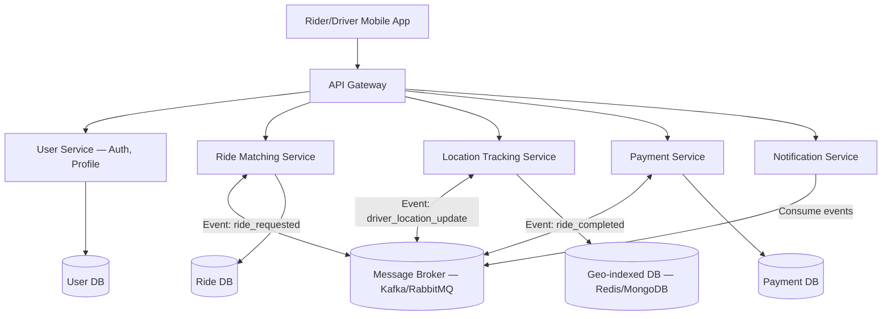

# ০১. Startup Project Brief — একটা মাল্টি-সার্ভিস মাইক্রোসার্ভিস প্ল্যাটফর্ম

Module 49-এ আমরা একটা ছোট, একজনে চালানোর মতো ইনভয়েসিং SaaS ডিজাইন করেছি — একটা মনোলিথিক অ্যাপ্লিকেশন, যেখানে সব লজিক এক কোডবেজে থাকে। কিন্তু Module 40-এ আমরা শিখেছি যখন একটা প্রোডাক্ট বড় হতে থাকে, একাধিক টিম একসাথে কাজ করতে হয়, বা একেকটা অংশ একেক গতিতে স্কেল করতে হয় — তখন মনোলিথ থেকে **মাইক্রোসার্ভিস আর্কিটেকচারে** সরে যাওয়ার প্রয়োজন হয়। এই লেসনে আমরা এমন একটা প্রজেক্ট ডিজাইন করবো, যেটা সরাসরি স্টার্টআপ-স্কেলের চিন্তা দাবি করে — একাধিক সার্ভিস, একাধিক ডাটাবেজ, একটা রিয়েল মেসেজিং সিস্টেম দিয়ে জোড়া।

## প্রজেক্ট আইডিয়া: RideMitro — একটা রাইড-শেয়ারিং প্ল্যাটফর্মের ব্যাকএন্ড

কল্পনা করো তুমি একটা স্টার্টআপ শুরু করছো — ঢাকার মতো শহরে একটা রাইড-শেয়ারিং সার্ভিস (Uber/Pathao-এর মতো)। এই ধরনের প্ল্যাটফর্মে একসাথে অনেকগুলো ভিন্ন দায়িত্ব চলে — ইউজার ম্যানেজমেন্ট, রাইড ম্যাচিং, লোকেশন ট্র্যাকিং, পেমেন্ট, নোটিফিকেশন — আর প্রতিটার স্কেলিং চাহিদা আলাদা। লোকেশন ট্র্যাকিং সার্ভিসে প্রতি সেকেন্ডে হাজার হাজার আপডেট আসবে, কিন্তু পেমেন্ট সার্ভিসে তুলনামূলক কম ট্র্যাফিক। এই ধরনের অসম চাহিদার জন্যই মাইক্রোসার্ভিস আর্কিটেকচার মানানসই — প্রতিটা সার্ভিস স্বাধীনভাবে স্কেল করা যায়।

লক্ষ্য করো এখানে প্রতিটা সার্ভিসের নিজস্ব ডাটাবেজ আছে — এটাই মাইক্রোসার্ভিসের একটা মূল নিয়ম, **Database per Service**। কোনো সার্ভিস সরাসরি আরেকটা সার্ভিসের ডাটাবেজ পড়তে পারবে না, বরং API কল বা ইভেন্টের মাধ্যমে যোগাযোগ করবে। এই ইভেন্ট-ড্রিভেন যোগাযোগটাই সিস্টেমের সার্ভিসগুলোকে একে অপরের থেকে আলগা (loosely coupled) রাখে — একটা সার্ভিস ডাউন হলে পুরো সিস্টেম থেমে যায় না।

**মূল রিকোয়ারমেন্ট:**

- **API Gateway**: একটা একক এন্ট্রি পয়েন্ট, যেখান থেকে রিকোয়েস্ট সঠিক সার্ভিসে রুট হয় (rate limiting, auth verification এখানেই কেন্দ্রীভূত)
- **Event-Driven Communication**: রাইড রিকোয়েস্ট, ড্রাইভার লোকেশন আপডেট, রাইড সম্পন্ন হওয়া — এই ইভেন্টগুলো মেসেজ ব্রোকারের মাধ্যমে প্রচার হবে
- **Independent Deployability**: প্রতিটা সার্ভিস আলাদা Docker কন্টেইনারে চলবে, আলাদাভাবে ডেপ্লয় করা যাবে
- **Resilience**: একটা সার্ভিস ধীর হলে বা ডাউন হলে বাকি সিস্টেম যেন সম্পূর্ণ অচল না হয়ে যায় (circuit breaker প্যাটার্ন)

## মাইলস্টোন

1. **ধাপ ১ — মনোলিথ প্রোটোটাইপ**: প্রথমে সবকিছু একটা সিঙ্গেল FastAPI অ্যাপে বানাও (ঠিক Module 48-এর মতো), যাতে বিজনেস লজিকটা আগে ঠিকমতো কাজ করে প্রমাণ হয়
2. **ধাপ ২ — সার্ভিস আলাদা করা**: User, Ride, Location, Payment, Notification — প্রতিটাকে আলাদা প্রজেক্টে ভাগ করো, নিজস্ব ডাটাবেজ দাও
3. **ধাপ ৩ — মেসেজ ব্রোকার যোগ করা**: RabbitMQ বা Kafka বসাও, সার্ভিসগুলোর মধ্যে সরাসরি HTTP কলের বদলে ইভেন্ট-ভিত্তিক যোগাযোগে রূপান্তর করো
4. **ধাপ ৪ — API Gateway ও Observability**: একটা গেটওয়ে বসাও, প্রতিটা সার্ভিসে লগিং আর মনিটরিং যোগ করো (Sentry, Module 41-এর error tracking লেসনের প্রয়োগ)
5. **ধাপ ৫ — Deployment**: Kubernetes বা Docker Compose দিয়ে পুরো সিস্টেম একসাথে চালানো, লোড টেস্ট করা

এই প্রজেক্টটা ইচ্ছাকৃতভাবে বড় এবং কঠিন — বাস্তব স্টার্টআপগুলো ঠিক এইরকম জটিলতার মধ্য দিয়েই যায়। "মনোলিথ দিয়ে শুরু করে দরকার হলে মাইক্রোসার্ভিসে ভাঙা" — এই ধাপে ধাপে অগ্রসর হওয়ার কৌশলটাই সবচেয়ে গুরুত্বপূর্ণ শিক্ষা, কারণ বাস্তবে কোনো স্টার্টআপ প্রথম দিনেই নিখুঁত মাইক্রোসার্ভিস আর্কিটেকচার নিয়ে শুরু করে না।

পরের এবং শেষ প্রজেক্ট ব্রিফে আমরা আরেকটা মাত্রা যোগ করবো — এই ধরনের সিস্টেমের ভেতরে একটা স্বয়ংক্রিয় AI এজেন্ট বসিয়ে দেয়া, যেটা নিজে থেকে সিদ্ধান্ত নিতে পারে।
