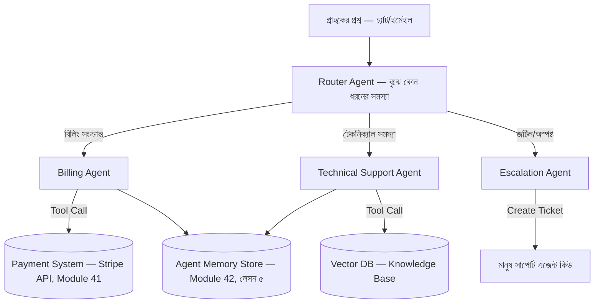

# ০১. AI Agent Startup Project Brief — একটা স্বয়ংক্রিয় সাপোর্ট এজেন্ট স্টার্টআপ

আমাদের যাত্রার শেষ প্রজেক্ট ব্রিফ এটা, আর এটা সবচেয়ে ভবিষ্যৎমুখী। Module 42-এ আমরা শিখেছি AI এজেন্ট কী, কীভাবে তারা নিজে থেকে সিদ্ধান্ত নেয়, মেমোরি রাখে, একে অপরের সাথে যোগাযোগ করে, আর কীভাবে প্রোডাকশনে নিরাপদভাবে ডেপ্লয় করা যায়। Module 50-এ আমরা শিখেছি কীভাবে একটা মাল্টি-সার্ভিস স্টার্টআপ আর্কিটেকচার ডিজাইন করতে হয়। এই লেসনে দুটোকে একসাথে জোড়া দিয়ে একটা প্রজেক্ট ব্রিফ তৈরি করবো, যেখানে একটা AI এজেন্ট নিজেই একটা স্টার্টআপ প্রোডাক্টের কেন্দ্রীয় ইঞ্জিন।

## প্রজেক্ট আইডিয়া: SupportPilot — একটা স্বয়ংক্রিয় কাস্টমার সাপোর্ট এজেন্ট প্ল্যাটফর্ম

কল্পনা করো একটা SaaS প্রোডাক্ট, যেটা ছোট ব্যবসাগুলোকে (Module 43-45-এর নীতিতে বানানো ইনভয়েসিং SaaS-এর মতোই) একটা AI-চালিত কাস্টমার সাপোর্ট এজেন্ট সরবরাহ করে। এই এজেন্ট শুধু প্রি-সেট উত্তর দেয় না — সে সত্যিকারের কাজ করতে পারে: গ্রাহকের অ্যাকাউন্ট চেক করা, রিফান্ড প্রসেস শুরু করা, টিকিট তৈরি করে মানুষ এজেন্টের কাছে এসকেলেট করা, আর প্রতিটা কথোপকথন থেকে শিখে ভবিষ্যতে আরো ভালো উত্তর দেয়া।

এটা ঠিক Module 42-এর "Task-Specific AI Agent" (লেসন ৪) আর "Multi-Agent Communication" (লেসন ৬)-এর ধারণাগুলোর বাস্তব প্রয়োগ — এখানে একটামাত্র এজেন্ট না, বরং কয়েকটা বিশেষায়িত এজেন্ট মিলে কাজ করে।

**মূল রিকোয়ারমেন্ট:**

- **Router Agent**: আগত মেসেজ বিশ্লেষণ করে ঠিক করবে কোন বিশেষায়িত এজেন্টের কাছে পাঠাতে হবে (Module 42-এর LangChain ইন্টিগ্রেশন লেসন এখানে সরাসরি কাজে লাগবে)
- **Tool-Using Agents**: এজেন্টরা শুধু টেক্সট জেনারেট করবে না, বাস্তব API কল করবে — গ্রাহকের অ্যাকাউন্ট স্ট্যাটাস চেক করা, রিফান্ড ইনিশিয়েট করা (Module 41-এর Stripe/PayPal ইন্টিগ্রেশনের সাথে মিলিয়ে)
- **Memory ও Context**: একই গ্রাহকের সাথে আগের কথোপকথন মনে রাখা, যাতে বারবার একই তথ্য জিজ্ঞেস করতে না হয়
- **Safety Guardrails**: এজেন্ট যেন নিজে থেকে বড় অঙ্কের রিফান্ড অনুমোদন করে না দেয় — একটা নির্দিষ্ট সীমার উপরে গেলে বাধ্যতামূলক মানুষ-অনুমোদন লাগবে (Module 42-এর "AI Agent Security & Safety" লেসনের সরাসরি প্রয়োগ)
- **Monitoring**: প্রতিটা এজেন্ট সিদ্ধান্ত লগ হবে, ভুল উত্তর দিলে ট্র্যাক করা যাবে (Module 42-এর মনিটরিং লেসন + Module 41-এর Sentry ইন্টিগ্রেশন)

## ব্যবসায়িক দিক — শুধু প্রযুক্তি না

এই প্রজেক্টটা শুধু একটা কারিগরি চ্যালেঞ্জ না — এটা একটা ব্যবসাও। Module 43-এর SaaS মেট্রিক্স অনুযায়ী চিন্তা করলে, এখানে মূল ভ্যালু প্রোপোজিশন হলো "মানুষ সাপোর্ট এজেন্ট নিয়োগের খরচের একটা অংশে ২৪/৭ সাপোর্ট।" প্রাইসিং মডেল হতে পারে প্রতি কথোপকথন-ভিত্তিক অথবা মাসিক ফ্ল্যাট রেট (Module 43, লেসন ৭)। আর Module 44-45-এর ইনডি হ্যাকিং স্ট্র্যাটেজি অনুযায়ী, প্রথম গ্রাহক পাওয়ার জন্য নিজের বানানো এজেন্টটা নিজের আগের প্রজেক্ট (যেমন Module 49-এর InvoiceBari)-তেই বসিয়ে প্রমাণ দেখানো যেতে পারে — "নিজের প্রোডাক্টে ব্যবহার করে দেখাও এটা কাজ করে।"

## মাইলস্টোন

1. **ধাপ ১ — একক এজেন্ট প্রোটোটাইপ**: প্রথমে একটামাত্র সাধারণ এজেন্ট বানাও, যেটা শুধু FAQ উত্তর দেয় (Module 42, লেসন ১-৩)
2. **ধাপ ২ — Tool Use যোগ করা**: এজেন্টকে বাস্তব API কল করার ক্ষমতা দাও (অ্যাকাউন্ট চেক, রিফান্ড ইনিশিয়েট)
3. **ধাপ ৩ — Multi-Agent Router**: আলাদা আলাদা বিশেষায়িত এজেন্ট বানিয়ে একটা Router-এর মাধ্যমে সংযুক্ত করো
4. **ধাপ ৪ — Safety ও Monitoring বসানো**: গার্ডরেল, লগিং, এসকেলেশন সিস্টেম যোগ করা
5. **ধাপ ৫ — প্রোডাকশন ডেপ্লয়মেন্ট**: Module 42-এর ডেপ্লয়মেন্ট লেসন অনুসরণ করে লাইভ সিস্টেমে ছাড়া, প্রথম বাস্তব গ্রাহকের কাছে পরীক্ষা করা

এই প্রজেক্টটা দিয়েই আমাদের কোর্সের সবগুলো সুতো একসাথে গাঁথা হলো — ব্যাকএন্ড ইঞ্জিনিয়ারিং, আর্কিটেকচার, ব্যবসায়িক চিন্তা, আর সবচেয়ে নতুন প্রযুক্তি হিসেবে AI এজেন্ট। এখান থেকে তুমি যা-ই বানাও না কেন — ছোট একটা টুল, একটা ইনডি SaaS, বা একটা AI-চালিত স্টার্টআপ — এই কোর্সে শেখা প্রতিটা ধারণা তোমার কাজে লাগবে। কোর্সের সম্পূর্ণ মডিউল তালিকা দেখতে দেখো রুট ফোল্ডারের **COURSE-COMPLETE.md** ফাইলটা।
