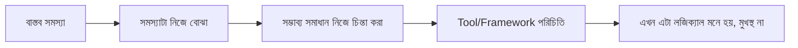
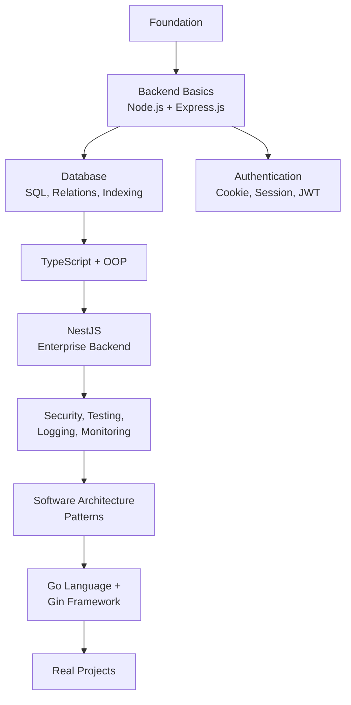

# ০১. Welcome to SWE Course

## নতুন শহরের গল্প

ধরো তুমি একটা শহরে নতুন এসেছো, যেখানে রাস্তার নাম নেই, ম্যাপ নেই — শুধু মানুষ হেঁটে যাচ্ছে এদিক ওদিক, প্রত্যেকে জানে কোথায় যেতে হবে। প্রথম কয়েকদিন তোমার মনে হবে, "এরা কীভাবে বুঝছে কোথায় যেতে হবে? আমার তো কিছুই চেনা লাগছে না।"

কিন্তু আসলে প্রত্যেকটা রাস্তার একটা লজিক আছে — হয়তো নদীর ধার দিয়ে বাজার এলাকা, উঁচু জায়গায় আবাসিক এলাকা। শুধু তুমি এখনো সেই লজিকটা শেখোনি। একবার শিখে গেলে, পুরো শহরটা হঠাৎ করে "গোছানো" মনে হতে শুরু করবে।

Software Engineering ঠিক এরকম একটা শহর। প্রথম প্রথম মনে হবে হাজারটা শব্দ (server, API, database, framework, deployment, middleware, ORM...) মাথার উপর দিয়ে যাচ্ছে। কিন্তু প্রত্যেকটা শব্দের পেছনে একটা সহজ, বাস্তব কারণ আছে — কোনো একটা সমস্যার সমাধান হিসেবে জিনিসটা তৈরি হয়েছিল। কেউ একদিন একটা সমস্যায় পড়েছিল, এবং সেই সমস্যার সমাধান করতে গিয়ে এই টুলটা/প্যাটার্নটা তৈরি হয়েছে।

## এই কোর্সের দর্শন

> আমরা কখনো কোনো টুল বা কনসেপ্ট মুখস্থ করাবো না। প্রথমে সমস্যাটা দেখাবো, তারপর দেখাবো কেন সেই সমাধানটাই সবচেয়ে যুক্তিসঙ্গত।

উদাহরণ দিয়ে বলি। আমরা "চলো Express.js শিখি" বলে শুরু করবো না। বরং প্রশ্ন করবো:

> "একটা ব্রাউজার যখন আমার কম্পিউটারে থাকা কোনো প্রোগ্রামের কাছে ডেটা চায়, তখন সেই প্রোগ্রামটা কীভাবে বুঝবে ব্রাউজার আসলে কী চাইছে — হোমপেজ, নাকি প্রোফাইল পেজ, নাকি কোনো ছবি?"

এই প্রশ্নের উত্তর খুঁজতে খুঁজতে আমরা নিজেরাই বুঝবো — "আচ্ছা, তাহলে একটা নিয়ম দরকার যেটা ঠিকানা (URL) দেখে বুঝবে কী পাঠাতে হবে।" এই নিয়ম বানানোর কাজটাই একটা framework সহজ করে দেয়, আর তখন Express.js শেখাটা মুখস্থ বিদ্যা থাকে না — সেটা হয়ে যায় তোমার নিজের প্রশ্নের যৌক্তিক উত্তর।

## এই কোর্সে কী কী থাকছে (High Level Map)

সংক্ষেপে:

- **Backend Fundamentals** — Node.js, Express.js দিয়ে ভিত্তি তৈরি
- **Database** — SQL, Relational Design, Indexing, Performance
- **TypeScript ও Object-Oriented Programming**
- **Authentication** — Cookie, Session, JWT
- **NestJS** দিয়ে Enterprise-grade Backend
- **API Security, Testing, Logging, Monitoring, Production Debugging**
- **Software Architecture Patterns**
- **Go Language ও Gin Framework**
- সবশেষে **Real Project** বানিয়ে সব একসাথে প্রয়োগ করা

## লক্ষ্যটা কী

কোর্স শেষে তুমি এমন একজন ইঞ্জিনিয়ার হবে যে:

- **"কেন"** প্রশ্নের উত্তর দিতে পারে — শুধু "কীভাবে" কপি-পেস্ট করতে পারে এমন না
- একটা নতুন সমস্যা দেখলে, আগে চেনা প্যাটার্নের সাথে তুলনা করে বুঝতে পারে
- প্রোডাকশনে স্মুথ, সলিড প্রোডাক্ট বানাতে পারে — শুধু "লোকাল-এ কাজ করে" এমন কোড না

পরের লেসনে দেখবো — এই স্টাইলে শিখে সবচেয়ে বেশি লাভবান হওয়ার জন্য তোমাকে কী কী অভ্যাস গড়ে তুলতে হবে।

**পরবর্তী:** [02-course-benefit-strategy.md](02-course-benefit-strategy.md)
