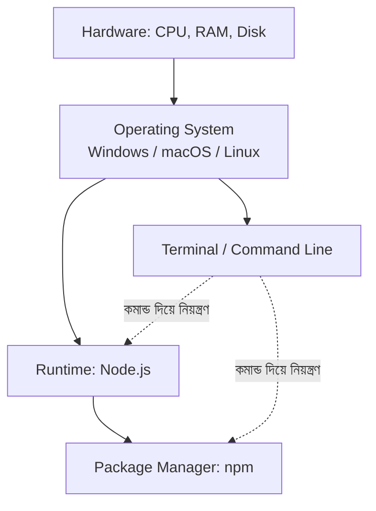
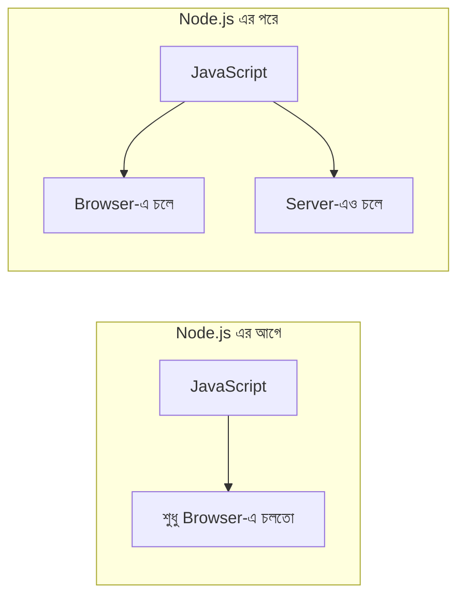

# ০৪. Understanding the Environment

কোড লেখা শুরু করার আগে জানা দরকার — কোড আসলে কোথায়, কীভাবে "চলে"। চারটা টার্ম বারবার আসবে সামনে — এখনই এদের সম্পর্ক পরিষ্কার করে নেই।

## চারটা স্তর



### ১. Operating System (OS)

তোমার কম্পিউটারের সবচেয়ে নিচের সফটওয়্যার স্তর — Windows, macOS, বা Linux। এটা হার্ডওয়্যার (CPU, RAM, Disk) আর তোমার প্রোগ্রামের মধ্যে দোভাষীর কাজ করে।

যখন তুমি একটা প্রোগ্রাম চালাও:
- OS সেটাকে CPU-তে সময় বরাদ্দ করে (কারণ একসাথে অনেক প্রোগ্রাম চলে, কিন্তু CPU-র কোর সীমিত)
- OS মেমরি (RAM) বরাদ্দ করে
- OS ফাইল সিস্টেমে পড়া/লেখার অনুমতি ম্যানেজ করে
- OS নেটওয়ার্ক কানেকশন ম্যানেজ করে

### ২. Runtime

একটা প্রোগ্রামিং ভাষার কোড (যেমন JavaScript) সরাসরি CPU বুঝতে পারে না। দরকার হয় একটা "অনুবাদক" যেটা কোডটাকে CPU-চালানোর মতো নির্দেশে রূপান্তর করে। এই অনুবাদক-প্রোগ্রামটাকে বলে **Runtime**।

**Node.js** হলো JavaScript-এর একটা runtime — এটা তোমার লেখা JS কোডকে ব্রাউজারের বাইরে, সরাসরি তোমার কম্পিউটারে (server হিসেবে) চালানোর ক্ষমতা দেয়।

> **এখানেই প্রথম বড় "aha" মোমেন্ট:** JavaScript শুরুতে *শুধু* ব্রাউজারে চলতো (ওয়েবপেজ ইন্টারেক্টিভ করার জন্য — বাটনে ক্লিক করলে কিছু হওয়া, ফর্ম চেক করা)। Node.js আসার পরে (2009 সালে) JavaScript দিয়ে **server**-ও বানানো সম্ভব হলো। মানে একই ভাষা দিয়ে frontend আর backend দুটোই লেখা যায় — এটাই কেন এত মানুষ JavaScript/Node.js দিয়ে backend শেখে তার প্রধান কারণ।



### ৩. Terminal / Command Line

GUI (মাউস দিয়ে ক্লিক করা ইন্টারফেস) ব্যবহার না করে, লেখা কমান্ড দিয়ে কম্পিউটারকে নির্দেশ দেয়ার একটা উপায়।

Backend developer হিসেবে টার্মিনাল তোমার সবচেয়ে ঘনিষ্ঠ হাতিয়ার হয়ে উঠবে:
- সার্ভার চালু করা (`node app.js`)
- প্যাকেজ ইনস্টল করা (`npm install express`)
- Git কমান্ড চালানো (`git commit`, `git push`)
- ফাইল/ফোল্ডার ম্যানেজ করা

### ৪. Package Manager

ধরো তোমার প্রজেক্টে ইমেইল পাঠানোর একটা ফিচার দরকার। পুরো ইমেইল-পাঠানো সিস্টেম (SMTP প্রোটোকল, রিট্রাই লজিক, এরর হ্যান্ডলিং) নিজে থেকে লেখা সময়ের বিশাল অপচয়। এর বদলে অন্য কেউ আগে থেকে লিখে রাখা, টেস্ট করা কোড (**library** বা **package**) ব্যবহার করা যায়।

**npm** (Node Package Manager) হলো সেই টুল যেটা দিয়ে এই "অন্য মানুষের লেখা কোড" ইনস্টল, আপডেট এবং ম্যানেজ করা হয়। এটা Node.js-এর সাথেই আসে, আলাদা করে ইনস্টল করতে হয় না।

## সম্পর্কটা একবার আবার দেখি

```
OS (Windows/Mac/Linux)
  └── Runtime (Node.js) ইনস্টল করা হয় OS-এর উপর
        └── Package Manager (npm) আসে Node.js-এর সাথেই
              └── Terminal দিয়ে তুমি এই সবগুলোর সাথে "কথা বলো"
```

এই চারটা স্তর বুঝে গেলে, পরে যখন কোনো ইনস্টলেশন এরর আসবে (যেমন "command not found" বা "permission denied"), তুমি সহজেই ধরতে পারবে সমস্যাটা কোন স্তরে হচ্ছে — OS পারমিশনের, নাকি Runtime ইনস্টলেশনের, নাকি প্যাকেজ ম্যানেজারের।

**পরবর্তী:** [05-connecting-the-dots.md](05-connecting-the-dots.md)
