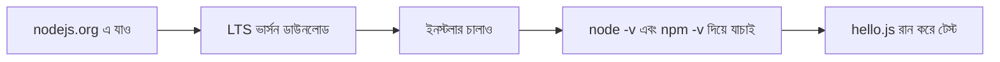
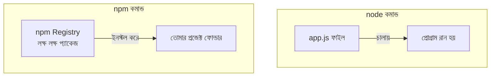

# ০৬. Installing Node.js

## কেন দরকার

আগের লেসনে বলেছি — Node.js হলো JavaScript-এর runtime, যেটা দিয়ে ব্রাউজারের বাইরে JS কোড চালানো যায়। এটাই আমাদের ব্যাকএন্ড কোড চালানোর ভিত্তি হবে। এই কোর্সের প্রায় প্রতিটা মডিউলে (Go Language অংশ ছাড়া) Node.js লাগবে।

## ইনস্টলেশন ধাপে ধাপে



### Windows

1. ব্রাউজারে যাও [nodejs.org](https://nodejs.org)।
2. **LTS (Long Term Support)** ভার্সনটা ডাউনলোড করো — এটাই সবচেয়ে স্টেবল, প্রোডাকশনের জন্য উপযুক্ত। "Current" ভার্সনে নতুন ফিচার থাকে কিন্তু কম স্টেবল, তাই শেখার শুরুতে LTS-ই ভালো।
3. ডাউনলোড হওয়া `.msi` ফাইলে ডাবল ক্লিক করো, Next চাপতে চাপতে ইনস্টল শেষ করো (ডিফল্ট অপশনগুলোই ঠিক আছে)।
4. ইনস্টল শেষে, **Command Prompt** বা **PowerShell** খুলে চেক করো:

```bash
node -v
npm -v
```

দুটো কমান্ডই যদি একটা ভার্সন নম্বর দেখায় (যেমন `v20.11.0` এবং `10.2.4`), ইনস্টলেশন সফল।

### macOS

```bash
# Homebrew ব্যবহার করে (রেকমেন্ডেড)
brew install node
```
অথবা nodejs.org থেকে সরাসরি `.pkg` ইনস্টলার ডাউনলোড করেও করা যায়।

### Linux (Ubuntu/Debian)

```bash
curl -fsSL https://deb.nodesource.com/setup_lts.x | sudo -E bash -
sudo apt-get install -y nodejs
```

## `node` বনাম `npm` — পার্থক্যটা স্পষ্ট করে নেই

এই দুটো কমান্ড একসাথে ইনস্টল হয় বলে অনেকে গুলিয়ে ফেলে। কিন্তু কাজ সম্পূর্ণ আলাদা:

| কমান্ড | কাজ | উদাহরণ |
|---|---|---|
| `node` | সরাসরি একটা JavaScript ফাইল **চালায়** | `node app.js` |
| `npm` | প্যাকেজ ইনস্টল/আনইনস্টল করে, প্রজেক্ট **ম্যানেজ করে** | `npm install express` |



একটা সহজ মনে রাখার উপায়: **`node` = "চালাও"**, **`npm` = "আনো এবং সাজাও"**।

## যাচাই করার জন্য একটা ছোট পরীক্ষা

একটা ফাইল বানাও `hello.js` নামে, ভেতরে লেখো:

```js
console.log("Node.js কাজ করছে!");
```

টার্মিনালে গিয়ে সেই ফোল্ডারে চলে যাও এবং চালাও:

```bash
node hello.js
```

যদি টার্মিনালে `Node.js কাজ করছে!` প্রিন্ট হয়, তাহলে বুঝবে Node.js ঠিকভাবে ইনস্টল হয়েছে এবং কাজ করছে।

> **যদি এরর আসে:** সবচেয়ে সাধারণ এরর হলো `'node' is not recognized as an internal or external command` (Windows-এ) — এর মানে Node.js ইনস্টলেশনের সময় সিস্টেম PATH-এ যোগ হয়নি। ইনস্টলার আবার চালাও এবং নিশ্চিত করো "Add to PATH" অপশনটা চেক করা আছে, অথবা কম্পিউটার একবার রিস্টার্ট দাও।

**পরবর্তী:** [07-installing-vscode.md](07-installing-vscode.md)
