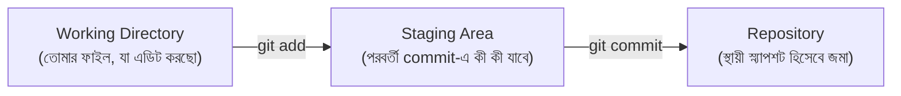
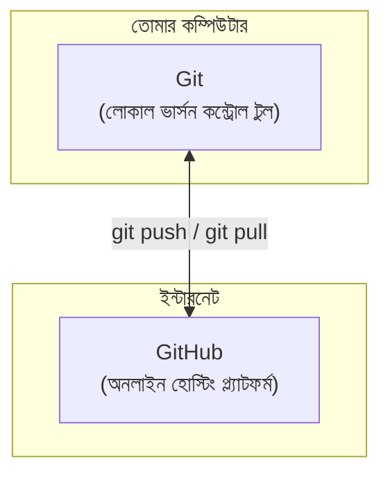
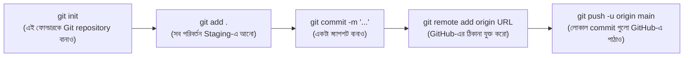

# ০৮. Installing Git এবং GitHub পরিচিতি

## সমস্যাটা প্রথমে বুঝি

ধরো তুমি একটা ফাইলে কাজ করছো, নাম `app.js`। কাজ করতে করতে হঠাৎ মনে হলো, "এই পরিবর্তনটা ভুল হয়ে গেলো, আগের ভার্সনে ফিরে যেতে চাই।"

এখন যদি তুমি ম্যানুয়ালি ফাইল কপি করে রাখো —

```
app.js
app_v1.js
app_v2.js
app_final.js
app_final_ACTUAL.js
app_final_ACTUAL_fixed.js
```

কিছুদিনের মধ্যেই এটা একটা বিশৃঙ্খলা হয়ে যাবে। কোনটা আসল ভার্সন, কে জানে!

**Git** এই সমস্যার সমাধান। এটা একটা **Version Control System** — প্রতিটা পরিবর্তনের একটা "স্ন্যাপশট" (commit) রাখে, যাতে তুমি যেকোনো সময় যেকোনো পুরনো অবস্থায় ফিরে যেতে পারো, অথবা দেখতে পারো ঠিক কী কী বদলেছে, কখন, কেন।

## Git ইনস্টলেশন

**Windows:** [git-scm.com](https://git-scm.com) থেকে ডাউনলোড করে ইনস্টল করো। ইনস্টলের সময় ডিফল্ট অপশনগুলো রাখাই যথেষ্ট।

**macOS:**
```bash
brew install git
```

**Linux:**
```bash
sudo apt-get install git
```

**যাচাই:**
```bash
git --version
```

## প্রথমবার Git সেটআপ (একবারই করতে হয়)

```bash
git config --global user.name "তোমার নাম"
git config --global user.email "tomar@email.com"
```

এই তথ্যটা প্রতিটা commit-এর সাথে যুক্ত থাকে — বোঝা যায় কে কোন পরিবর্তন করেছে। `--global` মানে এই সেটিং তোমার কম্পিউটারের **সব** Git প্রজেক্টে প্রযোজ্য হবে।

## Git-এর তিনটা স্তর (Working Directory → Staging → Repository)



- **Working Directory** — তোমার ফাইলগুলো যেখানে সরাসরি এডিট করো। এখানে পরিবর্তন করলে সেটা এখনো Git "মনে রাখেনি"।
- **Staging Area** — কোন কোন পরিবর্তন পরবর্তী commit-এ যাবে, সেটা বেছে নেয়ার জায়গা (`git add <ফাইল>`)। ধরো তুমি ৩টা ফাইলে কাজ করেছো, কিন্তু চাও শুধু ১টা ফাইলের পরিবর্তন এখন commit হোক — Staging Area এই নিয়ন্ত্রণ দেয়।
- **Repository** — যেখানে commit হিসেবে স্থায়ীভাবে স্ন্যাপশট জমা হয় (`git commit -m "বার্তা"`)। প্রতিটা commit একটা টাইম-স্ট্যাম্পড, স্থায়ী পয়েন্ট যেখানে যেকোনো সময় ফিরে যাওয়া যায়।

## GitHub — Git-এর সাথে পার্থক্য

এখানে অনেকে গুলিয়ে ফেলে — **Git** আর **GitHub** এক জিনিস না।



| | Git | GitHub |
|---|---|---|
| এটা কী | একটা টুল/সফটওয়্যার | একটা ওয়েবসাইট/সার্ভিস |
| কোথায় চলে | তোমার কম্পিউটারে (লোকাল) | ইন্টারনেটে |
| ইন্টারনেট লাগে? | না, অফলাইনেও কাজ করে | হ্যাঁ |
| কাজ | পরিবর্তন ট্র্যাক করা | Git repository অনলাইনে হোস্ট করা |

GitHub মূলত তিনটা কাজ করে:

1. **Backup** — তোমার কম্পিউটার নষ্ট হয়ে গেলেও কোড হারাবে না, GitHub-এ নিরাপদে থাকবে।
2. **Collaboration** — অন্য কেউ একই প্রজেক্টে কাজ করতে পারবে, পরিবর্তনগুলো একসাথে মিলিয়ে (merge) নেয়া যাবে।
3. **Portfolio** — তোমার কাজ অন্যদের (যেমন ভবিষ্যৎ employer) দেখানোর জায়গা।

## GitHub অ্যাকাউন্ট সেটআপ

1. [github.com](https://github.com)-এ গিয়ে একটা ফ্রি অ্যাকাউন্ট বানাও।
2. একটা নতুন repository তৈরি করো (`New repository` বাটনে ক্লিক করে)।
3. তোমার লোকাল কম্পিউটারের কোডকে GitHub-এর সাথে যুক্ত করার কমান্ড:

```bash
git init
git add .
git commit -m "প্রথম commit"
git remote add origin <তোমার-repository-URL>
git push -u origin main
```

### এই কমান্ডগুলোর মানে (সংক্ষেপে)



> এই কমান্ডগুলো এখনই পুরোপুরি মুখস্থ করার দরকার নেই। **Module 37 (Git and GitHub Fundamentals)**-এ ব্র্যাঞ্চিং, মার্জিং, কনফ্লিক্ট সমাধান, রিমোট রিপোজিটরি — এসব নিয়ে গভীরভাবে কাজ করবো। এখন শুধু ধারণাটা বুঝে রাখো:
>
> **Git = লোকাল ভার্সন কন্ট্রোল টুল, GitHub = সেই Git-কে অনলাইনে হোস্ট করার প্ল্যাটফর্ম।**

## Module 1 শেষে নিজেকে যাচাই করো

নোট না দেখে নিজেকে এই প্রশ্নগুলোর উত্তর দাও — এটাই বোঝাবে তুমি Module 2-এর জন্য প্রস্তুত কিনা:

1. Runtime কী, এবং Node.js কেন দরকার?
2. `node` কমান্ড আর `npm` কমান্ডের মধ্যে পার্থক্য কী?
3. Git আর GitHub-এর মধ্যে পার্থক্য কী, এক বাক্যে বলো।
4. Working Directory, Staging Area, আর Repository — এই তিনটার সম্পর্ক কী?
5. IDE (VS Code) শুধু একটা টেক্সট এডিটরের চেয়ে বেশি কেন?

যদি এই পাঁচটার উত্তর নিজের ভাষায় দিতে পারো, তুমি প্রস্তুত — পরের মডিউলে আমরা প্রথমবারের মতো একটা **Web Server** বানাবো এবং বুঝবো ব্রাউজার আর সার্ভারের মধ্যে ঠিক কী ঘটে।

**পরবর্তী মডিউল:** Module 2 — Introduction To Webservers
