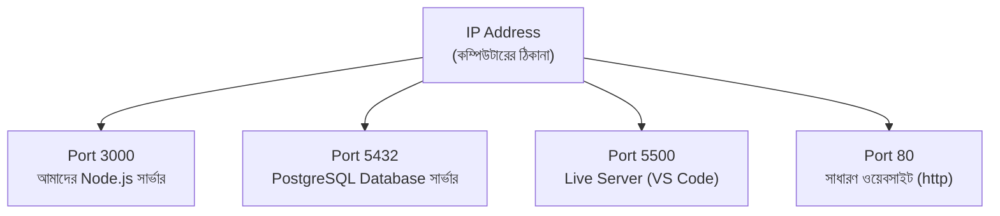

# ০৮. How Does PORT, Web Server and IP Address Work Together?

আগের লেসনে আমরা লিখেছিলাম `server.listen(3000, ...)`। এই `3000` সংখ্যাটা আমরা তখন তেমন গুরুত্ব না দিয়ে ব্যবহার করেছিলাম, শুধু বলেছিলাম এটা একটা "পোর্ট নম্বর"। এবার এই সংখ্যাটার প্রকৃত ভূমিকা বুঝি, আর দেখি কীভাবে এটা IP address আর ওয়েব সার্ভারের সাথে মিলে কাজ করে।

একটা উপমা দিয়ে শুরু করি। ধরো একটা বহুতল অফিস ভবন — সেটার একটা ঠিকানা আছে, ধরো "১২৩ মেইন স্ট্রিট"। কিন্তু সেই ভবনের ভেতরে অনেকগুলো আলাদা আলাদা অফিস আছে — ৩০১ নম্বর কক্ষে একটা আইনি সংস্থা, ৪০৫ নম্বর কক্ষে একটা ডিজাইন স্টুডিও। কেউ যদি শুধু "১২৩ মেইন স্ট্রিট"-এ চিঠি পাঠায়, ভবনের রিসেপশনিস্ট বুঝবে না চিঠিটা ঠিক কোন অফিসের জন্য। তাই ঠিকানার সাথে কক্ষ নম্বরটাও লাগে — "১২৩ মেইন স্ট্রিট, কক্ষ ৩০১"।

একটা কম্পিউটারও ঠিক এই ভবনের মতো। কম্পিউটারের **IP address** হলো ভবনের ঠিকানা — এটা বলে দেয় কোন কম্পিউটারের কথা বলা হচ্ছে। কিন্তু একটা কম্পিউটারে একসাথে অনেকগুলো প্রোগ্রাম চলতে পারে, যাদের প্রত্যেকের নিজস্ব নেটওয়ার্ক-সংক্রান্ত কাজ থাকতে পারে — হয়তো একটা ওয়েব সার্ভার চলছে, একই সাথে একটা ডেটাবেজ সার্ভারও চলছে, আরেকটা প্রোগ্রাম ইমেইল পাঠাচ্ছে। শুধু IP address দিয়ে বলা যাবে না ঠিক কোন প্রোগ্রামের সাথে কথা বলতে হবে। এই সমস্যার সমাধানই হলো **পোর্ট নম্বর** — এটা কম্পিউটারের ভেতরের "কক্ষ নম্বর"।



তার মানে একটা সম্পূর্ণ ঠিকানা আসলে দুই অংশে গঠিত — **IP address + পোর্ট নম্বর**। যখন তুমি লেখো `localhost:3000`, তুমি আসলে বলছো "127.0.0.1 নামের কম্পিউটারে, ৩০০০ নম্বর কক্ষে যে প্রোগ্রামটা বসে আছে, তার সাথে কথা বলতে চাই।"

কিছু পোর্ট নম্বরের বিশেষ প্রথাগত অর্থ আছে, যেগুলো তুমি বারবার দেখবে:

| পোর্ট | সাধারণত যার জন্য ব্যবহৃত হয় |
|---|---|
| 80 | সাধারণ ওয়েবসাইট (HTTP) — ব্রাউজারে টাইপ করলে ডিফল্টভাবে এই পোর্টে যায় |
| 443 | নিরাপদ ওয়েবসাইট (HTTPS) |
| 3000 | Node.js ডেভেলপমেন্ট সার্ভারের জন্য খুবই জনপ্রিয় প্রথা |
| 5432 | PostgreSQL ডেটাবেজ |
| 27017 | MongoDB ডেটাবেজ |

লক্ষ্য করো, `80` আর `443` এত সাধারণ যে ব্রাউজার এগুলো ডিফল্ট ধরে নেয় — এই কারণেই তুমি `https://google.com:443` না লিখে শুধু `https://google.com` লিখলেই কাজ চলে, ব্রাউজার নিজে থেকেই `:443` জুড়ে দেয়। কিন্তু `3000` নম্বর পোর্টের জন্য এই ডিফল্ট নিয়ম নেই, তাই সবসময় স্পষ্ট করে লিখতে হয় `localhost:3000`।

একটা ব্যবহারিক প্রশ্ন হতে পারে — একই পোর্টে যদি দুইটা প্রোগ্রাম একসাথে চালানোর চেষ্টা করো, কী হবে? চেষ্টা করে দেখো — আগের লেসনের `server.js` চালু রেখে, আরেকটা টার্মিনালে আবার `node server.js` চালাও। দ্বিতীয়বার একটা এরর আসবে, সাধারণত এরকম কিছু:

```
Error: listen EADDRINUSE: address already in use :::3000
```

`EADDRINUSE` মানে "এই ঠিকানা (পোর্ট) ইতিমধ্যে ব্যবহৃত হচ্ছে।" এটাই প্রমাণ করে — একটা নির্দিষ্ট মুহূর্তে, একটা নির্দিষ্ট পোর্টে, শুধু একটা প্রোগ্রামই "বসে" থাকতে পারে। এই এররটা দেখলে ভয় পাওয়ার কিছু নেই — এর মানে হয় তুমি ইতিমধ্যে সার্ভারটা চালু রেখেছো (আগের টার্মিনালে গিয়ে `Ctrl+C` চাপো), অথবা অন্য কোনো প্রোগ্রাম সেই পোর্ট দখল করে বসে আছে (তখন অন্য একটা পোর্ট নম্বর বেছে নিতে হবে, যেমন 3001)।

সংক্ষেপে সম্পর্কটা এরকম: **IP address কম্পিউটার চেনায়, পোর্ট সেই কম্পিউটারের ভেতরের নির্দিষ্ট প্রোগ্রাম চেনায়, আর ওয়েব সার্ভার হলো সেই প্রোগ্রামটাই যেটা সেই পোর্টে বসে থেকে অনুরোধের অপেক্ষা করছে।**

পরের লেসনে আমরা ফিরে যাবো আমাদের নিজের বানানো সার্ভারে, আর দেখবো কীভাবে সেটাকে দিয়ে সত্যিকারের একটা HTML পাতা পাঠানো যায় — শুধু একটা টেক্সট বার্তা না।
