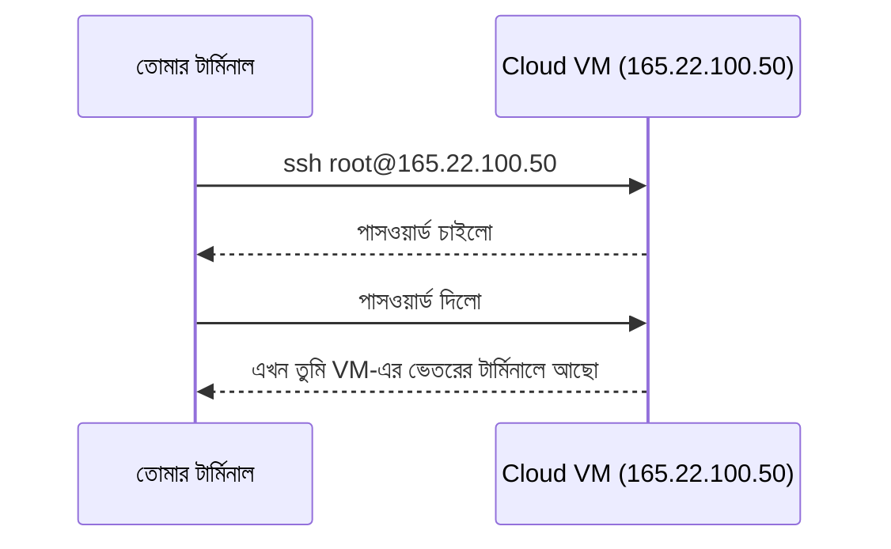

# ১১. ক্লাউড ল্যাব এ Node.js ডেপলয় করা

তত্ত্বটা তো বুঝলাম — cloud মানে একটা ভাড়া করা কম্পিউটার, যেখানে সার্ভার চালালে সেটা সবার জন্য উন্মুক্ত হয়ে যায়। এবার সেটা হাতে-কলমে করে দেখার পালা। এই লেসনে আমরা একটা cloud ভার্চুয়াল মেশিনে (VM) আমাদের `server.js`-টা নিয়ে গিয়ে চালাবো।

মনে রাখো, লোকাল কম্পিউটারে যা করেছিলে (Module 1-এ Node.js ইনস্টল করা, তারপর `node server.js` চালানো), cloud মেশিনেও প্রায় হুবহু একই কাজ করতে হবে — পার্থক্য শুধু এটা যে এখন তুমি নিজের কম্পিউটারের বদলে একটা দূরবর্তী (remote) কম্পিউটারে কাজ করছো, যেটার সাথে তুমি ইন্টারনেটের মাধ্যমে সংযুক্ত হচ্ছো।

## ধাপ ১: একটা Cloud VM ভাড়া নেয়া (বা ফ্রি ট্রায়াল ব্যবহার করা)

অনেক cloud provider নতুন ব্যবহারকারীদের জন্য ফ্রি ট্রায়াল দেয় (যেমন DigitalOcean, AWS Free Tier, Oracle Cloud Free Tier)। এখানে ধরে নিচ্ছি তুমি এমন একটা Linux ভিত্তিক VM (Ubuntu) চালু করেছো, আর তোমাকে একটা IP address দেয়া হয়েছে, ধরো `165.22.100.50`।

## ধাপ ২: SSH দিয়ে VM-এ সংযুক্ত হওয়া

**SSH (Secure Shell)** হলো একটা নিরাপদ উপায়, যেটা দিয়ে তুমি তোমার নিজের টার্মিনাল থেকেই দূরবর্তী কম্পিউটারের টার্মিনাল নিয়ন্ত্রণ করতে পারো — ঠিক যেন তুমি সরাসরি সেই মেশিনের সামনে বসে আছো।

```bash
ssh root@165.22.100.50
```

প্রথমবার সংযুক্ত হতে চাইলে একটা নিশ্চিতকরণ প্রশ্ন আসবে, `yes` লিখে এন্টার চাপো, তারপর পাসওয়ার্ড দাও (cloud provider এটা তোমাকে ইমেইলে বা ড্যাশবোর্ডে দিয়ে থাকবে)।



## ধাপ ৩: VM-এ Node.js ইনস্টল করা

লক্ষ্য করো, এই VM-টা একদম খালি একটা Linux মেশিন — এখানে Node.js আগে থেকে ইনস্টল করা নেই। তাই Module 1-এর মতোই ইনস্টল করতে হবে:

```bash
curl -fsSL https://deb.nodesource.com/setup_lts.x | sudo -E bash -
sudo apt-get install -y nodejs
node -v
```

## ধাপ ৪: কোড VM-এ নেয়া

তোমার `server.js` এবং `index.html` ফাইলগুলো VM-এ নিয়ে যেতে হবে। এটার সবচেয়ে পরিষ্কার উপায় হলো Git ব্যবহার করা (Module 1-এ শেখা), কিন্তু এখন দ্রুত একটা সহজ উপায় দেখাই — `scp` কমান্ড দিয়ে সরাসরি ফাইল কপি করা:

```bash
scp server.js index.html root@165.22.100.50:/root/
```

## ধাপ ৫: সার্ভার চালু করা

VM-এর টার্মিনালে (SSH সেশনে) গিয়ে:

```bash
node server.js
```

এবার তোমার নিজের ব্রাউজারে গিয়ে ঠিকানার বারে লেখো:

```
http://165.22.100.50:3000
```

যদি সব ঠিক থাকে, তুমি দেখতে পাবে সেই একই HTML পাতাটা — কিন্তু এবার এটা আর `localhost`-এ সীমাবদ্ধ না। যদি তুমি তোমার বন্ধুকে এই ঠিকানাটা পাঠাও, সেও একই পাতা দেখতে পারবে, কারণ এই IP address-টা পাবলিক, দুনিয়ার যে কেউ এতে পৌঁছাতে পারে।

## একটা গুরুত্বপূর্ণ বাস্তব সমস্যা: Firewall

অনেক সময় সার্ভার চালু থাকা সত্ত্বেও ব্রাউজার থেকে কানেক্ট করা যায় না। এর একটা সাধারণ কারণ হলো **firewall** — cloud provider ডিফল্টভাবে কিছু পোর্ট বন্ধ রাখে নিরাপত্তার জন্য। যদি ৩০০০ পোর্টে কানেক্ট করতে না পারো, cloud provider-এর ড্যাশবোর্ডে গিয়ে সেই পোর্টটা "খুলে" (allow) দিতে হবে। এটা নিয়ে বিস্তারিত পরের লেসনের ডকুমেন্টে থাকবে।

## একটা প্রশ্ন যেটা মনে রাখা দরকার

তুমি যদি এখন SSH সেশনটা বন্ধ করে দাও (টার্মিনাল বন্ধ করে দাও), তোমার সার্ভারটাও বন্ধ হয়ে যাবে! কারণ `node server.js` চলছে সেই সেশনের সাথে যুক্ত হয়ে। বাস্তব প্রোডাকশনে, সার্ভারকে ব্যাকগ্রাউন্ডে, সেশন বন্ধ হয়ে গেলেও চালু রাখার জন্য বিশেষ টুল ব্যবহার করা হয় (যেমন `pm2`), যেটা নিয়ে আমরা Module 33-এ (Monitoring & Alerting) বিস্তারিত শিখবো। আপাতত এই সীমাবদ্ধতাটা জেনে রাখাই যথেষ্ট।
