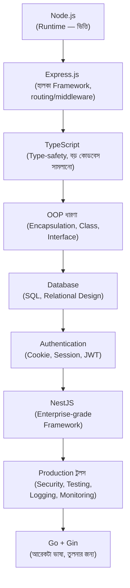

# ০১. আমরা এই কোর্সে ব্যাকএন্ডের কী কী টুলস আর ফ্রেমওয়ার্ক শিখবো, কীভাবে প্র্যাকটিস করবো

Module 2-তে আমরা নিজের হাতে একটা সার্ভার বানিয়েছিলাম, মাত্র কয়েক লাইন কোড দিয়ে — `http` মডিউল ব্যবহার করে। সেই সার্ভারটা কাজ করেছে ঠিকই, কিন্তু নিজেকে প্রশ্ন করো — যদি সেই একই সার্ভারে ১০০টা আলাদা পাতা থাকতো, প্রতিটার জন্য আলাদা লজিক থাকতো, ইউজার লগইন থাকতো, ডেটাবেজ থাকতো — তাহলে কি সেই কোডটা এখনো এত পরিষ্কার, এত সহজ থাকতো? উত্তরটা হলো, না। খুব দ্রুতই সেটা একটা জটলা পাকানো, অগোছালো কোডের স্তূপে পরিণত হতো।

এই সমস্যাটাই আসলে ব্যাখ্যা করে কেন আমরা "framework" নামের জিনিস ব্যবহার করি। একটা framework মূলত কারো আগে সমাধান করা একগুচ্ছ সাধারণ সমস্যার জবাব — routing (কোন পাতায় কী দেখাবে বোঝা), middleware (একাধিক ধাপে অনুরোধ প্রসেস করা), error handling (ভুল হলে সুন্দরভাবে সামলানো) — এসব কাজ যেন প্রতিবার নতুন করে না লিখতে হয়, সেজন্য কেউ একবার লিখে একটা পুনঃব্যবহারযোগ্য কাঠামো বানিয়ে দিয়েছে। আমরা সেই কাঠামোর উপর দাঁড়িয়ে নিজের অ্যাপ্লিকেশনের নির্দিষ্ট লজিকটুকু লিখি।

এই কোর্সে আমরা একটা নির্দিষ্ট পথ ধরে এগোবো, যেখানে প্রতিটা নতুন টুল আসার আগে তার প্রয়োজনীয়তা অনুভব করানো হবে। বড় ছবিটা এরকম দেখতে:

লক্ষ্য করো, আমরা প্রথমে **Express.js** দিয়ে শুরু করবো, কারণ এটা তুলনামূলক সহজ, আর তোমাকে বুঝতে সাহায্য করবে একটা framework আসলে "কী" করছে ভেতরে ভেতরে — কারণ Module 2-তে তুমি ইতিমধ্যে দেখেছো Express.js ছাড়া কীভাবে একটা সার্ভার লেখা যায়। পরে আমরা **NestJS**-এ যাবো, যেটা অনেক বেশি কাঠামোবদ্ধ, বড় প্রজেক্টের জন্য উপযুক্ত — কিন্তু NestJS বোঝার আগে TypeScript আর OOP-এর ধারণাগুলো (Module 13-14) শক্ত থাকা দরকার, কারণ NestJS পুরোপুরি এই দুটোর উপর দাঁড়িয়ে তৈরি।

ডেটাবেজের ক্ষেত্রেও একই দর্শন অনুসরণ করবো — আগে বুঝবো কেন ডেটা "স্থায়ীভাবে" রাখা দরকার (Module 15), তারপর SQL-এর মৌলিক ভাষা শিখবো, তারপর ধীরে ধীরে জটিল সম্পর্ক (relationships), ইনডেক্সিং, পারফরম্যান্স — এভাবে গভীরে যাবো।

শেষ দিকে, তুমি একই ধরনের সমস্যা **Go ভাষা এবং Gin framework** দিয়েও সমাধান করতে শিখবে। এটা এমন না যে Node.js "খারাপ" আর Go "ভালো" — বরং ভিন্ন ভিন্ন পরিস্থিতিতে ভিন্ন ভিন্ন টুল বেশি উপযুক্ত, আর দুটো ভাষায় একই সমস্যা সমাধান করলে তুমি বুঝবে কোন অংশটা "ভাষা-নির্দিষ্ট" আর কোন অংশটা "ব্যাকএন্ড ইঞ্জিনিয়ারিং-এর সার্বজনীন নীতি" — যেটা যেকোনো ভাষায় প্রযোজ্য।

প্র্যাকটিসের নিয়মটা সহজ, এবং Module 1-এ যা বলেছিলাম তারই পুনরাবৃত্তি — প্রতিটা নতুন টুল বা কনসেপ্ট আসার সাথে সাথে একটা ছোট, নিজে হাতে চালানো উদাহরণ থাকবে। তুমি সেটা টাইপ করবে, রান করবে, ভাঙবে (ইচ্ছাকৃতভাবে এরর তৈরি করে দেখবে কী হয়), তারপর ঠিক করবে। এই "বানানো-ভাঙা-ঠিক করা" চক্রটাই আসল শেখা তৈরি করে, শুধু পড়ে যাওয়া না।
