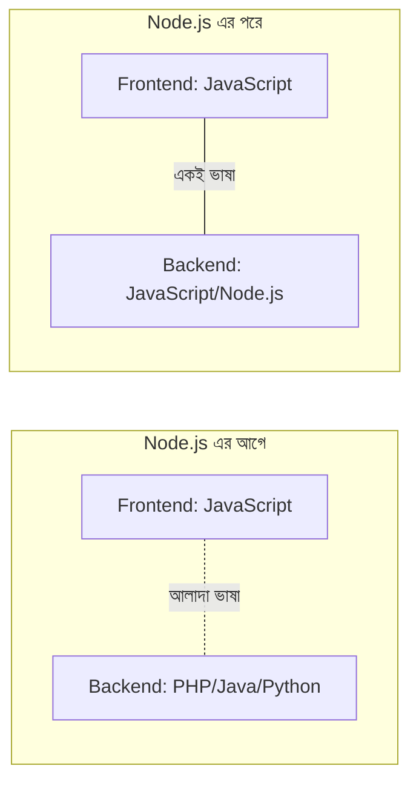

# ০২. Why Do We Need Tools Like Node.js for Backend?

এই প্রশ্নটা এমন একটা প্রশ্ন যেটা অনেকে এড়িয়ে যায়, মনে করে "সবাই তো Node.js শেখে, তাই আমিও শিখবো।" কিন্তু আমরা এই কোর্সে প্রতিটা টুলের পেছনের যুক্তি বুঝতে চাই। তাই প্রশ্নটা সরাসরি করি — Node.js না থাকলে কী সমস্যা হতো?

চলো ইতিহাসের দিকে একটু তাকাই, কারণ ইতিহাস বুঝলে "কেন"-টা সবচেয়ে স্বচ্ছভাবে বোঝা যায়। JavaScript ভাষাটা তৈরি হয়েছিল ১৯৯৫ সালে, শুধুমাত্র একটা কাজের জন্য — ব্রাউজারের ভেতরে ওয়েবপেজকে একটু "জীবন্ত" করা। বাটনে ক্লিক করলে কিছু একটা হওয়া, ফর্মে ভুল তথ্য দিলে সতর্ক করা — এই ধরনের ছোট ইন্টারঅ্যাকশন। তখন JavaScript ব্রাউজারের বাইরে চলার কোনো উপায়ই ছিলো না, কারণ এটাকে চালানোর জন্য দরকার একটা "ইঞ্জিন" (interpreter), আর সেই ইঞ্জিনটা তখন শুধু ব্রাউজারের ভেতরেই বসানো ছিলো।

এদিকে, ব্যাকএন্ড ডেভেলপমেন্ট চলতো সম্পূর্ণ ভিন্ন ভাষায় — PHP, Java, Python, Ruby। তার মানে যে ডেভেলপার একটা পূর্ণাঙ্গ ওয়েবসাইট বানাতো, তাকে দুটো আলাদা ভাষা শিখতে হতো — একটা ব্রাউজারের জন্য (JavaScript), আরেকটা সার্ভারের জন্য (PHP বা অন্য কিছু)। দুটো ভাষার সিনট্যাক্স, চিন্তার ধরন, ইকোসিস্টেম সব আলাদা।

২০০৯ সালে Ryan Dahl নামের একজন ডেভেলপার একটা সহজ কিন্তু শক্তিশালী চিন্তা করলেন — Google Chrome-এ ব্যবহৃত JavaScript ইঞ্জিনটা (নাম V8) যদি ব্রাউজার থেকে আলাদা করে, সরাসরি কম্পিউটারে চালানো যায়, তাহলে কী হয়? তিনি সেই ইঞ্জিনটা নিয়ে তার চারপাশে কিছু অতিরিক্ত সুবিধা (ফাইল পড়া, নেটওয়ার্ক কানেকশন তৈরি করা) জুড়ে দিলেন, আর জন্ম নিলো **Node.js**।

এর ফলাফলটা কী দাঁড়ালো? এখন একই ভাষা (JavaScript) দিয়ে তুমি ব্রাউজারের কোডও লিখতে পারো, সার্ভারের কোডও লিখতে পারো।

এখানে তিনটা বাস্তব সুবিধা তৈরি হলো, যেগুলো আজও Node.js-কে জনপ্রিয় রাখে:

**প্রথমত, একই দলের মানুষ দুই দিকেই কাজ করতে পারে।** একজন ডেভেলপার যে frontend-এ দক্ষ, সে চাইলে backend-ও শিখতে পারে খুব বেশি নতুন সিনট্যাক্স শেখা ছাড়াই — কারণ ভাষা একই। একে বলে **Full-Stack Development**-এর সহজীকরণ।

**দ্বিতীয়ত, কোড শেয়ার করা যায়।** ধরো একটা ফাংশন যেটা কোনো ফরম্যাট ভ্যালিডেট করে (যেমন ইমেইল ঠিক লেখা হয়েছে কিনা) — এই একই ফাংশন frontend আর backend দুই জায়গাতেই ব্যবহার করা যায়, আলাদা করে দুইবার লেখার দরকার নেই।

**তৃতীয়ত, এবং এই কোর্সের জন্য সবচেয়ে গুরুত্বপূর্ণ — Node.js একটা বিশেষ ধরনের কাজে অসম্ভব ভালো, যার নাম হলো "একসাথে অনেক কাজ সামলানো, বসে না থেকে"।** এই বিশেষত্বটার নাম **non-blocking I/O** বা **asynchronous behavior**, যেটা নিয়ে আমরা Module 5-এ গভীরে যাবো। সংক্ষেপে বলতে গেলে — Node.js একটা সার্ভারকে এমনভাবে বানাতে দেয়, যাতে একজন ইউজারের ধীরগতির কাজ (যেমন বড় একটা ফাইল পড়া) অন্য ইউজারদের অপেক্ষায় ফেলে না রাখে। এটা ওয়েব সার্ভারের জন্য একটা দারুণ উপযুক্ত বৈশিষ্ট্য, কারণ একটা সার্ভারকে সবসময়ই একসাথে অনেক ইউজারের অনুরোধ সামলাতে হয়।

তার মানে Node.js "যেহেতু জনপ্রিয়" তাই শেখাচ্ছি না — শেখাচ্ছি কারণ এটা একটা নির্দিষ্ট, বাস্তব সমস্যার (একই ভাষায় পুরো স্ট্যাক লেখা, আর একসাথে অনেক অনুরোধ কার্যকরভাবে সামলানো) সুচিন্তিত সমাধান।
