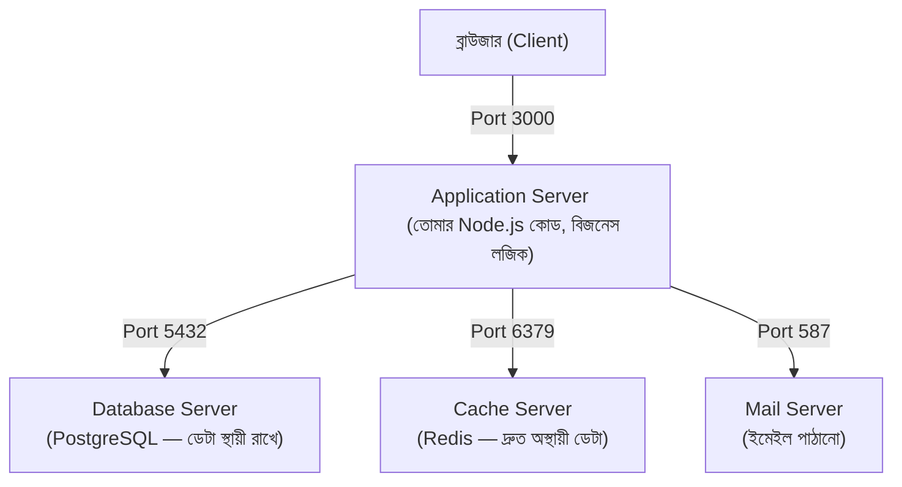

# ০৪. Type of Servers and Port Mapping for Them

Module 2-তে আমরা শিখেছিলাম, একটা কম্পিউটারে একসাথে অনেক প্রোগ্রাম চলতে পারে, প্রতিটা আলাদা পোর্টে "বসে" থাকে। এই লেসনে আমরা দেখবো, একটা বাস্তব ব্যাকএন্ড অ্যাপ্লিকেশনে সাধারণত কী কী ধরনের সার্ভার একসাথে চলে, এবং কেন তাদের আলাদা রাখা হয় একটাতে সব না মিশিয়ে।

## একটা বাস্তব অ্যাপ্লিকেশনের ভেতরের ছবি

ধরো তুমি একটা ছোট ই-কমার্স ওয়েবসাইট বানাচ্ছো। এর পেছনে আসলে একটামাত্র সার্ভার কাজ করে না — সাধারণত কয়েকটা আলাদা আলাদা সার্ভিস একসাথে চলে, প্রতিটার নিজস্ব দায়িত্ব:

প্রতিটা বাক্সই আসলে একটা আলাদা "সার্ভার" — মানে একটা প্রোগ্রাম যেটা একটা নির্দিষ্ট পোর্টে বসে অনুরোধের অপেক্ষা করছে, ঠিক Module 2-তে যেভাবে আমরা শিখেছিলাম।

## কেন সব একসাথে না মিশিয়ে আলাদা রাখা হয়

এখানে একটা স্বাভাবিক প্রশ্ন আসতে পারে — কেন সব কাজ একটামাত্র প্রোগ্রামে না করে এভাবে ভাগ করা হয়? উত্তরটা কয়েকটা কারণে দাঁড়ায়।

**প্রথমত, প্রতিটা কাজের ধরন আলাদা, তাই আলাদা টুল বেশি উপযুক্ত।** ডেটা স্থায়ীভাবে, নিরাপদে, সুশৃঙ্খলভাবে রাখার জন্য বিশেষভাবে ডিজাইন করা হয়েছে ডেটাবেজ সার্ভার (PostgreSQL, MySQL, MongoDB)। খুব দ্রুত, সাময়িকভাবে ডেটা রাখার জন্য (যেমন কারো লগইন সেশন মনে রাখা) ডিজাইন করা হয়েছে cache সার্ভার (Redis)। তোমার Application সার্ভার এই সবকিছু নিজে থেকে করার চেষ্টা করলে সেটা অনেক ধীর আর জটিল হয়ে যেত।

**দ্বিতীয়ত, আলাদা রাখলে প্রতিটাকে আলাদাভাবে স্কেল করা যায়।** ধরো তোমার ডেটাবেজে অনেক চাপ পড়ছে কিন্তু Application সার্ভারে না — তাহলে শুধু ডেটাবেজ সার্ভারের ক্ষমতা বাড়ানো যায়, পুরো সিস্টেম না বাড়িয়ে।

**তৃতীয়ত, একটা অংশ ভেঙে পড়লে পুরো সিস্টেম যেন সম্পূর্ণভাবে বন্ধ না হয়ে যায় (যদিও ভালোভাবে ডিজাইন করা সিস্টেমে) — যদিও শুরুতে ছোট প্রজেক্টে এই সুবিধা তেমন চোখে পড়ে না, প্রজেক্ট বড় হলে এটা অত্যন্ত গুরুত্বপূর্ণ হয়ে দাঁড়ায়।**

## Port Mapping — কে কোন পোর্টে থাকে

বাস্তব ডেভেলপমেন্টে, প্রতিটা সার্ভিসের জন্য একটা প্রথাগত (conventional) পোর্ট নম্বর থাকে, যেটা বেশিরভাগ ডেভেলপার মেনে চলে (যদিও এটা বদলানো যায়):

| সার্ভিস | ডিফল্ট পোর্ট | কাজ |
|---|---|---|
| Node.js Application Server | 3000 (বা 4000, 5000) | তোমার নিজের লেখা বিজনেস লজিক |
| PostgreSQL | 5432 | Relational Database |
| MySQL | 3306 | Relational Database |
| MongoDB | 27017 | Document Database |
| Redis | 6379 | Cache / দ্রুত মেমরি স্টোরেজ |
| SMTP (ইমেইল) | 25 বা 587 | ইমেইল পাঠানো |

এই সংখ্যাগুলো মুখস্থ করার দরকার নেই — বরং লক্ষ্য করার মূল বিষয়টা হলো, **প্রতিটা সার্ভিস তার নিজস্ব পোর্টে আলাদাভাবে চলে, আর তোমার Application সার্ভার এই সবগুলোর সাথে আলাদা আলাদা "সংযোগ" (connection) তৈরি করে কথা বলে।** এই সংযোগ তৈরি করার প্রক্রিয়াটা আমরা হাতে-কলমে দেখবো Module 15 থেকে, যখন প্রথমবার আমরা একটা ডেটাবেজের সাথে সংযুক্ত হবো।

এই মুহূর্তে আমাদের প্রজেক্টে (Module 2-এর সার্ভার) শুধু একটা Application Server আছে, বাকি কিছু নেই — এটাই স্বাভাবিক, কারণ এখনো আমরা ডেটাবেজ শিখিনি। কিন্তু এই বড় ছবিটা মাথায় রাখা জরুরি, যাতে সামনে যখন ডেটাবেজ যুক্ত হবে, তুমি বুঝতে পারো এটা ঠিক কোথায় বসছে, কীভাবে বাকি অংশের সাথে সম্পর্কিত।
