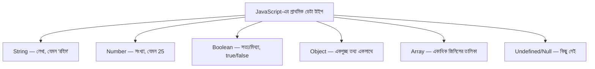

# ০২. JavaScript Basics for Node.js

ব্যাকএন্ড কোড লিখতে গেলে JavaScript-এর কিছু মৌলিক জিনিস এত ঘন ঘন ব্যবহৃত হয় যে সেগুলো একদম হাতের তালুর মতো চেনা থাকা দরকার। এই লেসনে আমরা সেই জিনিসগুলো ঝালিয়ে নেবো, প্রতিটার সাথে বোঝার চেষ্টা করবো এটা ব্যাকএন্ডে ঠিক কোথায় লাগবে।

## Variable — ডেটা রাখার বাক্স

একটা variable-কে ভাবতে পারো একটা লেবেল-লাগানো বাক্স হিসেবে, যেটার ভেতরে তুমি কোনো একটা মান (value) রাখতে পারো।

```js
let userName = "রহিম";
let age = 25;
let isLoggedIn = true;
```

## ডেটা টাইপ — বাক্সের ভেতরে কী ধরনের জিনিস থাকতে পারে



ব্যাকএন্ডে এই ধরনের প্রতিটা টাইপ বারবার আসবে — যেমন ধরো ইউজারের তথ্য একটা **Object** হিসেবে রাখা হয়:

```js
const user = {
  name: "রহিম",
  age: 25,
  isLoggedIn: true
};
```

আর একাধিক ইউজারের তালিকা রাখা হয় একটা **Array of Objects** হিসেবে:

```js
const users = [
  { name: "রহিম", age: 25 },
  { name: "করিম", age: 30 }
];
```

এই প্যাটার্নটা (Array of Objects) আসলে বেশিরভাগ ব্যাকএন্ড ডেটার মূল আকৃতি — একটা ডেটাবেজ থেকে "সব ইউজার দাও" চাইলে, উত্তরটা এভাবেই সাজানো একটা তালিকা হয়ে ফেরত আসে। (এই ধারণাটা Module 8-এ আরও গভীরে যাবো, যখন JSON নিয়ে বিস্তারিত কথা বলবো।)

## Function — কাজের রেসিপি

একটা function হলো একটা নির্দেশাবলীর সেট, যেটা তুমি বারবার ব্যবহার করতে পারো, একই কোড বারবার না লিখে।

```js
function greetUser(name) {
  return `স্বাগতম, ${name}!`;
}

console.log(greetUser("রহিম")); // স্বাগতম, রহিম!
```

আধুনিক JavaScript-এ একই কাজটা আরেকভাবেও লেখা যায়, যাকে বলে **arrow function** — এই সিনট্যাক্সটা তুমি Express.js-এর কোডে সবচেয়ে বেশি দেখবে:

```js
const greetUser = (name) => {
  return `স্বাগতম, ${name}!`;
};
```

## Template Literal — টেক্সটের ভেতরে ভ্যারিয়েবল বসানো

উপরের উদাহরণে যে ব্যাকটিক (`` ` ``) চিহ্ন আর `${name}` দেখলে, এটা একটা সুবিধাজনক উপায় টেক্সটের ভেতরে ভ্যারিয়েবলের মান বসানোর জন্য — একে বলে **template literal**। এটা এত বেশি ব্যবহৃত হবে যে এখনই অভ্যাস করে নেয়া ভালো:

```js
const port = 3000;
console.log(`সার্ভার চালু আছে port ${port}-এ`);
```

## Array-এর কিছু গুরুত্বপূর্ণ পদ্ধতি (Method)

ব্যাকএন্ড কোডে ডেটার তালিকা নিয়ে কাজ করার সময় এই তিনটা পদ্ধতি অসম্ভব ঘন ঘন ব্যবহৃত হয়:

```js
const numbers = [1, 2, 3, 4, 5];

// map: প্রতিটা আইটেমকে পরিবর্তন করে নতুন array বানায়
const doubled = numbers.map((n) => n * 2); // [2, 4, 6, 8, 10]

// filter: শর্ত মেলে এমন আইটেমগুলো বেছে নেয়
const evenNumbers = numbers.filter((n) => n % 2 === 0); // [2, 4]

// find: শর্ত মেলে এমন প্রথম আইটেমটা খুঁজে দেয়
const firstEven = numbers.find((n) => n % 2 === 0); // 2
```

এই পদ্ধতিগুলো Module 9-এ (JS Essentials for Backend Development) আরও বিস্তারিতভাবে দেখবো, কারণ এগুলো ছাড়া ব্যাকএন্ডে ডেটা প্রসেস করা প্রায় অসম্ভব — যেমন "সব ইউজারের মধ্যে যাদের বয়স ১৮-এর বেশি তাদের বের করো" — এটা এক লাইনে `filter` দিয়ে করা যায়।

এই মৌলিক জিনিসগুলো মাথায় সতেজ রেখে, চলো এখন এমন একটা ধারণায় যাই যেটা নতুনদের কাছে প্রায়ই কিছুটা রহস্যময় লাগে — **callback**।
