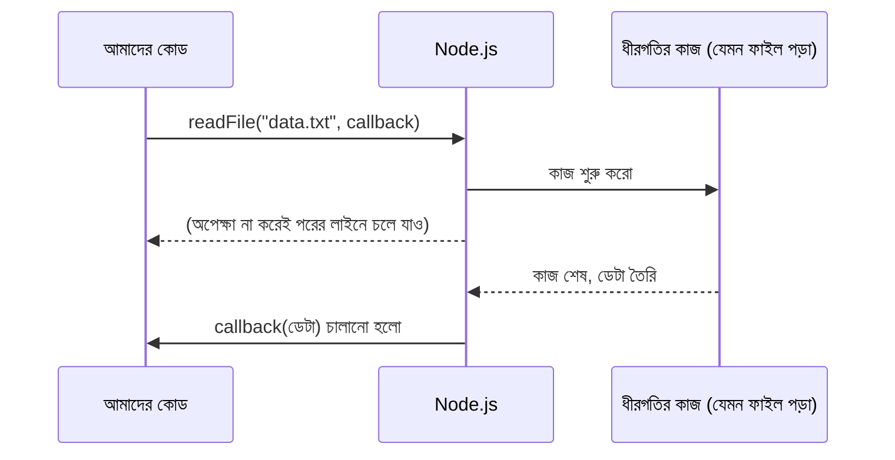

# ০৩. What is Callback? How Callback Works?

আগের লেসনে আমরা function-এর ধারণাটা ঝালিয়ে নিয়েছি — একটা রেসিপি, যেটা বারবার ব্যবহার করা যায়। এখন একটা প্রশ্ন করি, যেটা প্রথমবার শুনলে অদ্ভুত লাগতে পারে — একটা function কি আরেকটা function-কে "প্যারামিটার" হিসেবে নিতে পারে? উত্তর হলো, হ্যাঁ, JavaScript-এ পারে, আর এই ক্ষমতাটাই ব্যাকএন্ড ডেভেলপমেন্টের একদম প্রাণকেন্দ্রে বসে আছে।

যে function-টাকে আরেকটা function-এর ভেতরে "পরে ডাকার জন্য" পাঠানো হয়, তাকে বলা হয় **callback**। নামটা থেকেই আন্দাজ করা যায় — "কল ব্যাক", মানে কাজ শেষ হলে তুমি আমাকে ফিরে ডেকো।

## রেস্টুরেন্টের ওয়েটার দিয়ে বোঝা

ধরো তুমি একটা রেস্টুরেন্টে বসে আছো। ওয়েটারকে অর্ডার দিলে, ওয়েটার রান্নাঘরে গিয়ে দাঁড়িয়ে থাকে না যতক্ষণ না খাবার তৈরি হয়। সে বরং বলে যায় — "খাবার তৈরি হলে আমাকে জানিও, আমি টেবিলে নিয়ে যাবো।" এই "খাবার তৈরি হলে জানানো"-টাই একটা callback-এর মতো কাজ করে — একটা কাজ (রান্না) শেষ হওয়ার পর, আরেকটা কাজ (টেবিলে পৌঁছানো) স্বয়ংক্রিয়ভাবে ঘটে।

আসলে, আমরা আগেই একবার callback ব্যবহার করে ফেলেছি, খেয়াল না করেই। Module 2-এর সেই `server.js` ফাইলে মনে করে দেখো:

```js
const server = http.createServer((request, response) => {
  response.end('হ্যালো!');
});
```

`http.createServer()`-কে আমরা যে `(request, response) => {...}` ফাংশনটা দিয়েছিলাম, সেটাই একটা **callback**। আমরা `createServer`-কে বলে দিয়েছি — "যখনই একটা নতুন request আসবে, এই ফাংশনটা চালিয়ো।" আমরা নিজে কখনো এই ফাংশনটাকে সরাসরি ডাকিনি — Node.js নিজে থেকে সঠিক সময়ে এটাকে ডাকে।

## নিজে হাতে একটা callback লেখা

চলো নিজেরাই ছোট একটা উদাহরণ বানাই, যাতে ব্যাপারটা আরও পরিষ্কার হয়:

```js
function processOrder(itemName, callback) {
  console.log(`${itemName} অর্ডার প্রসেস হচ্ছে...`);
  callback(itemName); // কাজ শেষে callback-টাকে ডাকা হচ্ছে
}

function notifyCustomer(itemName) {
  console.log(`${itemName} প্রস্তুত, গ্রাহককে জানানো হলো!`);
}

processOrder("বিরিয়ানি", notifyCustomer);
```

এখানে `processOrder` ফাংশনটা দুইটা প্যারামিটার নিচ্ছে — একটা সাধারণ ডেটা (`itemName`), আর একটা ফাংশন (`callback`)। ফাংশনের ভেতরে কাজ শেষ হলে, সে `callback(itemName)` লিখে সেই ফাংশনটাকে চালু করে দিচ্ছে। ফলাফলে টার্মিনালে দেখা যাবে:

```
বিরিয়ানি অর্ডার প্রসেস হচ্ছে...
বিরিয়ানি প্রস্তুত, গ্রাহককে জানানো হলো!
```

## কেন এভাবে করার দরকার — সময়ের ব্যাপারটা

এই ছোট উদাহরণে callback ব্যবহার না করলেও চলতো — দুইটা লাইন সরাসরি একের পর এক লিখলেই একই ফলাফল পাওয়া যেতো। তাহলে callback-এর আসল গুরুত্ব কোথায়?

আসল গুরুত্ব তখন বোঝা যায়, যখন একটা কাজ **সময় নেয়** — যেমন একটা ফাইল পড়া, ইন্টারনেট থেকে ডেটা আনা, বা ডেটাবেজে প্রশ্ন করা। এই ধরনের কাজে Node.js জানে না কাজটা ঠিক কখন শেষ হবে, তাই সে অপেক্ষা করে বসে থাকে না (এটাই আগের লেসনে উল্লেখ করা non-blocking আচরণ)। বরং সে বলে — "কাজ শেষ হলে, এই callback-টা চালিয়ো, ততক্ষণে আমি অন্য কাজ করি।"



Node.js-এর নিজস্ব `fs` (file system) মডিউলে এই প্যাটার্নটা হাতেনাতে দেখা যায়:

```js
const fs = require('fs');

fs.readFile('data.txt', 'utf8', (error, data) => {
  if (error) {
    console.log('ফাইল পড়তে সমস্যা হয়েছে:', error);
    return;
  }
  console.log('ফাইলের ভেতরের ডেটা:', data);
});

console.log('ফাইল পড়া শুরু হয়েছে, এখন আমি অন্য কাজ করছি...');
```

এখানে `fs.readFile`-কে দেওয়া তৃতীয় প্যারামিটারটাই callback। মজার বিষয় হলো, টার্মিনালে "ফাইল পড়া শুরু হয়েছে..." লেখাটা **আগে** দেখা যাবে, আর ফাইলের ডেটা **পরে** — কারণ ফাইল পড়ার কাজটা ব্যাকগ্রাউন্ডে চলে, আর মূল কোড থেমে না থেকে পরের লাইনে চলে যায়। ফাইল পড়া শেষ হলে callback-টা চালানো হয়।

এই ধরনের callback-এ প্রথম প্যারামিটার হিসেবে `error` রাখাটা Node.js-এর একটা সাধারণ প্রথা — যদি কাজ করতে গিয়ে কোনো ভুল হয়, সেটা এখানে জানানো হয়, নাহলে এটা `null` থাকে। এই প্যাটার্নটার নাম **error-first callback**, আর এটা Node.js-এর অসংখ্য বিল্ট-ইন ফাংশনে দেখা যায়।

callback-এর এই ধারণাটাই Module 5-এ আমরা আরও গভীরে নিয়ে যাবো, যখন দেখবো callback অনেক বেশি জটিল হয়ে গেলে কী সমস্যা হয় (যাকে বলে "callback hell"), আর কীভাবে Promise আর async/await সেই সমস্যা সমাধান করে। কিন্তু আপাতত, Express.js-এর কোডে যেখানেই তুমি `(req, res) => {...}` দেখবে, মনে রেখো — এটাও একটা callback, ঠিক যেভাবে ওয়েটারকে বলা "খাবার তৈরি হলে জানিও।"

এখন চলো ফিরে যাই variable ঘোষণার তিনটা পদ্ধতির দিকে — `let`, `var`, আর `const` — কারণ Express.js-এর কোডে এই তিনটার সঠিক ব্যবহার বোঝা জরুরি।
