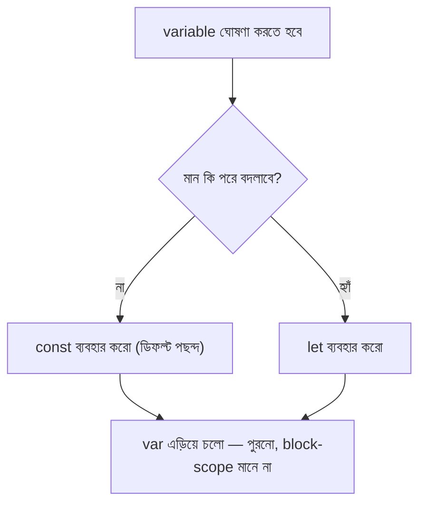

# ০৪. Use of let, var and const in JS

আগের লেসনে callback দেখতে গিয়ে আমরা বারবার `const` আর `let` লিখে ফেলেছি, কিন্তু কেন কোথাও `const`, কোথাও `let` ব্যবহার হলো, সেটা নিয়ে থামিনি। এই লেসনে থামার পালা — কারণ variable ঘোষণার এই তিনটা পদ্ধতির পেছনে আসলে একটা ইতিহাস আর একটা যুক্তি লুকিয়ে আছে, আর ভুল পদ্ধতি বেছে নিলে Express.js-এর মতো বড় কোডবেসে অদ্ভুত বাগ তৈরি হতে পারে।

## var — পুরনো দিনের বাক্স, যেটার দরজা সবসময় খোলা

JavaScript যখন প্রথম তৈরি হয় (১৯৯৫), তখন variable ঘোষণার একমাত্র উপায় ছিলো `var`। কিন্তু `var`-এর একটা অদ্ভুত আচরণ আছে, যাকে বলে **function-scoped** — মানে একটা `var` দিয়ে বানানো variable শুধু যে function-এর ভেতরে আছে সেটার মধ্যেই সীমাবদ্ধ থাকে, কিন্তু if-block বা loop-এর ভেতরে সীমাবদ্ধ থাকে না।

```js
if (true) {
  var message = "ভেতরে ঘোষণা করা হয়েছে";
}
console.log(message); // "ভেতরে ঘোষণা করা হয়েছে" — if-block পার হয়েও দেখা যাচ্ছে!
```

এটা অনেকটা এমন, যেন তুমি একটা ঘরের ভেতরে একটা বাক্স রাখলে, কিন্তু বাক্সের প্রভাব পুরো বাড়িতে ছড়িয়ে পড়লো — দরজা দিয়ে আটকানো গেলো না। বড় প্রোগ্রামে এই আচরণ প্রায়ই অপ্রত্যাশিত বাগের জন্ম দেয়, কারণ ডেভেলপার ভাবে variable-টা শুধু if-block-এর ভেতরেই আছে, কিন্তু বাস্তবে সেটা বাইরেও "ফাঁস" হয়ে যাচ্ছে।

## let — সঠিক সীমানার বাক্স

২০১৫ সালে (ES6 নামের JavaScript-এর একটা বড় আপডেটে) এই সমস্যা সমাধানের জন্য এলো `let`। `let` হলো **block-scoped** — মানে যে `{ }` ব্লকের ভেতরে ঘোষণা করা হয়েছে, সেই ব্লকের বাইরে এটা আর পাওয়া যায় না।

```js
if (true) {
  let message = "ভেতরে ঘোষণা করা হয়েছে";
  console.log(message); // ঠিকভাবে কাজ করবে
}
console.log(message); // Error! message এখানে সংজ্ঞায়িত নেই
```

এবার বাক্সের দরজাটা ঠিকমতো বন্ধ থাকে — ঘরের ভেতরের জিনিস ঘরের ভেতরেই থাকে। `let` দিয়ে ঘোষণা করা variable-এর মান পরে পরিবর্তনও করা যায়:

```js
let score = 10;
score = 20; // ঠিক আছে, মান বদলানো যাচ্ছে
```

## const — যে বাক্সের ভেতরের জিনিস আর বদলানো যাবে না

`const` (constant থেকে) দিয়ে ঘোষণা করা variable-ও block-scoped, কিন্তু এর একটা বাড়তি নিয়ম আছে — একবার মান বসিয়ে দিলে, সেই মান আর পরিবর্তন করা যাবে না।

```js
const port = 3000;
port = 4000; // Error! Assignment to constant variable.
```

এটা এমন একটা বাক্স, যেটার ভেতরে জিনিস রাখার পর সীল করে দেওয়া হয়েছে — খুলে বদলানো যাবে না।

একটা গুরুত্বপূর্ণ বিষয় লক্ষ্য করার মতো — `const` দিয়ে বানানো object বা array-এর **ভেতরের** মান বদলানো যায়, শুধু পুরো variable-টাকে নতুন কিছু দিয়ে replace করা যায় না:

```js
const user = { name: "রহিম" };
user.name = "করিম"; // ঠিক আছে, object-এর ভেতরের মান বদলানো হচ্ছে
console.log(user.name); // "করিম"

user = { name: "সালাম" }; // Error! পুরো variable-টা replace করার চেষ্টা করা হচ্ছে
```

তার মানে `const` আসলে বলছে "এই লেবেলটা সবসময় এই একই জিনিসকে নির্দেশ করবে", ভেতরের জিনিসটা সম্পূর্ণ অপরিবর্তনীয় (immutable) — এই দুটো ভিন্ন ধারণা।



## বাস্তব কোডে কোনটা কখন

আধুনিক Node.js আর Express.js কোডে সাধারণ প্রথা হলো — **ডিফল্ট হিসেবে সবসময় `const` ব্যবহার করো**, আর শুধু তখনই `let`-এ যাও যখন তুমি নিশ্চিতভাবে জানো মানটা পরে বদলাবে (যেমন একটা loop-এর counter, বা কোনো hisab যেটা ধাপে ধাপে বাড়বে)। `var` আধুনিক কোডে প্রায় ব্যবহারই হয় না, শুধু পুরনো কোড পড়তে গেলে চেনা দরকার।

```js
const PORT = 3000; // এটা বদলাবে না, তাই const
let requestCount = 0; // প্রতিটা request-এ বাড়বে, তাই let

function trackRequest() {
  requestCount = requestCount + 1;
  console.log(`মোট ${requestCount}টা request এসেছে`);
}
```

এই ছোট নিয়মটা মাথায় রাখলে, Express.js-এর কোড পড়ার সময় প্রায় প্রতিটা লাইনে কেন `const` লেখা হয়েছে সেটা এখন থেকে স্বাভাবিক লাগবে — কারণ বেশিরভাগ ক্ষেত্রে আমরা কোনো একবার তৈরি হওয়া জিনিসকে (যেমন app, server, বা কোনো route handler) আর বদলাই না, শুধু ব্যবহার করি।

এখন যেহেতু callback আর variable ঘোষণার মৌলিক বিষয়গুলো ঝালিয়ে নেওয়া হয়েছে, চলো সত্যিকারের কাজে নেমে পড়ি — Express.js ইনস্টল করে প্রথম সার্ভারটা বানাই, আর সেটাকে ব্রাউজার ছাড়াই Postman বা Thunder Client দিয়ে টেস্ট করি।
