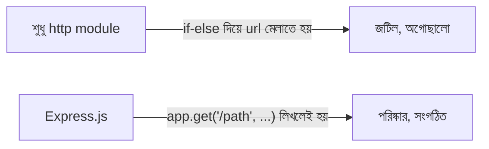
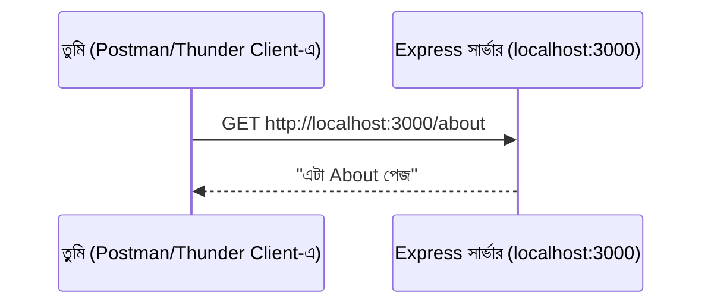

# ০৫. Express JS Setup with Clients like Postman and Thunder Client

Module 2-এ আমরা `http` মডিউল দিয়ে নিজের হাতে একটা সার্ভার বানিয়েছিলাম, আর তার লেসনের শেষে একটা সীমাবদ্ধতার কথা বলেছিলাম — যেকোনো URL চাইলেই একই জবাব আসে, কারণ আমরা `request.url` পরীক্ষা করিনি। সেই সীমাবদ্ধতা কাটানোর কাজটা আমরা নিজে হাতেও করতে পারতাম (if-else দিয়ে url মিলিয়ে), কিন্তু এখন সময় হয়েছে এমন একটা টুল ব্যবহার করার যেটা এই কাজটা অনেক পরিষ্কারভাবে করে দেয় — **Express.js**।

## Express.js কী, এক কথায়

Express.js হলো Node.js-এর উপরে তৈরি একটা **framework** — মানে এটা `http` মডিউলকে সম্পূর্ণ বাদ দেয় না, বরং তার উপরে একটা সুবিধাজনক স্তর (layer) যোগ করে। এই স্তরটা সবচেয়ে বড় যে সুবিধাটা দেয়, তা হলো **routing** — অর্থাৎ, "কে কোন URL চাইলে কী হবে" এটা পরিষ্কারভাবে, সংগঠিতভাবে লেখার ক্ষমতা।



## প্রজেক্ট শুরু করা

প্রথমে একটা নতুন ফোল্ডার বানাও, আর সেখানে Node.js প্রজেক্ট শুরু করো:

```bash
mkdir express-shikhi
cd express-shikhi
npm init -y
```

`npm init -y` কমান্ডটা একটা `package.json` ফাইল তৈরি করে — এটা প্রজেক্টের একটা "পরিচয়পত্র", যেখানে প্রজেক্টের নাম, ভার্সন, আর কোন কোন প্যাকেজের উপর নির্ভরশীল সেটা লেখা থাকে। `-y` ফ্ল্যাগটা মানে "সব প্রশ্নের ডিফল্ট উত্তর ধরে নাও", তাই কোনো প্রশ্ন ছাড়াই ফাইলটা তৈরি হয়ে যায়।

এবার Express.js ইনস্টল করি:

```bash
npm install express
```

এই কমান্ডটা Express.js-কে ইন্টারনেট থেকে ডাউনলোড করে `node_modules` নামের একটা ফোল্ডারে রাখে, আর `package.json`-এ লিখে দেয় যে আমাদের প্রজেক্ট এখন Express.js-এর উপর নির্ভরশীল। এই "প্যাকেজ ইনস্টল করা"-র ধারণাটা Module 3-এ যে "Core Module বনাম External Package" পার্থক্যের কথা বলা হয়েছিলো, তারই বাস্তব উদাহরণ — `http` একটা Core Module (Node.js-এর ভেতরেই আছে), কিন্তু Express.js একটা External Package (আলাদা করে ইনস্টল করতে হয়)।

## প্রথম Express সার্ভার লেখা

`index.js` নামে একটা ফাইল তৈরি করো:

```js
const express = require('express');
const app = express();
const PORT = 3000;

app.get('/', (req, res) => {
  res.send('হ্যালো, এটা Express.js থেকে জবাব!');
});

app.get('/about', (req, res) => {
  res.send('এটা About পেজ');
});

app.listen(PORT, () => {
  console.log(`সার্ভার চালু আছে port ${PORT}-এ`);
});
```

লাইন ধরে দেখা যাক ঠিক কী ঘটছে। `const express = require('express');` লাইনটা আমরা যে প্যাকেজ ইনস্টল করলাম, সেটাকে ফাইলে নিয়ে আসছে — ঠিক যেভাবে Module 2-এ `require('http')` করেছিলাম। `const app = express();` একটা Express অ্যাপ্লিকেশন তৈরি করছে, যেটাকে আমরা `app` নামের variable-এ (আগের লেসনের ভাষায়, `const` কারণ এই variable-টা আর বদলাবে না) রাখছি।

`app.get('/', (req, res) => {...})` — এখানেই Express.js-এর আসল শক্তি দেখা যায়। এই লাইনটা বলছে, "যখনই কেউ `/` পাতা GET পদ্ধতিতে চায়, এই callback-টা চালাও" (হ্যাঁ, এটাও আগের লেসনে শেখা callback-ই)। `req` (request) আর `res` (response) — এই দুটো প্যারামিটার Module 2-এর `http` মডিউলের `request` আর `response`-এর মতোই কাজ করে, শুধু Express এদের সাথে অনেক বাড়তি সুবিধাজনক পদ্ধতি (method) জুড়ে দিয়েছে, যেমন `res.send(...)` — এটা `response.end(...)`-এর চেয়ে বেশি স্মার্ট, কারণ এটা নিজে থেকে বুঝে নেয় তুমি কী ধরনের ডেটা পাঠাচ্ছো (টেক্সট, JSON, ইত্যাদি)।

লক্ষ্য করো, আমরা `/` আর `/about` — দুটো আলাদা পাতার জন্য দুটো আলাদা `app.get(...)` লিখেছি, কোনো if-else ছাড়াই। এটাই Express.js-এর routing-এর সৌন্দর্য।

সার্ভার চালাও:

```bash
node index.js
```

## ব্রাউজার ছাড়া API টেস্ট করা — Postman আর Thunder Client

এখন পর্যন্ত আমরা ব্রাউজারে গিয়ে URL টাইপ করে টেস্ট করেছি। কিন্তু বাস্তব ব্যাকএন্ড ডেভেলপমেন্টে, একটা API-কে প্রায়ই এমনভাবে টেস্ট করতে হয় যেটা ব্রাউজারের ঠিকানার বার দিয়ে সহজে করা যায় না — যেমন POST রিকোয়েস্ট পাঠানো, সাথে বাড়তি ডেটা বা header পাঠানো। এই কাজের জন্য দুটো জনপ্রিয় টুল হলো **Postman** আর **Thunder Client**।

**Postman** একটা আলাদা, স্বতন্ত্র অ্যাপ্লিকেশন, যেটা ইনস্টল করে ব্যবহার করতে হয়। এটাতে তুমি একটা URL লিখে, পদ্ধতি (GET, POST, ইত্যাদি) বেছে নিয়ে, প্রয়োজনে অতিরিক্ত ডেটা জুড়ে দিয়ে "Send" চাপলেই জবাব দেখতে পাও।

**Thunder Client** একই কাজ করে, কিন্তু এটা VS Code-এর ভেতরেই একটা extension হিসেবে বসানো যায় — ফলে কোড লেখা আর API টেস্ট করা একই জানালার মধ্যে হয়ে যায়, বারবার অ্যাপ বদলাতে হয় না।



Thunder Client ইনস্টল করে VS Code-এর সাইডবারে থান্ডার আইকনে ক্লিক করো, "New Request" চাপো, URL-এ লেখো `http://localhost:3000/about`, পদ্ধতি রাখো GET, তারপর "Send" চাপো। নিচের প্যানেলে জবাব দেখতে পাবে — ঠিক যেমনটা ব্রাউজারে দেখেছিলে, কিন্তু এবার এমন একটা টুলে, যেটা দিয়ে সামনে আরও জটিল রিকোয়েস্টও পাঠানো যাবে।

এই টুলগুলো এখন থেকে আমাদের নিত্যদিনের সঙ্গী হয়ে থাকবে, কারণ সামনে আমরা যখন এমন API বানাবো যেগুলো ডেটা গ্রহণ করে (যেমন ফর্ম সাবমিট করা, ইউজার তৈরি করা), তখন শুধু ব্রাউজারের ঠিকানার বার দিয়ে টেস্ট করা আর সম্ভব হবে না।

সার্ভার চালু রেখে, চলো এবার দেখি একটা URL-এর মধ্যে দিয়ে ডেটা পাঠানোর দুটো আলাদা পদ্ধতি — Query Parameter আর Path Parameter — এর পার্থক্য কী, আর কখন কোনটা ব্যবহার করা উচিত।
