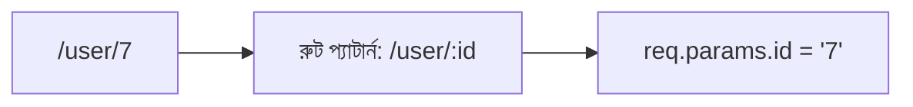
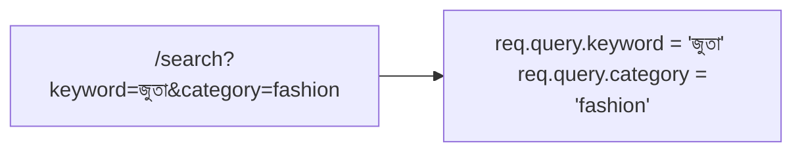

# ০৬. GET API and Query Param vs Path/Route Parameters

আগের লেসনে আমরা `/` আর `/about`-এর জন্য দুটো আলাদা, সম্পূর্ণ ফিক্সড রুট লিখেছিলাম। কিন্তু বাস্তব অ্যাপ্লিকেশনে প্রায়ই দরকার হয় এমন কিছু, যেখানে URL-এর একটা অংশ **পরিবর্তনশীল** — যেমন ধরো, প্রতিটা ইউজারের জন্য আলাদা প্রোফাইল পেজ দেখাতে হবে। প্রতিটা ইউজারের জন্য আলাদা করে `app.get('/user/1', ...)`, `app.get('/user/2', ...)` লিখতে যাওয়া তো অবাস্তব — হাজার ইউজার হলে হাজারটা লাইন লাগবে। এই সমস্যার সমাধানেই আসে দুটো ভিন্ন কৌশল — **Path Parameter** আর **Query Parameter**।

## Path Parameter — URL-এর ভেতরেই বসানো তথ্য

Path Parameter (একে Route Parameter-ও বলে) হলো URL-এর গঠনের ভেতরেই একটা "খালি জায়গা" রাখা, যেখানে প্রকৃত মান বসবে।

```js
app.get('/user/:id', (req, res) => {
  const userId = req.params.id;
  res.send(`ইউজার নম্বর ${userId}-এর প্রোফাইল`);
});
```

এখানে `:id` অংশটাই একটা placeholder — এর মানে হলো, "এই জায়গায় যেকোনো মান আসতে পারে, আর সেটাকে `id` নামে ধরে রাখো।" কেউ যদি `http://localhost:3000/user/7` চায়, তাহলে Express স্বয়ংক্রিয়ভাবে `req.params.id`-এর মধ্যে `"7"` বসিয়ে দেয়।



Path Parameter সাধারণত ব্যবহার করা হয় যখন মানটা **কোনো নির্দিষ্ট জিনিসের পরিচয়** নির্দেশ করে — যেমন কোন ইউজার, কোন পণ্য, কোন পোস্ট। এটা অনেকটা একটা বাড়ির ঠিকানার মতো — "বাড়ি নম্বর ৭" ঠিকানারই অবিচ্ছেদ্য অংশ, আলাদা কোনো "অতিরিক্ত তথ্য" না।

## Query Parameter — URL-এর শেষে ঐচ্ছিক তথ্য

Query Parameter দেখতে ভিন্ন — এটা URL-এর শেষে `?` চিহ্নের পরে বসে, আর `key=value` জোড়া হিসেবে লেখা হয়, একাধিক হলে `&` দিয়ে জোড়া লাগানো হয়।

```js
app.get('/search', (req, res) => {
  const keyword = req.query.keyword;
  const category = req.query.category;
  res.send(`খোঁজা হচ্ছে "${keyword}", ক্যাটাগরি: ${category}`);
});
```

কেউ যদি এই URL-টা চায়: `http://localhost:3000/search?keyword=জুতা&category=fashion`, তাহলে `req.query.keyword`-এর মান হবে `"জুতা"`, আর `req.query.category`-এর মান হবে `"fashion"`।



Query Parameter সাধারণত ব্যবহার হয় **ঐচ্ছিক, ফিল্টারিং, বা সাজানোর তথ্যের জন্য** — যেমন সার্চ করার শব্দ, পাতা নম্বর (pagination), সাজানোর ক্রম। এটা এমন তথ্য, যেটা না দিলেও রিকোয়েস্টটা "অবৈধ" হয়ে যায় না, শুধু আচরণ কিছুটা বদলায়।

## দুটোর মধ্যে পার্থক্য, পাশাপাশি রেখে দেখা

| বিষয় | Path Parameter | Query Parameter |
|---|---|---|
| URL-এ দেখতে | `/user/7` | `/search?keyword=জুতা` |
| Express-এ পাওয়া যায় | `req.params` | `req.query` |
| কখন ব্যবহার | কোনো নির্দিষ্ট জিনিসের পরিচয় বোঝাতে | ঐচ্ছিক, ফিল্টার/সাজানোর তথ্যের জন্য |
| না দিলে কী হয় | সাধারণত রুটটাই মেলে না (404) | সাধারণত ডিফল্ট আচরণ চলে, error হয় না |
| উদাহরণ | কোন ইউজার, কোন প্রোডাক্ট আইডি | সার্চ শব্দ, পেজ নম্বর, সাজানোর ধরন |

একটা সহজ মনে রাখার উপায় — যদি প্রশ্নটা হয় **"কোনটা?"** (কোন ইউজার, কোন প্রোডাক্ট), তাহলে Path Parameter। যদি প্রশ্নটা হয় **"কীভাবে ফিল্টার/সাজাবে?"**, তাহলে Query Parameter।

## দুটো একসাথে ব্যবহার করা

বাস্তব অ্যাপ্লিকেশনে প্রায়ই দুটো একসাথে ব্যবহার করা হয়:

```js
app.get('/user/:id/orders', (req, res) => {
  const userId = req.params.id;
  const status = req.query.status; // যেমন ?status=pending

  res.send(`ইউজার ${userId}-এর অর্ডার, স্ট্যাটাস ফিল্টার: ${status || 'সব'}`);
});
```

এখানে `http://localhost:3000/user/7/orders?status=pending` রিকোয়েস্ট করলে, Express একসাথে `req.params.id` (`"7"`) আর `req.query.status` (`"pending"`) দুটোই বের করে দিতে পারে। লক্ষ্য করো, `status || 'সব'` অংশটা বলছে — যদি `status` কিছু না দেওয়া থাকে (`undefined`), তাহলে ডিফল্ট হিসেবে `'সব'` দেখাও। এটাই Query Parameter-এর "ঐচ্ছিক" স্বভাবের একটা বাস্তব প্রতিফলন।

এই দুটো টুল হাতে থাকলে, এখন আমরা এমন API বানাতে পারি যেগুলো সত্যিকারের অর্থবহ ডেটা আদান-প্রদান করতে পারে, শুধু একটা ফিক্সড টেক্সট ফেরত দেওয়ার বদলে। Postman বা Thunder Client দিয়ে এই দুটো ধরনের URL নিজে হাতে চালিয়ে দেখো, `req.params` আর `req.query`-এর ভেতরে কী আসছে তা `console.log` দিয়ে দেখলে ব্যাপারটা আরও স্পষ্ট হবে।

এখন প্রশ্নটা আসে — এতক্ষণ আমাদের সার্ভার শুধু ব্রাউজার বা Postman-এর রিকোয়েস্ট সামলাচ্ছিলো, কিন্তু একটা backend কি নিজেই আরেকটা backend-কে রিকোয়েস্ট পাঠাতে পারে? চলো পরের লেসনে সেটাই দেখি।
