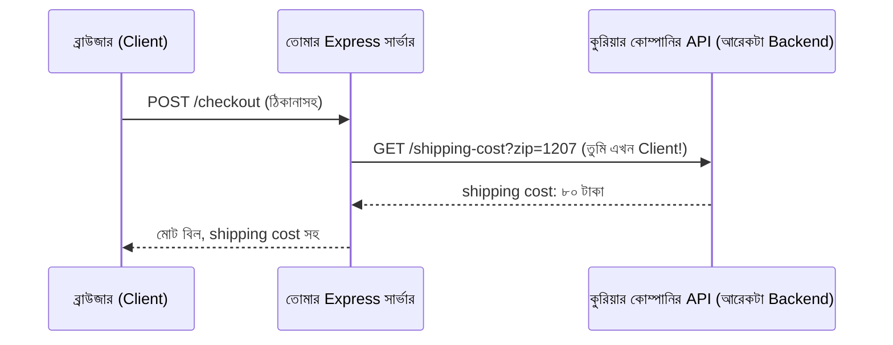

# ০৭. Backend Service as Client [Calling Backend from Other Backend]

এতদিন আমাদের চিন্তার কাঠামোটা ছিলো এরকম — একজন **client** (ব্রাউজার, বা Postman/Thunder Client) একটা রিকোয়েস্ট পাঠায়, আর একটা **server** (আমাদের Express অ্যাপ) সেটার জবাব দেয়। এই সম্পর্কে সার্ভারের ভূমিকা সবসময় "জবাবদাতা"। কিন্তু বাস্তব জগতের অ্যাপ্লিকেশনে, একটা backend প্রায়ই নিজেই একটা **client**-এর ভূমিকা নেয়, আরেকটা backend-কে রিকোয়েস্ট পাঠিয়ে।

## কেন এটা দরকার হয়

ধরো তুমি একটা ই-কমার্স অ্যাপ বানাচ্ছো, আর চেকআউটের সময় গ্রাহকের ঠিকানা থেকে shipping cost হিসাব করতে হবে। এই হিসাবটা করার জন্য একটা third-party সার্ভিস (যেমন একটা কুরিয়ার কোম্পানির API) ব্যবহার করতে হয়। তোমার Express সার্ভার এখানে দুটো ভূমিকায় থাকে একসাথে:



লক্ষ্য করো — ব্রাউজারের কাছে তোমার সার্ভার একজন **server**, কিন্তু কুরিয়ার কোম্পানির API-এর কাছে তোমার সার্ভার একজন **client**। এই দ্বৈত ভূমিকাটাই আধুনিক ব্যাকএন্ড সিস্টেমের বাস্তবতা — এই ধরনের একাধিক সার্ভিস একে অপরকে ডাকার প্যাটার্নটাকেই বলা হয় **microservices** বা **service-to-service communication**, যেটা নিয়ে আমরা আরও বিস্তারিত যাবো Module 40-এ।

## Node.js দিয়ে আরেকটা backend-কে কল করা — fetch দিয়ে

আধুনিক Node.js-এ (v18 এর পর থেকে) `fetch` ফাংশনটা বিল্ট-ইন হিসেবেই পাওয়া যায় — এটা ব্রাউজারে যেভাবে ব্যবহার হয়, ঠিক একইভাবে।

```js
app.get('/weather-report', async (req, res) => {
  const response = await fetch('https://api.example.com/weather?city=Dhaka');
  const data = await response.json();

  res.send(`ঢাকার তাপমাত্রা: ${data.temperature}°C`);
});
```

এখানে কয়েকটা নতুন জিনিস চোখে পড়বে — `async` আর `await` শব্দদুটো। এগুলো এমন একটা পদ্ধতি, যেটা দিয়ে সময়সাপেক্ষ কাজ (যেমন আরেকটা সার্ভারের জবাবের জন্য অপেক্ষা করা) callback-এর চেয়ে অনেক পরিষ্কার, উপর-নিচ পড়ার মতো ভাষায় লেখা যায়। এই মুহূর্তে এটা শুধু "এভাবে লিখতে হয়" হিসেবে মনে রাখলেই চলবে — Module 5-এ আমরা `async`/`await`-এর ভেতরের কাজের প্রক্রিয়া, আর এটা callback-এর সাথে কীভাবে সম্পর্কিত, সেটা গভীরে গিয়ে বুঝবো।

`fetch(url)` একটা রিকোয়েস্ট পাঠায় আর জবাবের জন্য অপেক্ষা করে (`await` দিয়ে বলা হচ্ছে "এই কাজ শেষ না হওয়া পর্যন্ত পরের লাইনে যেও না")। `response.json()` জবাবটাকে JavaScript object-এ রূপান্তর করে, যেটা নিয়ে Module 8-এ JSON আলোচনায় আরও বিস্তারিত জানবো।

## axios দিয়ে করা — আরেকটা জনপ্রিয় বিকল্প

`fetch` ছাড়াও, backend-থেকে-backend কল করার জন্য একটা খুব জনপ্রিয় External Package আছে, নাম **axios**। এটা ইনস্টল করতে হয়:

```bash
npm install axios
```

আর ব্যবহার এরকম:

```js
const axios = require('axios');

app.get('/weather-report', async (req, res) => {
  const result = await axios.get('https://api.example.com/weather?city=Dhaka');
  res.send(`ঢাকার তাপমাত্রা: ${result.data.temperature}°C`);
});
```

`axios`-এর সুবিধা হলো, এটা জবাবকে স্বয়ংক্রিয়ভাবে JSON-এ রূপান্তর করে দেয় (`.json()` আলাদা করে ডাকতে হয় না), আর error হ্যান্ডলিং, timeout-এর মতো বিষয়গুলোতে বাড়তি সুবিধা দেয়। বাস্তব প্রজেক্টে দুটোই ব্যবহৃত হয় — `fetch` কোনো বাড়তি ইনস্টল ছাড়াই কাজ করে, আর `axios` কিছুটা বেশি সুবিধাজনক ফিচার দেয়।

## নিজের দুটো Express সার্ভার দিয়ে হাতে-কলমে দেখা

ব্যাপারটা আরও স্পষ্ট করার জন্য, চলো দুটো ছোট সার্ভার বানাই। প্রথমটা, `service-a.js`, port 4000-এ চলবে:

```js
const express = require('express');
const app = express();

app.get('/greet', (req, res) => {
  res.send('Service A থেকে শুভেচ্ছা!');
});

app.listen(4000, () => console.log('Service A চালু আছে port 4000-এ'));
```

দ্বিতীয়টা, `service-b.js`, port 5000-এ চলবে, আর এটা Service A-কে কল করবে:

```js
const express = require('express');
const app = express();

app.get('/combined', async (req, res) => {
  const response = await fetch('http://localhost:4000/greet');
  const message = await response.text();

  res.send(`Service B বলছে: "${message}" — এটা আমি Service A থেকে পেয়েছি!`);
});

app.listen(5000, () => console.log('Service B চালু আছে port 5000-এ'));
```

দুটো টার্মিনালে দুটো সার্ভার আলাদাভাবে চালাও (`node service-a.js` আর `node service-b.js`), তারপর Postman বা ব্রাউজারে `http://localhost:5000/combined` চাইলে দেখবে — Service B, Service A-কে ভেতরে-ভেতরে কল করে তার জবাব নিজের জবাবের ভেতরে জুড়ে দিচ্ছে। এটাই Module 3-এর সেই "একাধিক সার্ভার একসাথে চলা" ছবির একটা জীবন্ত উদাহরণ, শুধু এখানে সবগুলোই Application Server, ডেটাবেজ বা ক্যাশ না।

এই প্যাটার্নটা মাথায় রেখে, এবার একটু ভিন্ন কোণ থেকে ব্যাপারটা দেখি — Python-এর জগতে Express.js-এর মতোই একটা জনপ্রিয় framework আছে, নাম FastAPI। পরের লেসনে দেখবো, দুটো সম্পূর্ণ ভিন্ন ভাষার framework কেন গঠনগতভাবে প্রায় একই রকম দেখতে লাগে।
