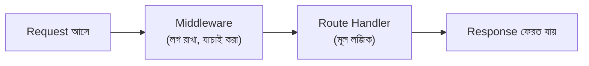

# ০৮. FastAPI vs Express.js: How They Are Almost Same?

এই কোর্সে আমরা Node.js আর Express.js নিয়ে কাজ করছি, কিন্তু বাস্তব জগতে চাকরির বাজারে বা বিভিন্ন কোম্পানিতে গেলে দেখবে অনেকে Python-এর **FastAPI** নামের একটা framework ব্যবহার করে ব্যাকএন্ড বানাতে। প্রথম দেখায় মনে হতে পারে এই দুটো সম্পূর্ণ আলাদা জগতের জিনিস — একটা JavaScript, আরেকটা Python। কিন্তু আসল গল্পটা হলো, এই দুটো framework-এর **গঠনগত চিন্তাভাবনা প্রায় হুবহু একই**, শুধু সিনট্যাক্স (ভাষার লেখার ধরন) আলাদা।

কেন এমন হয়? কারণ ব্যাকএন্ড ডেভেলপমেন্টের মূল সমস্যাগুলো — "একটা URL-এ রিকোয়েস্ট এলে কী করবো", "ডেটা কীভাবে গ্রহণ করবো", "জবাব কীভাবে পাঠাবো" — এই সমস্যাগুলো যেকোনো ভাষায়, যেকোনো framework-এই একই থাকে। তাই ভালো framework-গুলো একই ধরনের সমাধানে পৌঁছায়, ভাষা যাই হোক না কেন।

## রুট তৈরি করা — পাশাপাশি রেখে দেখা

Express.js-এ আমরা যেভাবে একটা রুট লিখি:

```js
app.get('/', (req, res) => {
  res.send('হ্যালো, এটা Express.js থেকে জবাব!');
});
```

FastAPI-তে একই কাজ দেখতে এমন:

```python
@app.get("/")
def home():
    return {"message": "হ্যালো, এটা FastAPI থেকে জবাব!"}
```

দুটো কোডই মূলত একই কথা বলছে — "GET পদ্ধতিতে `/` পাতা চাইলে, এই ফাংশনটা চালাও।" পার্থক্য শুধু লেখার ধরনে — Express.js-এ ফাংশনটা `app.get`-এর একটা প্যারামিটার (callback) হিসেবে যায়, FastAPI-তে `@app.get("/")` নামের একটা **decorator** ফাংশনের উপরে বসিয়ে দেওয়া হয়। কিন্তু ফলাফল একই — একটা URL-কে একটা ফাংশনের সাথে জুড়ে দেওয়া।

## Path Parameter — দুই ভাষাতেই একই ধারণা

আগের লেসনে আমরা শিখেছিলাম Express.js-এ Path Parameter:

```js
app.get('/user/:id', (req, res) => {
  res.send(`ইউজার নম্বর ${req.params.id}`);
});
```

FastAPI-তে একই ধারণা:

```python
@app.get("/user/{id}")
def get_user(id: str):
    return {"message": f"ইউজার নম্বর {id}"}
```

লক্ষ্য করো — Express.js `:id` লেখে, FastAPI `{id}` লেখে, কিন্তু ধারণাটা হুবহু এক — URL-এর একটা অংশ পরিবর্তনশীল, আর সেই মানটা ফাংশনের ভেতরে ব্যবহারযোগ্য হয়ে যায়। FastAPI-তে একটা বাড়তি সুবিধা আছে — `id: str` লিখে বলে দেওয়া যায় এই মানটা কী টাইপের হওয়া উচিত (Python-এর একটা ফিচার, যাকে বলে **type hint**), যেটা Express.js-এ সরাসরি নেই, আলাদা যাচাই করে নিতে হয়।

## Query Parameter-এও একই মিল

```js
// Express.js
app.get('/search', (req, res) => {
  res.send(`খোঁজা হচ্ছে: ${req.query.keyword}`);
});
```

```python
# FastAPI
@app.get("/search")
def search(keyword: str):
    return {"message": f"খোঁজা হচ্ছে: {keyword}"}
```

FastAPI-তে মজার বিষয় হলো, Path Parameter আর Query Parameter লেখার ধরনে তেমন পার্থক্য নেই — FastAPI নিজে বুঝে নেয় কোনটা কী, URL প্যাটার্নে সংজ্ঞায়িত থাকলে সেটা Path Parameter, না থাকলে Query Parameter। Express.js-এ এই দুটো স্পষ্টভাবে আলাদা (`req.params` বনাম `req.query`)।

## Middleware — দুই জায়গাতেই একই ধারণা, ভিন্ন নাম নয়

দুটো framework-এই এমন একটা ধারণা আছে যেটাকে বলে **middleware** — এমন একটা ফাংশন, যেটা মূল route handler চালানোর **আগে** চলে, কোনো common কাজ করার জন্য (যেমন লগ রাখা, ইউজার লগইন করা আছে কিনা যাচাই করা)।



Express.js-এ:

```js
app.use((req, res, next) => {
  console.log(`একটা রিকোয়েস্ট এসেছে: ${req.method} ${req.url}`);
  next(); // পরের ধাপে যাওয়ার অনুমতি
});
```

FastAPI-তে:

```python
@app.middleware("http")
async def log_requests(request, call_next):
    print(f"একটা রিকোয়েস্ট এসেছে: {request.method} {request.url}")
    response = await call_next(request)
    return response
```

দুটোতেই ধারণাটা এক — request-কে মূল লজিকে পৌঁছানোর আগে একটা "চেকপয়েন্ট" দিয়ে পার করানো। Express.js-এ `next()` কল করে "এগিয়ে যাও" বলা হয়, FastAPI-তে `call_next(request)` একই কাজ করে।

## তাহলে পার্থক্যটা আসলে কোথায়

| বিষয় | Express.js | FastAPI |
|---|---|---|
| ভাষা | JavaScript (Node.js) | Python |
| রুট লেখা | `app.get('/path', callback)` | `@app.get("/path")` decorator |
| Type checking | নিজে থেকে যাচাই করতে হয় | বিল্ট-ইন (type hints দিয়ে) |
| Async ধরন | `async/await`, callback-ভিত্তিক | `async def`, Python-এর নিজস্ব asyncio |
| জনপ্রিয়তার জায়গা | Full-stack JS টিম, স্টার্টআপ | ডেটা সায়েন্স/AI-সংযুক্ত ব্যাকএন্ড টিম |

এই তুলনাটা থেকে যে মূল শিক্ষাটা নেওয়ার, তা হলো — একবার তুমি ব্যাকএন্ডের মূল ধারণাগুলো (routing, parameter, middleware, request-response চক্র) ভালোভাবে বুঝে ফেললে, নতুন একটা framework বা এমনকি নতুন একটা ভাষা শেখা অনেক সহজ হয়ে যায় — কারণ শুধু সিনট্যাক্স বদলায়, চিন্তাভাবনার কাঠামো একই থাকে। এই কোর্সে যদি পরে তুমি Go বা Python-ভিত্তিক ব্যাকএন্ড framework-ও শেখো (Module 46-47-এ যেমন Go আর Gin আছে), তখন এই একই প্যাটার্নগুলো আবার চোখে পড়বে, শুধু ভিন্ন পোশাকে।

এই মডিউলের শেষ ধাপে, চলো দেখি এতক্ষণ যা শিখলাম তার একটা গোছানো কোড-সহায়িকা কীভাবে সাথে রাখা যায়, যাতে নিজে হাতে চর্চা করা সহজ হয়।
