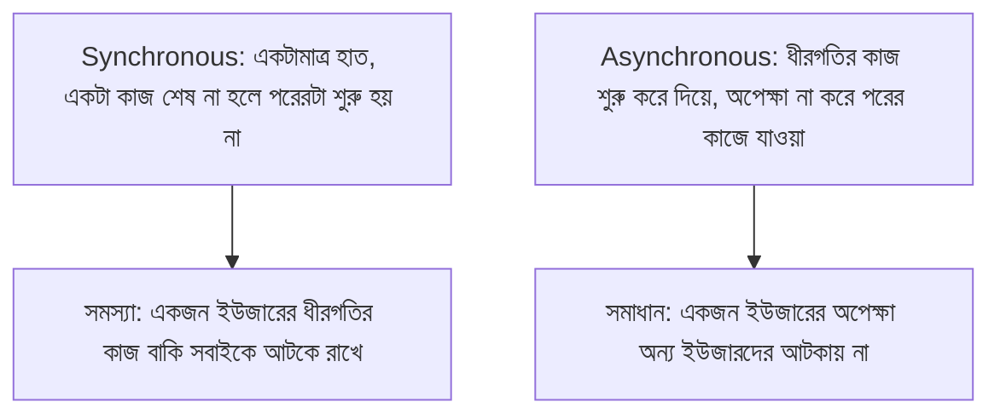

# ০১. Introduction to Async Code in Node JS - Nature of Javascript

Module 4-এ আমরা Express.js দিয়ে API বানানো শুরু করেছি, callback-এর সাথেও পরিচয় হয়েছে। কিন্তু এখন একটা গভীর প্রশ্নে যাওয়ার সময় হয়েছে, যেটা না বুঝলে ব্যাকএন্ড কোডের অনেক আচরণই রহস্যময় মনে হবে — JavaScript আসলে কাজ করে কীভাবে, ভেতরে ভেতরে?

উত্তরটা একটু অপ্রত্যাশিত হতে পারে। JavaScript হলো একটা **single-threaded** ভাষা — মানে এর কাছে কাজ করার জন্য মাত্র একটাই "হাত" আছে। একসাথে দুটো কাজ সে সত্যিকার অর্থে করতে পারে না; একটা সময়ে একটামাত্র লাইন কোড চলে, তারপর পরেরটা। এটাকে বলে **synchronous execution** — সিরিয়ালি, একের পর এক।

এটা প্রথম শুনলে অদ্ভুত লাগতে পারে, কারণ আমরা তো দেখি একটা ওয়েবসাইট একসাথে হাজার হাজার ইউজারের রিকোয়েস্ট সামলাচ্ছে। একটামাত্র হাত দিয়ে এটা কীভাবে সম্ভব? এই প্রশ্নের উত্তর খোঁজাই এই পুরো মডিউলের উদ্দেশ্য।

চলো একটা analogy দিয়ে বুঝি। একটা ছোট্ট চায়ের দোকান কল্পনা করো, যেখানে একজনমাত্র কর্মচারী আছে। যদি সে **synchronous** ভাবে কাজ করে, তাহলে একজন কাস্টমারের চা বানানো শুরু করে সে চুলার সামনে দাঁড়িয়ে থাকবে, পুরো ৫ মিনিট অপেক্ষা করবে চা ফুটতে ফুটতে, আর এই পুরো সময় দোকানে আসা অন্য কোনো কাস্টমারের দিকে ফিরেও তাকাবে না। এটা ভয়াবহ অদক্ষ একটা ব্যবস্থা — একজন কাস্টমারের জন্য বাকি সবাইকে সারিতে দাঁড় করিয়ে রাখা।

এখন চিন্তা করো, সেই একই কর্মচারী যদি একটু স্মার্ট হয় — চা চুলায় বসিয়ে দিয়ে, "৫ মিনিট পরে ডাকবো" এমন একটা টাইমার সেট করে, ততক্ষণে পরের কাস্টমারের অর্ডার নেয়। চা ফুটে গেলে টাইমার তাকে জানিয়ে দেয়, তখন সে গিয়ে চা কাপে ঢালে। এই দ্বিতীয় পদ্ধতিটাই হলো **asynchronous behavior** — একটা ধীরগতির কাজ শুরু করে দিয়ে, তার শেষ হওয়ার জন্য বসে না থেকে, অন্য কাজে মনোযোগ দেয়া, আর কাজ শেষ হলে ফিরে এসে বাকিটা সামলানো।

ব্যাকএন্ড সার্ভারের জগতে "চা ফোটানো"-র সমতুল্য কাজগুলো হলো এমন সব অপারেশন যেগুলোতে সময় লাগে, কিন্তু CPU-কে ব্যস্ত রাখে না — যেমন:

- ডেটাবেজ থেকে ডেটা আনা (নেটওয়ার্কের ওপারে থাকা অন্য একটা সিস্টেমের উত্তরের অপেক্ষা)
- একটা ফাইল ডিস্ক থেকে পড়া
- অন্য কোনো API-কে রিকোয়েস্ট পাঠিয়ে উত্তরের অপেক্ষা করা (এই ধরনের backend-to-backend কল আমরা Module 4-এ "Backend service as Client" লেসনে দেখেছি)

এই সবকিছুকে বলা হয় **I/O (Input/Output) operation**, আর একটা ব্যাকএন্ড সার্ভারের বেশিরভাগ সময়ই আসলে এসব I/O অপারেশনের উত্তরের অপেক্ষায় কাটে, নিজে হিসাব-নিকাশ (computation) করে কাটে না। Node.js-এর ডিজাইনের মূল দর্শনটাই হলো — যেহেতু সার্ভারের সবচেয়ে বেশি সময় যায় অপেক্ষায়, তাই সেই অপেক্ষার সময়টা অন্য কাজে লাগিয়ে দেয়াই বুদ্ধিমানের কাজ। এই কারণেই Node.js "non-blocking I/O" মডেলে চলে, যেটার কথা আমরা Module 3-এ সংক্ষেপে উল্লেখ করেছিলাম।



এই সহজ উদাহরণ দিয়ে ব্যাপারটা দেখা যাক — নিচের কোডটা চালালে কী হয়, সেটা অনুমান করার চেষ্টা করো:

```javascript
console.log("এক");

setTimeout(() => {
  console.log("দুই — ২ সেকেন্ড পরে");
}, 2000);

console.log("তিন");
```

স্বাভাবিক বুদ্ধিতে মনে হতে পারে আউটপুট হবে "এক", তারপর ২ সেকেন্ড অপেক্ষা করে "দুই", তারপর "তিন"। কিন্তু বাস্তবে আউটপুট আসে এভাবে:

```
এক
তিন
দুই — ২ সেকেন্ড পরে
```

কেন এমন হলো? কারণ `setTimeout` একটা asynchronous ফাংশন — এটা Node.js-কে বলে দেয়, "এই কাজটা ২ সেকেন্ড পরে করো, কিন্তু এখনই আমাকে আটকে রেখো না, তুমি বাকি কোড চালাতে থাকো।" তাই `console.log("তিন")` লাইনটা অপেক্ষা না করেই সাথে সাথে চলে যায়, আর `setTimeout`-এর ভেতরের ফাংশনটা (যাকে callback বলে, Module 4 লেসন ৩-এ পরিচয় হয়েছিলো) ২ সেকেন্ড পরে, বাকি সব সিঙ্ক্রোনাস কোড শেষ হওয়ার পরে চলে।

এই আচরণটাই — কোড লেখা এক ক্রমে, কিন্তু চলা আরেক ক্রমে — নতুনদের সবচেয়ে বেশি বিভ্রান্ত করে, আর ঠিক এই বিভ্রান্তি কাটানোই এই পুরো Module 5-এর লক্ষ্য। আমরা ধাপে ধাপে দেখবো কীভাবে Node.js ভেতরে ভেতরে এই "অপেক্ষা না করে এগিয়ে যাওয়া" ব্যবস্থাপনা করে, আর কীভাবে সেটা নিয়ন্ত্রণ করার জন্য callback থেকে Promise, আর Promise থেকে async/await পর্যন্ত এসেছি।

পরের লেসনে আমরা callback-এর জগতে আরেকটু গভীরে যাবো, দেখবো একাধিক asynchronous কাজ একটার পর একটা করতে গেলে কী সমস্যা তৈরি হয় — যাকে বলা হয় "callback hell"।
