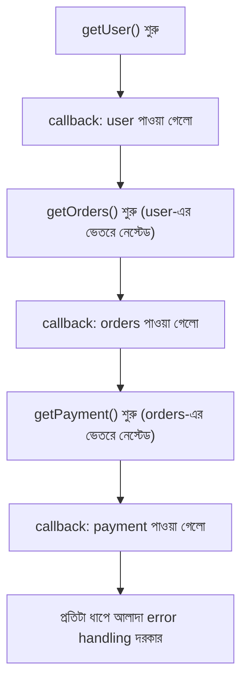

# ০২. Async Code in Node JS Part 2

আগের লেসনে আমরা দেখেছি asynchronous কোড কেন দরকার, আর `setTimeout`-এর একটা সাধারণ উদাহরণ দিয়ে দেখেছি কীভাবে Node.js একটা ধীরগতির কাজ শুরু করে দিয়ে বাকি কোড চালিয়ে যায়। এবার একটু পেছনে ফিরে তাকাই — Module 4 লেসন ৩-এ ("What is callback? how callback works?") আমরা callback-এর প্রাথমিক পরিচয় পেয়েছিলাম। সেই ধারণাটা আরেকটু ঝালিয়ে নেয়া দরকার, কারণ callback-ই হলো asynchronous JavaScript-এর সবচেয়ে পুরনো আর মৌলিক হাতিয়ার।

মনে করে দেখো, একটা **callback** হলো এমন একটা function, যেটাকে আরেকটা function-এর প্যারামিটার হিসেবে পাঠানো হয়, এই প্রতিশ্রুতিতে যে — "তোমার কাজ শেষ হলে, আমাকে ডেকো, আমি তখন এই ফাংশনটা চালাবো।" এটা অনেকটা রেস্টুরেন্টে খাবারের অর্ডার দেয়ার মতো — তুমি ওয়েটারকে বলছো "খাবার রেডি হলে আমার টেবিলে নিয়ে এসো", তুমি রান্নাঘরের সামনে দাঁড়িয়ে অপেক্ষা করছো না।

Node.js-এর অনেক বিল্ট-ইন ফাংশন callback-ভিত্তিক। যেমন ফাইল পড়ার একটা ক্লাসিক উদাহরণ দেখি:

```javascript
const fs = require("fs");

console.log("ফাইল পড়া শুরু হচ্ছে...");

fs.readFile("data.txt", "utf8", (error, content) => {
  if (error) {
    console.log("ফাইল পড়তে সমস্যা হয়েছে:", error.message);
    return;
  }
  console.log("ফাইলের ভেতরের লেখা:", content);
});

console.log("ফাইল পড়ার রিকোয়েস্ট পাঠানো হয়ে গেছে, বাকি কোড চলছে...");
```

এখানে `fs.readFile`-এর শেষ প্যারামিটারটাই callback — ডিস্ক থেকে ফাইল পড়া শেষ হলে Node.js এই ফাংশনটাকে ডেকে `error` আর `content` পাঠিয়ে দেয়। লক্ষ্য করো, "বাকি কোড চলছে" লেখাটা "ফাইলের ভেতরের লেখা"-র আগেই প্রিন্ট হবে, ঠিক আগের লেসনের `setTimeout`-এর মতো কারণেই — ফাইল পড়া একটা I/O অপারেশন, যেটা asynchronous ভাবে চলে।

এতদূর পর্যন্ত সবকিছু সুন্দর। সমস্যাটা তৈরি হয় তখন, যখন একটার পর একটা asynchronous কাজ করতে হয় — যেমন ধরো, প্রথমে ইউজারের তথ্য ডেটাবেজ থেকে আনতে হবে, তারপর সেই তথ্য দিয়ে তার অর্ডারের তালিকা আনতে হবে, তারপর সেই অর্ডার থেকে পেমেন্টের তথ্য আনতে হবে। প্রতিটা ধাপ যেহেতু আগের ধাপের ফলাফলের ওপর নির্ভরশীল, callback দিয়ে এটা লিখলে দেখতে হয় এরকম:

```javascript
getUser(userId, (error, user) => {
  getOrders(user.id, (error, orders) => {
    getPayment(orders[0].id, (error, payment) => {
      console.log("পেমেন্টের তথ্য:", payment);
      // আরও একটা ধাপ যোগ হলে, আরেকটা বন্ধনী ভেতরে যাবে...
    });
  });
});
```

এই কাঠামোটাকে ডেভেলপাররা মজা করে বলে **"Callback Hell"** বা **"Pyramid of Doom"** — কারণ কোডটা ডান দিকে ক্রমাগত হেলে পড়তে থাকে, একটা পিরামিডের মতো আকৃতি নেয়। এটা শুধু দেখতে খারাপ তা নয়, এর বাস্তব সমস্যাও আছে:



প্রথম সমস্যা — **error handling** প্রতিটা স্তরে আলাদা করে লিখতে হয়, আর একটা স্তরে ভুল করে ভুলে গেলে পুরো চেইন নীরবে ভেঙে যেতে পারে। দ্বিতীয় সমস্যা — কোড **পড়া কঠিন হয়ে যায়**, কারণ মানুষের মস্তিষ্ক স্বাভাবিকভাবে "প্রথমে এটা করো, তারপর ওটা করো" — এই রৈখিক (linear) চিন্তায় অভ্যস্ত, কিন্তু নেস্টেড callback পড়তে হয় ভেতর থেকে বাইরে, উল্টো দিক থেকে। তৃতীয় সমস্যা — যদি দুটো আলাদা কাজ (যেমন orders আনা আর user-এর প্রোফাইল ছবি আনা) একইসাথে চালাতে চাও, callback দিয়ে সেটা ম্যানেজ করাও বেশ জটিল হয়ে পড়ে।

এই সমস্যাগুলো এতটাই বাস্তব ছিলো যে, JavaScript ভাষার ডিজাইনাররা এর জন্য একটা নতুন, পরিষ্কার সমাধান নিয়ে আসেন — **Promise**। Promise আসলে callback-কেই ভেতরে ভেতরে ব্যবহার করে, কিন্তু তার ওপরে এমন একটা কাঠামো তৈরি করে যেটা কোডকে রৈখিক, পড়ার উপযোগী রূপে লিখতে দেয়। কিন্তু তার আগে, Promise বা async/await বোঝার একটা জরুরি পূর্বশর্ত আছে — সেটা হলো Node.js-এর ভেতরে ঠিক কীভাবে এই "পরে চালানো" ব্যাপারটা কার্যকর হয়, অর্থাৎ **event loop** নামের সেই ইঞ্জিনটা। পরের লেসনে আমরা ঠিক সেই ইঞ্জিনটার ভেতরেই ঢুকবো।
