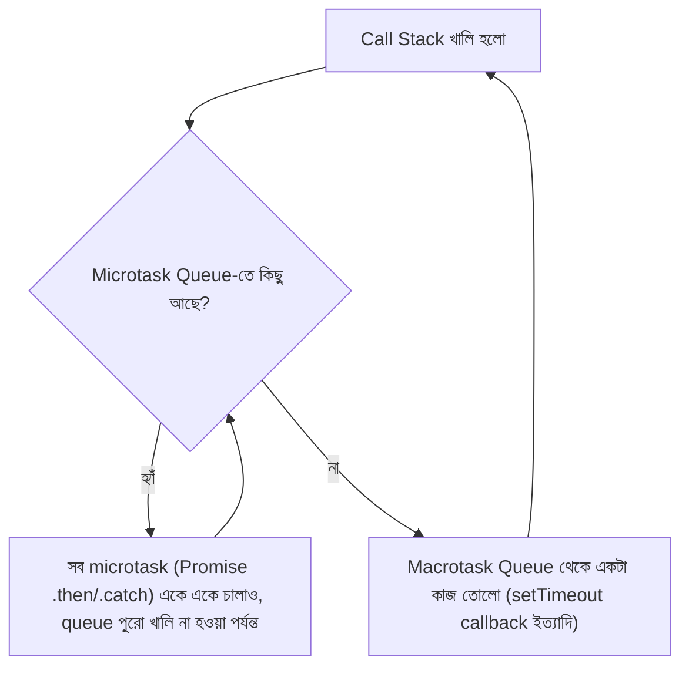

# ০৪. Event Loop, Promise and Async Await — How They Are Related?

গত লেসনে আমরা দেখেছি callback queue আর event loop মিলে কীভাবে asynchronous callback চালায়। এখন সময় হয়েছে সেই একই ভিত্তির ওপর দাঁড়িয়ে থাকা দুটো অতিপরিচিত নাম বোঝার — **Promise** আর **async/await**। এই দুটো জিনিস কোনো আলাদা ইঞ্জিন নয় — এরা মূলত সেই একই event loop-এর ওপর তৈরি একটা আরও সুন্দর, পরিষ্কার "মোড়ক" (wrapper)।

## Promise — একটা লিখিত প্রতিশ্রুতিপত্র

Module 5 লেসন ২-এ আমরা দেখেছিলাম callback hell-এর সমস্যা — নেস্টেড ফাংশনের পিরামিড। **Promise** এই সমস্যার সমাধান হিসেবে এসেছে। একটা Promise-কে ভাবতে পারো একটা লিখিত রসিদের মতো, যেটা তোমাকে রেস্টুরেন্টে অর্ডার দেয়ার সময় দেয়া হয় — রসিদটা নিজে খাবার না, কিন্তু এটা প্রতিশ্রুতি দেয় যে ভবিষ্যতে হয় খাবার আসবে (resolve), অথবা রান্নাঘরে সমস্যা হলে জানানো হবে (reject)।

```javascript
function getUserFromDatabase(userId) {
  return new Promise((resolve, reject) => {
    // এখানে ধরে নিচ্ছি একটা ডেটাবেজ কল হচ্ছে
    setTimeout(() => {
      if (userId) {
        resolve({ id: userId, name: "রহিম" });
      } else {
        reject(new Error("userId দেয়া হয়নি"));
      }
    }, 1000);
  });
}

getUserFromDatabase(101)
  .then((user) => {
    console.log("ইউজার পাওয়া গেলো:", user.name);
  })
  .catch((error) => {
    console.log("সমস্যা হয়েছে:", error.message);
  });
```

এখানে `resolve` মানে "প্রতিশ্রুতি পূরণ হলো, ফলাফল এই", আর `reject` মানে "প্রতিশ্রুতি ভাঙলো, কারণ এই"। `.then()` দিয়ে আমরা বলছি "সফল হলে এই কাজটা করো", আর `.catch()` দিয়ে "ব্যর্থ হলে এই কাজটা করো"। লক্ষ্য করার মতো বিষয় হলো — Promise-এর ভেতরেও কিন্তু আসলে `setTimeout`-ই ব্যবহৃত হচ্ছে, অর্থাৎ Promise callback-কে বাতিল করেনি, বরং তার ওপরে একটা সুশৃঙ্খল কাঠামো বসিয়েছে।

Promise-এর সবচেয়ে বড় সুবিধা দেখা যায় যখন একাধিক asynchronous ধাপ একটার পর একটা করতে হয় — আগের লেসনের সেই পিরামিডটা এখন হয়ে যায় একটা সহজ, রৈখিক চেইন:

```javascript
getUser(101)
  .then((user) => getOrders(user.id))
  .then((orders) => getPayment(orders[0].id))
  .then((payment) => console.log("পেমেন্ট:", payment))
  .catch((error) => console.log("যেকোনো ধাপে সমস্যা হলে এখানে ধরা পড়বে:", error.message));
```

এখানে একটামাত্র `.catch()` পুরো চেইনের যেকোনো ধাপের ভুল ধরতে পারে — এটাই callback hell-এর error-handling সমস্যার সরাসরি সমাধান।

## Microtask Queue — একটা বিশেষ VIP লাইন

এখন প্রশ্ন হলো, event loop-এর সেই ছবিতে Promise কোথায় বসে? এখানেই একটা নতুন ধারণা আসে — **microtask queue**। গত লেসনে যে callback queue-র কথা বলেছিলাম (setTimeout, ফাইল পড়া ইত্যাদির জন্য), সেটাকে বলা হয় **macrotask queue**। কিন্তু Promise-এর `.then()`/`.catch()`-এর ভেতরের কোডগুলো জমা হয় একটা আলাদা, অগ্রাধিকারপ্রাপ্ত queue-তে, যার নাম **microtask queue**।

কল সেন্টারের analogy-তে ফিরে গেলে — ধরো macrotask queue হলো সাধারণ কাস্টমারদের ফিরতি কলের তালিকা, আর microtask queue হলো VIP কাস্টমারদের তালিকা, যাদের সবসময় আগে সার্ভ করা হয়। নিয়মটা হলো — call stack খালি হলে, event loop **প্রথমে পুরো microtask queue খালি করে**, তারপরই একটামাত্র macrotask (যেমন একটা setTimeout callback) তোলে।



এই কারণেই নিচের কোডে আউটপুট একটু অপ্রত্যাশিত ক্রমে আসে:

```javascript
console.log("১");

setTimeout(() => console.log("২ — macrotask"), 0);

Promise.resolve().then(() => console.log("৩ — microtask"));

console.log("৪");
```

আউটপুট আসবে: `১`, `৪`, `৩ — microtask`, `২ — macrotask` — যদিও `setTimeout`-এর সময় ০ মিলিসেকেন্ড দেয়া হয়েছে, তবুও Promise-এর microtask সবসময় আগে চলে, কারণ microtask queue-কে সবসময় macrotask-এর আগে সম্পূর্ণ খালি করা হয়।

## Async/Await — Promise-এর ওপর একটা সুন্দর মুখোশ

Promise চেইন `.then().then().then()` দিয়ে callback hell অনেকটা কমালেও, অনেক ধাপ থাকলে কোড তখনো একটু জটিল দেখায়। এখানেই আসে **async/await** — যেটা নতুন কোনো ইঞ্জিন নয়, বরং Promise-এর ওপর বসানো একটা "সিনট্যাক্স সুগার" (syntax sugar), অর্থাৎ একই জিনিস, কিন্তু লেখার ধরনটা সিঙ্ক্রোনাস কোডের মতো দেখতে।

```javascript
async function processOrder(userId) {
  try {
    const user = await getUser(userId);
    const orders = await getOrders(user.id);
    const payment = await getPayment(orders[0].id);
    console.log("পেমেন্ট সম্পন্ন:", payment);
  } catch (error) {
    console.log("কোনো এক ধাপে সমস্যা হয়েছে:", error.message);
  }
}
```

এখানে `async` কীওয়ার্ড একটা ফাংশনকে বলে দেয় "এই ফাংশন সবসময় একটা Promise রিটার্ন করবে", আর `await` বলে দেয় "এই লাইনে Promise resolve হওয়া পর্যন্ত অপেক্ষা করো, কিন্তু এই অপেক্ষার সময় পুরো থ্রেড ব্লক করবে না, বরং control ছেড়ে দাও যাতে event loop অন্য কাজ চালাতে পারে, Promise resolve হলে এখানেই ফিরে এসো।" ভেতরে ভেতরে এটা ঠিক আগের `.then()` চেইনটাই, শুধু দেখতে সিঙ্ক্রোনাস কোডের মতো লাগছে — এই কারণেই একে "syntax sugar" বলা হয়।

সংক্ষেপে সম্পর্কটা এরকম — callback হলো ভিত্তি, Promise সেই callback-কে সুশৃঙ্খল করে, আর async/await সেই Promise-কেই আরও সহজপাঠ্য করে তোলে। তিনটাই একই event loop ইঞ্জিনের ওপর দাঁড়িয়ে, শুধু লেখার স্তর আলাদা। এখন যেহেতু তত্ত্বটা পরিষ্কার, পরের লেসনে আমরা এটাকে একটা বাস্তব Express.js প্রজেক্টে প্রয়োগ করে দেখবো।
